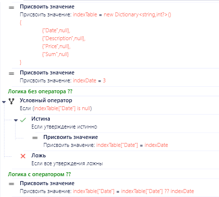

# PIX RPA Development Conventions & Best Practices

Стандартизированные соглашения и рекомендации для разработки роботов на платформе PIX RPA.  
Цель репозитория — обеспечить единый подход к проектированию, документированию и поддержке автоматизированных процессов.

## Зачем нужны соглашения и лучшие практики для PIX RPA?

Следование согласованным принципам и рекомендациям при разработке RPA-решений на платформе PIX обеспечивает ряд существенных преимуществ как для отдельных разработчиков, так и для команд. Применение описанных в данном документе подходов позволяет достичь следующих результатов:

**Улучшенная поддерживаемость:** `Четкая организация кода`,`Упрощение навигации по проекту`,`Быстрое понимание структуры новыми разработчиками`,`Упрощение рефакторинга`

**Повышенная надежность:** `Изолированные компоненты`,`Улучшенная обработка ошибок`,`Упрощение отладки`,`Снижение рисков при изменениях`

**Масштабируемость:** `Легкость добавления новых функций/скриптов`,`Упрощение интеграции с другими системами`,`Возможность параллельной разработки`

**Безопасность:** `Централизованное управление конфигурацией`,`Защита конфиденциальных данных`, `Контроль доступа к ресурсам`, `Улучшенное логирование`

**Эффективность разработки:** `Ускорение разработки новых роботов`,`Уменьшение дублирования кода`,`Упрощение тестирования`,`Снижение затрат на поддержку`

**Улучшенное качество:** `Стандартизированный подход`,`Улучшенная читаемость кода`,`Упрощение код-ревью`,`Снижение количества ошибок`

**Что включено в этот документ:**
- Соглашения по именованию (переменных, функций, проектов) для повышения читаемости кода
- Структура проекта: организация файлов и каталогов для удобства масштабирования
- Паттерны разработки и лучшие практики

**Практическая польза:**
- Упрощение onboarding новых разработчиков
- Снижение числа ошибок за счет унификации процессов
- Упрощение интеграции с метаданными и внешними системами
- Повышение эффективности командной работы

**Участвуйте в развитии!**  
Репозиторий открыт для предложений и доработок — создавайте Issues или Pull Requests, чтобы улучшить стандарты сообщества.

## В этой статье

- (NEW) [Соглашение об администрировании мастера] // В работе 
- [Соглашение о структуре проекта](#соглашение-о-структуре-проекта) //В работе, будет доп по другим шаблонам
- [Соглашение о Git](#соглашения-о-git)
- [Соглашение об именовании](#соглашение-об-именовании)
- [Соглашение о БД](#соглашение-о-бд)
- [Соглашение об очередях](#соглашение-об-очередях)
- [Соглашение о логировании](#соглашение-о-логировании)
- [Соглашение об исключениях](#соглашения-об-исключениях) //В работе
- [Рекомендации по написанию скриптов](#рекомендации-по-написанию-скриптов)
- (NEW) [Рекомендации о тестировании] //В работе

Стандарт скрипта необходим для поддержания удобочитаемости скрипта, согласованности и совместной работы в команде разработчиков. Скрипт, который соответствует отраслевым методикам и установленным рекомендациям, проще понимать, поддерживать и расширять. Большинство проектов применяют согласованный стиль с помощью соглашений о скрипте.

## Соглашение о структуре проекта

**Примечание:** В этом разделе речь идет в основном только о Unattended Robots и бизнес-процессах, подходящих под шаблон State Machine на транзакциях или циклах. Информация по другим шаблонам и Attended Robots будет добавлена позже. Все роботы работают в связке с PIX Master (Оркестратор).

<details>
    <summary><b>Разделение проекта на слои</b></summary>

## Архитектурный подход

Разделение проекта на слои — это архитектурный подход, при котором код организуется в логические группы (слои) в соответствии с их ответственностью. 

### Преимущества:
- **Улучшение организации кода** — каждый компонент находится в своем логическом месте
- **Упрощение поддержки и масштабирования** — изменения вносятся локально в соответствующем слое
- **Четкое разделение ответственности** — каждый слой решает свои специфические задачи
- **Облегчение тестирования** — возможность изолированной проверки каждого слоя
- **Повышение переиспользования кода** — модули могут применяться в разных частях системы

---

## Структура проекта

```console
├───Common (слой шаблонов и прочих файлов)
├───Helpers (слой независимых функций)
├───Infrastructure (слой работы с сервисами/интеграциями)
│   ├───DataBase (работа с бд)
│   ├───Mail (работа с почтой)
│   └───Http Client (работа с API сервиса)
├───States (слой состояний)
│   ├───Init
│   │   └───Transactions
│   ├───GetSetTransaction
│   │   └───Transactions
│   ├───Process
│   │   └───Transactions
│   └───EndProcess
└───Tests (слой тестов)
    ├───IntegrationTests
    └───UnitTests
```

---

## Описание слоев

### 1. Common
Содержит общие компоненты проекта, которые используются во всех остальных слоях:

* Шаблоны документов
* Общие ресурсы

### 2. Helpers
Включает вспомогательные функции и утилиты, не зависящие от бизнес-логики:

* Утилиты для работы с данными
* Вспомогательные методы
* Общие алгоритмы

### 3. Infrastructure
Слой для работы с внешними системами и сервисами:

* Подключение к базам данных
* Работа с почтой
* Интеграции Http, SOAP Client

### 4. States
Основной слой бизнес-логики, организованный по состояниям процесса:

| Состояние | Ответственность |
|-----------|-----------------|
| INIT | Инициализация и подготовка данных для обработки |
| GET/SET TRANSACTION | Работа с транзакциями и управление данными |
| PROCESS | Обработка данных и бизнес-логика |
| END PROCESS | Завершение работы и очистка ресурсов |

### 5. Tests
Слой для тестирования всех остальных компонентов системы:

* E2E тесты (сквозное тестирование)
* Интеграционные тесты (проверка взаимодействия компонентов)
* Модульные тесты (проверка отдельных классов и методов)


**[⬆ К началу статьи](#в-этой-статье)**

</details>

<details>
    <summary><b>Используйте шаблон на основе State Machine</b></summary>

[Список шаблонов](https://github.com/TheMrDJek/pix-templates)

**Преимущества использования State Machine:**
- Четкое разделение логики на состояния
- Упрощение отладки и мониторинга
- Возможность остановки и возобновления процесса
- Улучшенная обработка ошибок
- Масштабируемость решения

**[⬆ К началу статьи](#в-этой-статье)**

</details>

<details>
    <summary><b>Используйте слои по назначению</b></summary>

## Преимущества четкого разделения состояний

**Правильное разделение на состояния позволяет:**
- Улучшить читаемость кода и структуру проекта
- Упростить отладку и изоляцию проблем
- Обеспечить повторное использование компонентов
- Реализовать более эффективный контроль над процессом
- Упростить тестирование отдельных частей системы

---

## Основные состояния робота

Каждый робот должен состоять минимум из 3 основных состояний, которые четко разделяют его жизненный цикл и зоны ответственности.

### Базовая структура (3 состояния):
1. **Init** — инициализация и подготовка системы
2. **ProcessTransaction** — выполнение основной бизнес-логики
3. **EndProcess** — завершение работы и освобождение ресурсов

### Расширенная структура (4 состояния):
Для бизнес-процессов с транзакциями/циклами/коллекциями рекомендуется использовать:

1. **Init** — инициализация и подготовка системы
2. **Get/SetTransaction** — получение данных для обработки
3. **ProcessTransaction** — обработка полученных данных
4. **EndProcess** — завершение работы и освобождение ресурсов

---

## Детальное описание состояний

### Init

Состояние используется для инициализации робота и подготовки окружения:

* Сброс ошибок предыдущих попыток
* Инициализация конфигурации и параметров
* Проверка доступов (БД, файловая система, API)
* Запуск и авторизация в приложениях (для UI-автоматизации)
* Парсинг входных данных (если не используются очереди)

### Get/Set Transaction

Состояние используется для получения транзакции — минимального набора данных для обработки:

* Получение элемента из очереди/коллекции
* Обработка сигнала остановки от мастера-оркестратора
* Подготовка данных для следующего этапа

> **Транзакция в роботе** — минимальный набор данных для обработки сущностей/домена.

**Примеры транзакций:**
* Элемент очереди — если робот обрабатывает очередь
* Письмо — если робот обрабатывает почту
* Файл — если робот обрабатывает документы в папке

### Processing Transaction

Состояние используется для обработки транзакции:

* Выполнение бизнес-логики для конкретной транзакции
* Обработка специфических для транзакции ошибок
* Сохранение результатов обработки

> **Важно:** Не размазывайте бизнес-логику, связанную с транзакцией, по другим состояниям. Операции вроде отправки писем, сохранения значений, отправки отчетов по транзакции должны выполняться в этом состоянии и его ветках.

### End Process

Состояние используется для корректного завершения работы робота:

* Отключение соединений с внешними системами
* Закрытие приложений (если необходимо)
* Проверка и логирование ошибок
* Удаление временных файлов и папок

> **Важно:** Не игнорируйте ошибки. Если в каком-либо состоянии произошла системная ошибка, робот должен корректно завершиться с соответствующим статусом и логом.

**[⬆ К началу статьи](#в-этой-статье)**

</details>

<details>
    <summary><b>Используйте ассеты мастера для хранения конфигурации</b></summary>

## Централизованное управление конфигурацией

Использование ассетов PIX Master для хранения конфигурационных данных роботов - это ключевая практика, которая обеспечивает гибкость, безопасность и стабильность решений.

**Основной принцип:** конфигурация должна быть реализована с использованием ассетов только из мастера-оркестратора.

### Преимущества централизованного хранения конфигурации:

- **Единая точка управления** — все настройки контролируются в одном месте
- **Оперативное изменение** — обновление параметров без необходимости перекомпиляции кода
- **Контроль версий** — отслеживание изменений в настройках по времени
- **Безопасность** — снижение рисков утечки конфиденциальной информации
- **Упрощение миграции** — легкий перенос роботов между средами

### Проблемы при использовании других источников конфигурации

Хранение конфигурации в альтернативных местах (файлах, БД) увеличивает количество зависимостей и может привести к сбоям:

* **Excel-файлы** — могут быть недоступны или повреждены
* **Базы данных** — потенциальные проблемы с соединением
* **Сетевые диски** — возможные проблемы с доступом или разрешениями
* **Локальные файлы** — усложнение обновления и синхронизации

---

## Типы конфигурационных параметров

### 1. Ассеты мастера-оркестратора

Основной и рекомендуемый метод хранения настроек. Доступны следующие типы ассетов:

* **Строка** — для простых текстовых значений
* **Число** — для числовых параметров
* **Логическое значение** — для флагов и переключателей
* **JSON-строка** — для сложных структурированных данных
* **Защищенные данные** — для конфиденциальной информации
* **Учетные данные** — специально для логинов и паролей

### 2. Входные параметры робота

Дополнительный механизм для передачи изменяемых значений при запуске:

* Все входные параметры имеют тип `string`
* Подходят для передачи динамических значений при запуске
* Используются для параметров, которые могут меняться от запуска к запуску

**Типичные примеры входных параметров:**
* Дата запуска отчета
* Идентификатор бизнес-процесса
* Количество элементов для обработки (если нужно обрабатывать порциями)
* Флаги режима работы

---

## Работа с разными окружениями

PIX Master обеспечивает эффективный механизм работы с несколькими контурами (DEV/UAT/PROD) без изменения кода роботов.

### Преимущества использования контуров:

* Одинаковые имена ассетов существуют в разных контурах с разными значениями
* Автоматический выбор правильных значений при переносе робота между контурами
* Возможность переопределения значений для конкретных агентов

### Схема работы с контурами:

```
┌────────────────┐  ┌────────────────┐  ┌────────────────┐
│  DEV Контур    │  │  UAT Контур    │  │  PROD Контур   │
├────────────────┤  ├────────────────┤  ├────────────────┤
│ apiUrl:        │  │ apiUrl:        │  │ apiUrl:        │
│ "dev-api.com"  │  │ "uat-api.com"  │  │ "api.com"      │
└────────────────┘  └────────────────┘  └────────────────┘
         │                  │                   │
         └──────────────────┼───────────────────┘
                            ▼
                    ┌────────────────┐
                    │  Код робота    │
                    │ var apiUrl =   │
                    │ assets["apiUrl"]│
                    └────────────────┘
```

### Рекомендации по контурам:

* Поддерживайте одинаковую структуру ассетов во всех контурах
* Документируйте назначение и ожидаемые значения ассетов
* Используйте преднастроенные валидаторы для проверки значений


**Важно:** При проектировании роботов учитывайте необходимость централизованного управления конфигурацией с самого начала. Это существенно упрощает поддержку и развитие решений в долгосрочной перспективе.

**[⬆ К началу статьи](#в-этой-статье)**

</details>

<details>
    <summary><b>Используйте зашифрованные ассеты для хранения конфиденциальных данных</b></summary>

## Защита конфиденциальной информации

Безопасное хранение конфиденциальных данных — критически важный аспект разработки RPA-решений. PIX Master предоставляет специальные механизмы для шифрования и защиты чувствительной информации, которые должны использоваться во всех проектах.

**Основной принцип:** Любая конфиденциальная информация (пароли, ключи, токены доступа, персональные данные) должна храниться только в специализированных защищенных ассетах.

### Типы защищенных ассетов в PIX Master

PIX Master предлагает два специализированных типа ассетов для хранения конфиденциальных данных:

| Тип ассета | Назначение | Особенности |
|------------|------------|-------------|
| **Защищенные данные** | Общая конфиденциальная информация (токены, ключи API, сертификаты) | Шифрование в хранилище, контроль доступа, аудит использования |
| **Учетные данные** | Пары логин/пароль для авторизации | Дополнительная защита, раздельное хранение логина и пароля, специальные методы доступа |

---

## Преимущества использования защищенных ассетов

### Безопасность:
* **Шифрование в хранилище** — данные хранятся в зашифрованном виде
* **Контроль доступа** — гибкая настройка прав на уровне ролей и пользователей
* **Журналирование** — все обращения к защищенным ассетам фиксируются в системном журнале

### Управление:
* **Централизация** — единая точка управления всеми учетными данными
* **Ротация** — возможность обновлять учетные данные без изменения кода роботов
* **Версионность** — отслеживание изменений в защищенных данных

### Соответствие требованиям:
* **Политики безопасности** — соответствие корпоративным требованиям
* **Регуляторные требования** — поддержка требований GDPR, PCI DSS и других стандартов
* **Аудит** — прозрачность для проверок информационной безопасности

---

## Категории данных для защищенного хранения

Следующие типы информации всегда должны храниться в защищенных ассетах:

### Учетные данные:
* Логины и пароли для информационных систем
* Учетные данные для подключения к базам данных
* Доменные учетные записи для сетевых ресурсов
* Учетные данные для почтовых серверов

### Ключи и токены:
* API-ключи для внешних сервисов
* OAuth-токены доступа
* JWT-токены
* Ключи шифрования и подписи

### Конфиденциальная бизнес-информация:
* Персональные данные сотрудников
* Информация о клиентах
* Финансовые данные
* Внутренние идентификаторы систем

### Сетевая информация:
* Строки подключения к базам данных
* Адреса внутренних серверов
* VPN-конфигурации
* Идентификаторы сетевых ресурсов

---

## Рекомендации по работе с защищенными ассетами

### Правильное использование:
* **Разделение данных** — храните разные типы данных в отдельных ассетах
* **Говорящие имена** — используйте понятную и стандартизированную систему именования
* **Минимальные привилегии** — предоставляйте доступ только тем, кому он действительно необходим
* **Регулярное обновление** — периодически обновляйте пароли и токены согласно политике безопасности

---

## Последствия нарушения правил безопасности

Несоблюдение принципов защиты конфиденциальных данных может привести к серьезным последствиям:

### Риски безопасности:
* **Утечка данных** — компрометация конфиденциальной информации
* **Несанкционированный доступ** — возможность внешнего вмешательства в работу систем
* **Нарушение целостности данных** — риск модификации важной информации

### Организационные проблемы:
* **Нарушение политик** — несоответствие корпоративным требованиям безопасности
* **Регуляторные санкции** — штрафы за нарушение требований законодательства
* **Репутационные потери** — подрыв доверия к компании и её системам

### Технические сложности:
* **Сложности обновления** — необходимость перекомпиляции при смене паролей
* **Проблемы масштабирования** — затруднения при развертывании в новых средах
* **Ограничения при миграции** — сложности при переносе решений между контурами

**[⬆ К началу статьи](#в-этой-статье)**

</details>

<details>
    <summary><b>Храните шаблоны и прочие файлы в самом проекте робота</b></summary>

Не используйте сетевые, временные папки для хранения шаблонов. в PIX можно хранить подобные файлы в самом проекте робота


**Преимущества хранения файлов в проекте:**
- Упрощение развертывания
- Улучшенная версионность
- Отсутствие внешних зависимостей
- Упрощение миграции
- Улучшенная изоляция проекта

**[⬆ К началу статьи](#в-этой-статье)**

</details>

<details>
    <summary><b>Управление временными файлами</b></summary>

При работе с файлами в процессе выполнения роботов важно соблюдать правила хранения временных файлов для обеспечения стабильности и безопасности системы.

**Используйте системную временную директорию:**
- Всегда используйте системную папку Temp для временных файлов вместо жестко заданных путей
- Получайте путь к системной временной директории с помощью класса [Path](https://learn.microsoft.com/ru-ru/dotnet/api/system.io.path)
- Никогда не храните временные файлы внутри проекта робота или в корневых директориях дисков

**Рекомендации по работе с временными файлами:**
- Создавайте уникальные имена для временных файлов (используйте Guid)
- Обязательно удаляйте временные файлы после использования, после исключения или очищайте временные папки перед использованием
- Логируйте операции создания и удаления временных файлов **для отладки**

**Запрещенные практики:**
- Хранение временных файлов в проекте робота: `@"C:\Projects\MyBot\temp\file.xlsx"`
- Хардкодинг путей: `@"C:\Temp\file.xlsx"` или `@"D:\WorkFiles\temp.csv"`
- Использование локальных папок без проверки доступности: `@".\temp\file.xlsx"`
- Создание временных файлов без механизма их гарантированного удаления

**[⬆ К началу статьи](#в-этой-статье)**

</details>

<details>
    <summary><b>Избегайте использования общих библиотек с другими роботами</b></summary>

Использование общих Utils(кастомных) библиотек или скриптов с другими роботами приводит к зависимости робот друг от друга или других конфликтах

За частую если требуется внести изменения в библиотеку, то приходится вностить изменения в несколько роботов сразу, что приводит к увеличению трудозатрат и нарушению DRY.

В качестве решения, можно держать набор общих библитек, но после использования в проекте развивать отдельно в рамках одного проекта.

**Преимущества отказа от общих библиотек:**
- Независимость проектов
- Упрощение поддержки
- Отсутствие побочных эффектов при изменениях
- Улучшенная изоляция

**[⬆ К началу статьи](#в-этой-статье)**

</details>

## Соглашения о Git

Git — это основной инструмент для контроля версий при разработке роботов на PIX RPA. Правильная организация работы с Git существенно повышает эффективность как индивидуальной, так и командной разработки.

<details>
    <summary><b>Используйте осмысленные названия коммитов</b></summary>

Правильное название коммита должно описывать, что именно было изменено, и по возможности — почему. Это облегчает понимание истории проекта и упрощает откат изменений в будущем.

**Рекомендуемый формат:**
```
<тип>: <краткое описание изменений>

<подробное описание, если необходимо>
```

Типы коммитов:
- `feat`: новая функциональность
- `fix`: исправление ошибки
- `docs`: изменения в документации
- `style`: форматирование, отступы (не влияют на логику)
- `refactor`: рефакторинг кода без изменения функциональности
- `test`: добавление или изменение тестов
- `chore`: обновление внешних зависимостей, настройка сборки
- `wip`: промежуточная работа (Work In Progress) — для коммитов с частичной реализацией функциональности

**Примеры хороших названий коммитов:**
- `feat: добавлен модуль распознавания счетов-фактур`
- `fix: исправлена логика обработки транзакций при потере соединения`
- `refactor: оптимизирована выборка данных из БД для уменьшения потребления памяти`
- `docs: обновлена документация по настройке подключения к API`
- `wip: начата реализация парсера документов`
- `wip: добавлена часть логики Init`
- `feat: реализована валидация входных параметров в Init`
- `feat: добавлен модуль работы с API в Processing`

**Сценарии использования коммитов типа `wip` и `feat`:**

1. **Промежуточная работа (wip):**
   - Когда нужно сохранить прогресс, но функциональность еще не завершена
   - При реализации части большого блока (например, часть состояния Init)
   - Для сохранения работы в конце рабочего дня
   - Коммиты можно делать в личную ветку разработки

 **Рекомендации по коммитам промежуточной работы:**
- Стремитесь делать частые маленькие коммиты вместо редких больших
- Явно помечайте незавершенную работу префиксом `wip:`
- При командной разработке работайте с промежуточными коммитами в личных ветках
- Используйте `git rebase -i` перед слиянием в основную ветку для объединения промежуточных коммитов

2. **Завершенная функциональность (feat):**
   - Когда реализована законченная функция, даже если это часть большего блока
   - Если изменение можно протестировать отдельно
   - Такие коммиты подходят для отправки на ревью

**Сценарии использования других типов коммитов:**

3. **Исправление ошибок (fix):**
   - Устранение багов в существующей функциональности
   - Исправление некорректной логики обработки данных
   - Решение проблем совместимости или производительности
   - Примеры: `fix: исправлено зависание при отсутствии ответа от API`, `fix: устранена утечка памяти при обработке больших файлов`

4. **Документация (docs):**
   - Обновление или создание документации к роботу
   - Добавление комментариев к сложным участкам кода
   - Создание или обновление README, руководств пользователей, технических спецификаций
   - Примеры: `docs: создано руководство по настройке робота`, `docs: обновлено описание параметров конфигурации`

5. **Стиль (style):**
   - Форматирование кода без изменения его функциональности
   - Переименование переменных для большей понятности
   - Изменение отступов, пробелов, переносов строк
   - Примеры: `style: переформатирован код по стандартам проекта`, `style: улучшена читаемость скрипта обработки транзакций`

6. **Рефакторинг (refactor):**
   - Изменение структуры кода без изменения его функциональности
   - Оптимизация производительности существующего кода
   - Перенос логики между компонентами для лучшей архитектуры
   - Примеры: `refactor: оптимизирована обработка транзакций для повышения производительности`, `refactor: перенесены общие функции в Helper-компонент`

7. **Тестирование (test):**
   - Добавление или изменение тестов для существующего кода
   - Создание тестовых данных или сценариев
   - Настройка автоматизированного тестирования
   - Примеры: `test: добавлены тесты для валидации входных данных`, `test: созданы тестовые сценарии для обработки ошибочных ситуаций`

8. **Обслуживание (chore):**
   - Обновление внешних зависимостей или версий библиотек
   - Изменения в системе сборки или настройках проекта
   - Административные задачи, не влияющие напрямую на код
   - Примеры: `chore: обновлены настройки проекта`, `chore: изменена структура папок проекта`

</details>

<details>
    <summary><b>Следуйте стратегии ветвления</b></summary>

Для разработки RPA-проектов на PIX RPA с использованием Git рекомендуется следующая стратегия. Она поможет организовать ветки, коммиты и процессы так, чтобы команда легко ориентировалась в изменениях, особенно при работе с несколькими роботами.

**1. Стратегия веток (Branching Strategy)**

Используйте адаптированный GitFlow или GitHub Flow с акцентом на разделение по роботам:

| Тип ветки | Назначение | Пример имени ветки |
|-----------|------------|---------------------|
| `main` | Стабильная версия всех роботов (только релизные версии) | `main` |
| `develop` | Интеграционная ветка для текущей разработки | `develop` |
| `feature/{robot}/{task}` | Разработка нового робота или функционала существующего | `feature/InvoiceProcessing/ocr-update` |
| `fix/{robot}/{issue}` | Исправление бага в конкретном роботе | `fix/InvoiceProcessing/duplicate-entry` |
| `release/{robot}/{version}` | Подготовка к релизу робота (тестирование, документация) | `release/InvoiceProcessing/v1.2.0` |
| `hotfix/{robot}/{issue}` | Срочные исправления в релизной версии робота | `hotfix/InvoiceProcessing/login-error` |

**Модели ветвления:**

<details>
  <summary><b>GitFlow — для комплексных проектов с плановыми релизами</b></summary>

  

  **GitFlow** подходит для RPA-проектов со строгим циклом релизов. Эта модель предоставляет четкую структуру для управления разработкой, тестированием и выпуском новых версий роботов:
  
  - **master/main**: содержит только стабильные релизы роботов
  - **develop**: основная ветка разработки
  - **feature branches**: для разработки новых роботов/функций
  - **release branches**: для подготовки к релизу
  - **hotfix branches**: для срочных исправлений в релизной версии
  
  **Когда использовать GitFlow:**
  - Сложные роботы с долгосрочной поддержкой
  - Командная разработка с четкими ролями
  - Необходимость поддержки нескольких версий роботов
</details>

<details>
  <summary><b>GitHub Flow — для быстрой итеративной разработки</b></summary>

  

  **GitHub Flow** — более простая модель, ориентированная на непрерывную доставку и интеграцию. Этот подход хорошо подходит для RPA-проектов с частыми обновлениями:
  
  - **main**: всегда содержит рабочую версию, готовую к деплою
  - **change branches**: создаются для любых изменений (новые функции, исправления и т.д.)
  - После тестирования изменения сливаются напрямую в main
  
  **Когда использовать GitHub Flow:**
  - Небольшие роботы или быстрые изменения
  - Непрерывная доставка и деплой
  - Небольшие команды или индивидуальная разработка
</details>

**2. Именование веток**

Четко указывайте робота и задачу:
- Для разработки: `feature/InvoiceProcessing/add-email-trigger`
- Для исправлений: `fix/DataExtraction/column-missing`
- Для хотфиксов: `hotfix/ReportGenerator/date-format`

Избегайте общих названий вроде `fix-bug` или `update` — всегда уточняйте контекст.

**Привязка к задачам в Jira:**

Для улучшения отслеживания задач рекомендуется включать идентификатор задачи Jira в название ветки:

- `feature/InvoiceProcessing/RPA-56-api-integration`
- `fix/PayrollBot/RPA-128-incorrect-calculation`
- `hotfix/CustomerOnboarding/RPA-237-auth-error`
- `feature/common/RPA-84-excel-library`

При такой структуре:
- `RPA-56` - идентификатор задачи в Jira
- `InvoiceProcessing` - название робота
- `api-integration` - краткое описание задачи

Этот подход позволяет автоматически связывать коммиты с задачами в Jira и упрощает отслеживание прогресса.

**3. Процесс разработки**

**Для индивидуальной разработки (один разработчик):**
- Создайте ветку `feature/{robot}/{task}` из `develop`
- Разрабатывайте функционал с регулярными коммитами
- Создайте Pull Request в `develop` для самопроверки
- После завершения работы и тестирования, выполните слияние через Pull Request

**Для командной разработки:**
- Архитектор проекта создает ветку `develop` с базовой структурой роботов
- Разработчики создают ветки `feature/{robot}/{task}` для конкретных задач
- Слияние в `develop` выполняется через Pull Request после код-ревью
- Подготовка релиза осуществляется в ветке `release/{robot}/{version}`
- После тестирования релиз сливается в `main` и `develop`

**4. Управление релизами**

- Создавайте теги для релизов в формате `{robot}-v{MAJOR}.{MINOR}.{PATCH}`
- Документируйте изменения в CHANGELOG.md для каждого робота
- Для срочных исправлений создавайте ветки `hotfix/{robot}/{issue}` от `main`
- После исправления сливайте хотфикс в обе ветки: `main` и `develop`

**5. Особенности работы с несколькими роботами**

- Используйте префикс с именем робота во всех ветках (кроме `main` и `develop`)
- В сообщениях коммитов указывайте робота: `[InvoiceProcessing] feat: добавлен модуль OCR`
- Для общих компонентов используйте префикс `common`: `feature/common/api-client`
- Приоритизируйте изменения в общих компонентах, чтобы минимизировать конфликты

**Примеры workflow:**

1. **Разработка нового функционала:**
   ```
   develop → feature/InvoiceProcessing/add-validation → Pull Request → develop
   ```

2. **Релиз робота:**
   ```
   develop → release/InvoiceProcessing/v1.0.0 → тестирование → main (+ тег InvoiceProcessing-v1.0.0)
   ```

3. **Хотфикс производственной версии:**
   ```
   main → hotfix/InvoiceProcessing/fix-api-error → main и develop
   ```

**[⬆ К началу статьи](#в-этой-статье)**

</details>

<details>
    <summary><b>Используйте Pull/Merge Request для изменений</b></summary>

Даже работая в одиночку, используйте механизм Pull Request для внесения изменений в основные ветки. Это обеспечивает дополнительный уровень проверки и документирует внесенные изменения.

**Для индивидуальной разработки:**
- Создавайте PR для слияния функциональных веток в основную
- Используйте PR как механизм самопроверки
- Документируйте ключевые решения в описании PR

**Для командной разработки:**
- Обязательно используйте PR для всех изменений в основных ветках
- Назначайте необходимых ревьюеров для каждого PR
- Приводите контекст задачи и список внесенных изменений

**Рекомендации для эффективных PR:**
**Описывайте контекст изменений**:
- Что было сделано и почему
- Как тестировалось
- Связанные задачи или проблемы

**Делайте небольшие PR**:
- Проще для проверки
- Снижение конфликтов слияния
- Быстрее получение обратной связи

**Используйте чек-листы** для отслеживания прогресса

**Рекомендации для ревью кода:**
- Сосредотачивайтесь на логике и архитектуре, а не на форматировании
- Используйте конструктивные комментарии
- Проверяйте обработку исключений и крайних случаев
- Обращайте внимание на производительность для операций с большими данными

**[⬆ К началу статьи](#в-этой-статье)**

</details>

<details>
    <summary><b>Настройте .gitignore для PIX-проектов</b></summary>

Правильная настройка .gitignore предотвращает попадание в репозиторий временных, автоматически генерируемых и конфиденциальных файлов.

**Типичные элементы .gitignore для PIX RPA проектов:**

```gitignore
# Папки для временных файлов
[Tt]emp/
[Ll]ogs/
[Tt]estResults/

# Файлы с данными для тестирования
test_data/
sample_files/
```

**Рекомендации по настройке .gitignore:**
- Адаптируйте базовый шаблон под конкретный проект
- Добавляйте новые правила по мере необходимости
- Избегайте слишком общих правил, которые могут исключить нужные файлы
- Проверяйте, что все конфиденциальные данные исключены из репозитория

**[⬆ К началу статьи](#в-этой-статье)**

</details>

<details>
    <summary><b>Не коммитьте конфиденциальные данные</b></summary>

Никогда не коммитьте в репозиторий:
- Пароли, токены и учетные данные
- Приватные ключи и сертификаты
- Локальные конфигурационные файлы с чувствительными данными
- Временные и логи-файлы
- Тестовые данные с конфиденциальной информацией

**Что делать, если конфиденциальные данные случайно попали в репозиторий:**
1. Немедленно измените все скомпрометированные учетные данные
2. Используйте `git filter-branch` или BFG Repo-Cleaner для удаления данных из истории
3. Создайте новую историю и используйте `git push --force`
4. Обновите .gitignore, чтобы предотвратить повторение ситуации

**[⬆ К началу статьи](#в-этой-статье)**

</details>

<details>
    <summary><b>Документируйте изменения для релизов (Скорее всего на удаление, возможно избыточно)</b></summary>

Поддержание актуальной документации об изменениях (changelog) упрощает отслеживание внесенных модификаций и планирование развертывания.

**Рекомендации по ведению changelog:**
1. **Форматирование**: используйте стандартизированный формат (например, [Keep a Changelog](https://keepachangelog.com/))
2. **Версионирование**: следуйте Semantic Versioning (MAJOR.MINOR.PATCH)
3. **Группировка изменений** по типам:
- Added (добавлено)
- Changed (изменено)
- Deprecated (устарело)
- Removed (удалено)
- Fixed (исправлено)
- Security (безопасность)

**Пример структуры CHANGELOG.md:**
```markdown
# История изменений

## [1.2.0] - 2023-06-15
### Добавлено
- Поддержка нового формата счетов от поставщика XYZ
- Автоматическая проверка дубликатов документов

### Изменено
- Оптимизирован процесс обработки транзакций для повышения скорости

### Исправлено
- Корректное закрытие соединений с базой данных при возникновении ошибок
- Обработка случаев с отсутствующими датами в документах

## [1.1.0] - 2023-05-10
### Добавлено
...
```

**Интеграция changelog с процессом разработки:**
- Обновляйте changelog при подготовке Pull Request
- Включайте обновление changelog как часть проверки при ревью
- Используйте автоматизированные инструменты для генерации changelog на основе коммитов

**[⬆ К началу статьи](#в-этой-статье)**

</details>

<details>
    <summary><b>Используйте тегирование для версий (Скорее всего на удаление, возможно избыточно)</b></summary>

Тегирование в Git позволяет отмечать важные точки в истории проекта, такие как релизы или значимые обновления.

**Рекомендации по тегированию:**
1. **Форматирование тегов:**
   - Используйте семантическое версионирование: `v1.0.0`, `v2.3.1`
   - Для релиз-кандидатов: `v1.0.0-rc.1`, `v1.0.0-rc.2`
   - Для бета-версий: `v1.0.0-beta`

2. **Аннотированные теги** предпочтительнее легких:
   ```
   git tag -a v1.0.0 -m "Релиз версии 1.0.0"
   ```

3. **Включайте информативное сообщение** с описанием основных изменений

4. **Синхронизируйте теги с удаленным репозиторием:**
   ```
   git push origin v1.0.0
   ```
   или для всех тегов:
   ```
   git push origin --tags
   ```

5. **Связывайте теги с релизами** в вашей системе управления проектами

**Процесс создания новой версии:**
1. Обновите номер версии в проекте
2. Обновите changelog
3. Создайте коммит с изменениями версии
4. Создайте тег для новой версии
5. Отправьте изменения и тег в репозиторий
6. Создайте релиз в системе управления проектами

**[⬆ К началу статьи](#в-этой-статье)**

</details>

<details>
    <summary><b> (МОЖНО) Используйте вкладку "Проекты" в PIX Master для контроля версий</b></summary>

Помимо системы контроля версий Git, PIX RPA предоставляет встроенный механизм версионирования через вкладку "Проекты" в PIX Master.

**Преимущества использования вкладки "Проекты":**
- Нативная интеграция с платформой PIX RPA
- Не требует дополнительной настройки Git и хостинга репозиториев
- Упрощенный процесс сохранения и возврата к предыдущим версиям
- Доступно всем пользователям без необходимости обучения работе с Git

**Сценарии использования:**
1. **Быстрая разработка** небольших роботов одним разработчиком
2. **Создание контрольных точек** перед значительными изменениями
3. **Командная разработка** при ограниченном доступе к системам контроля версий
4. **Резервное копирование** проектов параллельно с Git

**Рекомендации по использованию:**
1. **Создавайте новую версию** после каждого значимого изменения
2. **Добавляйте описательные комментарии** к версиям для отслеживания изменений
3. **Следуйте стандартам именования** версий (например, семантическое версионирование)
4. **Периодически экспортируйте** проекты для резервного копирования

**Ограничения по сравнению с Git:**
- Отсутствие механизма веток для параллельной разработки
- Ограниченный контроль конфликтов при слиянии изменений
- Нет инструментов для профессионального код-ревью

**Рекомендации для гибридного подхода:**
Для оптимального управления версиями рассмотрите комбинирование Git и встроенного механизма версионирования PIX Master:
1. Используйте Git для полноценного контроля версий и командной разработки
2. Применяйте вкладку "Проекты" для быстрых контрольных точек и резервного копирования
3. Экспортируйте критически важные версии из PIX Master и сохраняйте их в Git-репозитории

**[⬆ К началу статьи](#в-этой-статье)**

</details>

## Соглашение об именовании

Единые соглашения об именовании в проектах PIX RPA значительно упрощают разработку, поддержку и взаимодействие между членами команды. Правильное именование компонентов помогает быстрее понимать код и снижает количество ошибок.

<details>
    <summary><b>Используйте PascalCasing для параметров скриптов</b></summary>

Используйте регистр Pascal Case (первая буква каждого слова заглавная, без разделителей) при именовании параметров скрипта. Добавляйте соответствующие префиксы для обозначения типа параметра:

- `In_` для входных параметров (например, `In_CustomerId`)
- `Out_` для выходных параметров (например, `Out_ProcessingResult`)
- `InOut_` для параметров, которые являются одновременно входными и выходными (например, `InOut_TransactionStatus`)

**[⬆ К началу статьи](#в-этой-статье)**

</details>

<details>
    <summary><b>Используйте camelCasing для локальных переменных</b></summary>

Используйте регистр camel Case (первая буква строчная, первые буквы следующих слов заглавные) при именовании локальных переменных в скриптах.

**Преимущества:**
- Визуальное отличие локальных переменных от параметров скрипта
- Соответствие общепринятым стандартам C#
- Улучшенная читаемость и структурированность кода

**Последствия несоблюдения:**
- Смешение стилей затрудняет понимание области видимости переменных
- Снижение читаемости кода
- Усложнение поддержки и модификации существующего кода


**[⬆ К началу статьи](#в-этой-статье)**

</details>

<details>
    <summary><b>Используйте осмысленные и информативные имена</b></summary>

Всегда давайте переменным, параметрам и функциям имена, которые ясно отражают их назначение и контекст использования.

**Хорошие примеры:**
- `customerInvoiceFilePath` вместо просто `path`
- `isTransactionCompleted` вместо `flag` или `status`
- `employeeCount` вместо `num` или `n`

**Последствия использования абстрактных имен:**
- Снижение читаемости кода
- Увеличение времени на анализ и понимание логики
- Повышение риска ошибок при использовании переменных
- Затруднение отладки и поддержки

**Исключения:** 
Для индексов в коротких циклах допустимо использовать однобуквенные переменные (`i`, `j`, `k`), но только в рамках локального контекста и небольших блоков кода. Никогда не используйте такие переменные как параметры скриптов.


**[⬆ К началу статьи](#в-этой-статье)**

</details>

<details>
    <summary><b>Соблюдайте конвенции нейминга языка и компании</b></summary>

Придерживайтесь общепринятых правил именования в C# и соглашений, принятых в вашей компании. Это обеспечивает преемственность и совместимость с существующими проектами и библиотеками.

**Преимущества:**
- Сокращение времени на адаптацию новых разработчиков
- Единообразие кодовой базы

**Последствия несоблюдения:**
- Рассогласованность в кодовой базе
- Увеличение времени на обучение новых членов команды
- Увеличение времени на передачу проекта другому сотрудники или команде поддержки

Ссылки на официальные руководства:
- [Правила и соглашения об именовании C#](https://learn.microsoft.com/ru-ru/dotnet/csharp/fundamentals/coding-style/identifier-names)

**[⬆ К началу статьи](#в-этой-статье)**

</details>

<details>
    <summary><b>Используйте устоявшиеся термины для общих понятий</b></summary>

Выбирайте один термин для обозначения каждого понятия и придерживайтеся его во всем проекте. Избегайте использования синонимов, которые могут вызвать путаницу.

**Примеры стандартизации терминов:**
- Поставщик: использовать `supplier` (а не provider, vendor, contractor)
- Заказчик: использовать `customer` (а не client, consumer)
- Цена: использовать `price` (а не rate, cost, pricing, worth)
- Объем: использовать `volume` (а не amount, size, bulk, quantity)
- Склад: использовать `warehouse` (а не storage, store, storehouse)

**Преимущества:**
- Единообразие терминологии во всем проекте
- Снижение когнитивной нагрузки при чтении кода
- Улучшение понимания предметной области

**Последствия несоблюдения:**
- Путаница в терминологии
- Сложности при коммуникации в команде

**[⬆ К началу статьи](#в-этой-статье)**

</details>

<details>
    <summary><b>Не используйте кириллицу в именах</b></summary>

Используйте только ASCII-символы (латиницу) для имен переменных, функций и параметров.

**Преимущества:**
- Совместимость со всеми средами разработки и системами контроля версий
- Соответствие индустриальным стандартам
- Отсутствие проблем с кодировками

**Последствия использования кириллицы:**
- Возможные ошибки кодировки в различных средах


**[⬆ К началу статьи](#в-этой-статье)**

</details>

<details>
    <summary><b>Избегайте венгерской нотации</b></summary>

Венгерская нотация (добавление префикса типа к имени переменной) избыточна в современных средах разработки с поддержкой типизации и подсказок IDE.

**Примеры:**
- Не используйте: `strName`, `intAge`, `boolIsActive`
- Используйте: `name`, `age`, `isActive`

**Преимущества отказа от венгерской нотации:**
- Более чистый и читаемый код
- Легкость рефакторинга при изменении типа переменной
- Соответствие современным практикам разработки

**Последствия использования венгерской нотации:**
- Избыточность информации
- Сложности при изменении типов данных


**[⬆ К началу статьи](#в-этой-статье)**

</details>

<details>
    <summary><b>Избегайте избыточных названий</b></summary>

Не дублируйте информацию, которая уже очевидна из контекста или типа переменной.

**Преимущества лаконичных имен:**
- Более компактный и читаемый код
- Сокращение визуального шума
- Фокус на смысловой составляющей имени

**Последствия избыточности:**
- Увеличение длины кода без добавления ценности
- Снижение читаемости
- Потеря внимания к действительно важным аспектам кода


**[⬆ К началу статьи](#в-этой-статье)**

</details>

<details>
    <summary><b>Используйте контекстуально понятные имена</b></summary>

Контекст использования переменной должен быть очевиден из её имени. Избегайте общих терминов без уточнения.

**Примеры улучшения контекста:**
- `filePath` вместо просто `path`
- `invoiceStatus` вместо просто `status`
- `paymentMethod` вместо просто `method`
- `customerEmail` вместо просто `email`
- `documentCreationDate` вместо просто `date`
- `orderConfirmationMessage` вместо просто `message`
- `employeeFirstName` вместо просто `name`
- `transactionAmount` вместо просто `value`
- `errorMessageText` вместо просто `text`
- `invoiceDownloadUrl` вместо просто `url`

**Преимущества контекстуальных имен:**
- Ясность назначения и использования переменной
- Уменьшение зависимости от комментариев
- Снижение когнитивной нагрузки при чтении кода

**Последствия отсутствия контекста:**
- Необходимость постоянно держать в уме контекст использования переменной
- Сложности при рефакторинге
- Увеличение вероятности ошибок при использовании


**[⬆ К началу статьи](#в-этой-статье)**

</details>

<details>
    <summary><b>Избегайте абстрактных названий</b></summary>

Название переменной должно ясно передавать её назначение и ожидаемые значения, а не просто обозначать действие.

**Примеры:**
- `isEmailValid` вместо `checkEmail`
- `hasAttachments` вместо `checkAttachments`
- `isAuthorized` вместо `authorizationCheck`
- `canUserEdit` вместо `verifyEditPermission`
- `isAccountActive` вместо `accountStatusCheck`
- `hasUnreadMessages` вместо `checkMessages`
- `isFileUploaded` вместо `uploadFileStatus`
- `areCredentialsValid` вместо `validateCredentials`
- `isRequestSuccessful` вместо `requestResult`
- `hasExpired` вместо `expirationCheck`

**Преимущества конкретных имен:**
- Однозначность в понимании ожидаемого результата
- Возможность использования переменной в условных выражениях без дополнительных пояснений
- Самодокументирующийся код

**Последствия абстрактных названий:**
- Неоднозначность в интерпретации значений
- Необходимость изучения реализации для понимания назначения
- Повышенный риск неправильного использования


**[⬆ К началу статьи](#в-этой-статье)**

</details>

<details>
    <summary><b>Избегайте отрицательных переменных</b></summary>

Логические переменные с отрицанием в названии затрудняют понимание условных выражений и повышают вероятность ошибок.

**Примеры:**
- Используйте `isValid` вместо `isNotInvalid`
- Используйте `isCompleted` вместо `isNotPending`
- Используйте `hasAccess` вместо `isNotForbidden`
- Используйте `isEnabled` вместо `isNotDisabled`
- Используйте `isAvailable` вместо `isNotUnavailable`
- Используйте `isIncluded` вместо `isNotExcluded`
- Используйте `isApproved` вместо `isNotRejected`
- Используйте `isEmpty` вместо `isNotFilled`
- Используйте `canProceed` вместо `isNotBlocked`
- Используйте `isAllowed` вместо `isNotProhibited`

**Преимущества позитивных формулировок:**
- Интуитивно понятные условные выражения
- Снижение когнитивной нагрузки при чтении кода
- Уменьшение вероятности логических ошибок в условиях

**Последствия использования отрицаний:**
- Запутанные условные выражения с двойным отрицанием
- Повышенная вероятность ошибок при изменении условий
- Сложности при чтении и понимании логики


**[⬆ К началу статьи](#в-этой-статье)**

</details>

## Соглашение о БД

Правильный подход к работе с базами данных в PIX RPA проектах позволяет значительно повысить производительность роботов, уменьшить потребление ресурсов и сделать решения более надежными.

<details>
    <summary><b>Используйте Bulk запросы</b></summary>

Для добавления или обновления большого количества записей в БД используйте bulk операции вместо циклов с одиночными запросами.

**Преимущества Bulk запросов:**
- Только один запрос к базе данных вместо множества одиночных
- Существенное ускорение операций с большими наборами данных
- Снижение нагрузки на сеть и СУБД
- Сокращение ресурсов, необходимых для транзакций

**Пример сравнения производительности:**

|Кол-во записей|Обычный запрос (Insert)|Bulk-запрос (bulk insert)|Ускорение|
|-:|:-:|:-:|:-:|
|100|2 мс|1,9 мс|~5%|
|1 000|18 мс|8 мс|~125%|
|10 000|203 мс|76 мс|~167%|
|100 000|2,13 с|742 мс|~187%|
|1 000 000|21,56 с|8,3 с|~160%|

*Тестовая таблица содержит 6 столбцов (Guid, string x2, int, decimal?, DateTime)*  
*Конфигурация тестового окружения:*
- CPU INTEL i7-10510U с частотой 2,30 ГГц
- RAM DDR3 16 ГБ
- SSD SAMSUNG 512 ГБ

**[⬆ К началу статьи](#в-этой-статье)**

</details>

<details>
    <summary><b>Выполняйте фильтрацию в SQL-запросах, а не в коде</b></summary>

Всегда переносите логику фильтрации данных в SQL-запросы вместо загрузки всего набора данных и последующей фильтрации в коде.

**Преимущества фильтрации на уровне SQL:**
- Значительное снижение объема передаваемых данных
- Меньшее потребление оперативной памяти
- Использование оптимизированных механизмов БД для обработки данных
- Повышение скорости выполнения операций

**[⬆ К началу статьи](#в-этой-статье)**

</details>

<details>
    <summary><b>Избегайте создания хранимых процедур в БД</b></summary>

В проектах PIX RPA рекомендуется избегать создания хранимых процедур и размещать всю логику работы с данными в коде робота.

**Преимущества отказа от хранимых процедур:**
- Полный контроль логики внутри робота
- Упрощение процесса разработки и отладки
- Снижение зависимости от администраторов БД при внесении изменений
- Возможность легкого переноса логики между средами
- Улучшение версионирования кода (вся логика в одном репозитории)
- Упрощение управления доступами (не требуются права на создание объектов в БД)

**Когда можно использовать хранимые процедуры:**
- При наличии централизованной бизнес-логики, используемой несколькими системами
- Когда требуется сложная обработка с минимальной передачей данных
- Если существуют строгие требования безопасности к прямому доступу к таблицам

**[⬆ К началу статьи](#в-этой-статье)**

</details>

<details>
    <summary><b>Корректно работайте с NULL и пустыми строками</b></summary>

При работе с базами данных важно понимать разницу между NULL и пустой строкой ('') и использовать их в соответствии с бизнес-логикой.

**Основные принципы:**
- **NULL** используется, когда значение отсутствует или неизвестно
- **Пустая строка ('')** используется, когда значение известно, но пусто

**Примеры правильного использования:**

1. **Использование NULL:**
- Необязательное поле не заполнено пользователем
- Данные еще не получены или не обработаны
- Значение не существует в контексте записи

2. **Использование пустой строки (''):**
- Поле было заполнено, но содержит пустое значение
- Результат обработки или распознавания был пустым
- Пользователь явно оставил поле пустым (не NULL)

**Типичные ошибки:**
- Сравнение с NULL через оператор "==" вместо IS NULL в SQL
- Использование пустой строки для представления отсутствующих данных
- Неправильная обработка NULL в условиях и проверках

**[⬆ К началу статьи](#в-этой-статье)**

</details>

## Соглашение об очередях

Очереди в PIX Master — это мощный инструмент для организации параллельной обработки данных и масштабирования роботов. Правильное использование очередей значительно повышает отказоустойчивость и эффективность автоматизации.

**Основные принципы работы с очередями:**
- Очереди позволяют распределять нагрузку между несколькими экземплярами роботов
- Элементы очереди сохраняют состояние между запусками роботов
- Возможность обработки исключений и повторного запуска проблемных элементов

<details>
    <summary><b>Понимайте особенности очередей в PIX Master</b></summary>

В PIX Master реализован единый тип очередей, который хранится в базе данных:
- Доступны через API и активности робота
- Поддерживают операции мониторинга и аналитики
- Обеспечивают согласованное состояние между различными экземплярами роботов

**Преимущества очередей в PIX Master:**
- Централизованное управление данными для обработки
- Встроенная отказоустойчивость и механизмы восстановления
- Поддержка параллельной обработки несколькими роботами
- Возможность мониторинга и аналитики процессов обработки

**[⬆ К началу статьи](#в-этой-статье)**

</details>

<details>
    <summary><b>Выбирайте оптимальный формат данных для элементов очереди</b></summary>

В PIX Master данные в элементах очереди можно хранить в различных форматах, каждый из которых имеет свои преимущества и ограничения:

1. **Dictionary (C#):**
- **Рекомендуемый формат** для большинства сценариев в PIX RPA
- Подходит для коллекций ключ-значение с простой структурой
- Обеспечивает быстрый и простой доступ к данным по ключу
- Не требует сложной сериализации/десериализации
- Работает "из коробки" без дополнительных библиотек

2. **DataTable (C#):**
- Оптимален для табличных данных с чёткой структурой строк и столбцов
- Удобен для обработки больших наборов однотипных записей
- Предоставляет встроенные методы для фильтрации и обработки данных
- Эффективен при работе с данными из баз данных и Excel
- Хорошо поддерживается стандартными активностями PIX RPA

3. **JSON-строки:**
- Подходит для обмена данными с внешними системами
- Поддерживает текстовое представление данных
- **Ограничения в PIX RPA:**
    - Сложности с парсингом и созданием вложенных структур без пользовательских классов
    - Рекомендуется использовать только для простых структур
    - Для сложных данных предпочтительнее Dictionary или DataTable

**Рекомендации по выбору формата в PIX RPA:**
- Используйте **Dictionary** как основной формат для большинства сценариев
- Применяйте **DataTable** для табличных данных и при работе с Excel/базами данных
- Используйте **JSON** только для простых структур или когда требуется совместимость с внешними системами
- Избегайте сложных вложенных JSON-структур из-за ограничений парсинга в PIX RPA

**[⬆ К началу статьи](#в-этой-статье)**

</details>

<details>
    <summary><b>Обновляйте статус элементов очереди в правильном порядке</b></summary>

Элементы очереди обновляйте в последнюю очередь, после того как все данные сохранены и обработка транзакции полностью завершена.

**Преимущества:**
- Предотвращение потери данных в случае сбоя системы
- Обеспечение целостности данных
- Упрощение восстановления после сбоев

**Последствия несоблюдения:**
- Риск пометить элемент как обработанный до завершения всех связанных операций
- Сложности при восстановлении после сбоев
- Возможность создания дубликатов и потери данных

**Правильный порядок действий:**
1. Получение элемента из очереди (статус "В обработке")
2. Полная обработка данных и сохранение результатов в целевые системы
3. Проверка успешности всех операций
4. Обновление статуса элемента очереди ("Успешно" или "Ошибка")

**[⬆ К началу статьи](#в-этой-статье)**

</details>

<details>
    <summary><b>Используйте информативные сообщения в статусах очередей</b></summary>

Статусы элементов очереди должны содержать краткую, но информативную информацию о состоянии обработки. В случае ошибки добавляйте ключевую информацию об ошибке.

**Пример информативных сообщений:**
- "Счет успешно создан: INV-12345"
- "Ошибка обработки: данные клиента не найдены"
- "Отложено: ожидание подтверждения от системы XYZ"

**Преимущества:**
- Упрощение мониторинга и анализа производительности
- Ускорение диагностики проблем
- Облегчение ручной обработки исключений

**Структура информативного сообщения об ошибке:**
1. Краткое описание ошибки (1-2 слова)
2. Контекст операции
3. Ключевая информация для исправления (если применимо)

**Пример:** "Ошибка API: создание клиента. Код 403: недостаточно прав"

**[⬆ К началу статьи](#в-этой-статье)**

</details>

<details>
    <summary><b>Правильно обрабатывайте повторные попытки (retry)</b></summary>

Механизм повторных попыток позволяет роботам эффективно справляться с временными сбоями.

**Рекомендации:**
- Используйте встроенный механизм повторных попыток в оркестраторе
- Чётко разделяйте временные и постоянные ошибки
- Устанавливайте разумное количество повторных попыток (обычно 3-5)
- Используйте экспоненциальную задержку между попытками

**Временные ошибки (подходят для retry):**
- Сетевые таймауты
- Временная недоступность API
- Блокировки в базе данных
- Кратковременные сбои в работе внешних систем

**Постоянные ошибки (не подходят для retry):**
- Отсутствие необходимых данных
- Неверный формат входных данных
- Ошибки авторизации и доступа
- Логические ошибки в данных

**[⬆ К началу статьи](#в-этой-статье)**

</details>

<details>
    <summary><b>Используйте транзакционный подход при работе с очередями (В работе)</b></summary>

Обработка элементов очереди должна следовать транзакционному подходу для обеспечения целостности данных.

**Основные принципы:**
- Каждый элемент очереди обрабатывается как атомарная транзакция
- В случае сбоя вся транзакция откатывается (если возможно) или регистрируется для ручной обработки
- Статус элемента очереди отражает статус всей транзакции

**Рекомендации:**
- Используйте паттерн "Сохранение данных → Обновление очереди"
- В случае сбоя при сохранении данных, не обновляйте статус элемента очереди
- Сохраняйте контрольные точки для сложных многошаговых процессов
- Реализуйте механизм компенсации для отката частично выполненных операций

**Преимущества транзакционного подхода:**
- Гарантия целостности данных между системами
- Предотвращение дублирования или потери данных
- Упрощение восстановления после сбоев
- Повышение надежности системы в целом

**[⬆ К началу статьи](#в-этой-статье)**

</details>

## Соглашение о логировании

Эффективное логирование - ключевой элемент успешного выполнения и сопровождения RPA-роботов. В PIX RPA часть информации логируется автоматически, но правильная настройка пользовательского логирования существенно упрощает отладку, мониторинг и поддержку роботов.

**Основные цели логирования в RPA-проектах:**
- **Диагностика проблем** — быстрое определение причин сбоев
- **Мониторинг производительности** — анализ времени выполнения процессов
- **Аудит действий** — отслеживание критичных бизнес-операций
- **Сбор метрик** — данные для оптимизации процессов

**Что не следует логировать:**
- Информацию, которая уже логируется платформой PIX RPA автоматически
- Конфиденциальные данные (пароли, персональные данные, коммерческую информацию)
- Избыточную информацию, создающую "информационный шум"
- Полные стеки вызовов в часто повторяющихся операциях

<details>
    <summary><b>Логируйте прогресс обработки (В работе)</b></summary>

При обработке массивов данных важно логировать текущий прогресс для понимания состояния выполнения и оценки оставшегося времени.

**Рекомендации:**
- Для крупных массивов (более 100 элементов) логируйте прогресс в процентах (10%, 20%, ...)
- Используйте формат "обработано X из Y элементов" для большей информативности
- Логируйте через равные интервалы (например, каждые 10% или 100 элементов)
- Избегайте слишком частого логирования при небольших объемах данных


**Пример: //Пока пример на C# будут примеры скриптов**
```csharp
// Эффективное логирование прогресса
var totalItems = dataTable.Rows.Count;
var logStep = Math.Max(1, totalItems / 10); // Логируем каждые 10%

for (int i = 0; i < totalItems; i++)
{
    // Обработка элемента
    ProcessItem(dataTable.Rows[i]);
    
    // Логирование прогресса с интервалами
    if (i % logStep == 0 || i == totalItems - 1)
    {
        var percentage = (int)Math.Round((double)(i + 1) / totalItems * 100);
        Logger.Info($"Прогресс обработки: {percentage}% ({i + 1} из {totalItems})");
    }
}
```

**[⬆ К началу статьи](#в-этой-статье)**

</details>

<details>
    <summary><b>Правильно логируйте исключения (В работе)</b></summary>

Исключения должны логироваться так, чтобы содержать достаточно информации для диагностики, но не создавать избыточных записей.

**Рекомендации:**
- Логируйте контекст, в котором произошла ошибка (идентификатор транзакции, этап процесса)
- Включайте сообщение и тип исключения, а также ключевую информацию из внутренних исключений
- Не дублируйте информацию, которая уже логируется платформой PIX RPA
- Избегайте логирования полных трейсов исключений элементы очередей мастера

**Пример эффективного логирования исключений://Пока пример на C# будут примеры скриптов**
```csharp
try
{
    // Код, который может вызвать исключение
    ProcessInvoice(invoiceId);
}
catch (Exception ex)
{
    // Логируем с контекстом, но без полного стека вызовов
    var innerMsg = ex.InnerException != null ? $" Внутренняя ошибка: {ex.InnerException.Message}" : "";
    Logger.Error($"Ошибка при обработке счета {invoiceId}. Тип: {ex.GetType().Name}. Сообщение: {ex.Message}.{innerMsg}");
    
    // Перебрасываем исключение для обработки на более высоком уровне
    throw;
}
```

**[⬆ К началу статьи](#в-этой-статье)**

</details>

<details>
    <summary><b>Используйте подходящие уровни логирования</b></summary>

В PIX RPA фактические уровни логирования смещены относительно традиционных из-за того, что начало и конец выполнения скриптов автоматически логируются на уровне INFO.

**Важно**: Из-за особенностей логирования в PIX RPA стандартная иерархия уровней смещается:
- **ERROR** сохраняет своё предназначение
- **WARNING** фактически соответствует уровню INFO в традиционном понимании 
- **INFO** фактически соответствует уровню DEBUG в традиционном понимании
- Уровни **DEBUG** и **TRACE** в production практически не используются

**Рекомендуемые уровни в PIX RPA:**
- **ERROR** — критические ошибки, требующие вмешательства или прерывающие выполнение
- **WARNING** — важные бизнес-события и ключевые этапы процесса (используйте для значимой информации)
- **INFO** — детальная техническая информация, промежуточные этапы и диагностические сообщения
- **DEBUG** — очень подробная отладочная информация (не используйте в production)

**Особенности использования уровней в PIX RPA:**
- Поскольку системная информация уже логируется на уровне INFO, используйте для своих значимых сообщений уровень WARNING
- Для диагностических и детальных сообщений используйте уровень INFO
- В production среде обычно настраивается просмотр только уровней ERROR и WARNING
- Уровень INFO включайте только при детальной диагностике проблем

**Типичные сценарии использования:**
- **ERROR**: "Не удалось подключиться к API после 3 попыток", "Транзакция отклонена: недостаточно средств"
- **WARNING**: "Успешно обработана транзакция #12345", "Загружено 100 записей из БД", "Полностью сформирован пакет документов"
- **INFO**: "Начата обработка элемента #42", "Параметры запроса к API: {параметры}", "Результат проверки формата: допустимый"
- **DEBUG**: Крайне детальная информация о внутренних операциях (практически не используется)

**[⬆ К началу статьи](#в-этой-статье)**

</details>

<details>
    <summary><b>Избегайте избыточного логирования</b></summary>

Избыточное логирование создает "информационный шум" и усложняет анализ логов.

**Не рекомендуется логировать:**
- События начала и конца скриптов (PIX RPA уже логирует эту информацию)
- Техническую информацию о вызовах методов без бизнес-контекста
- Подробности каждой итерации в цикле (кроме прогресса)
- Успешные стандартные операции, которые редко вызывают проблемы

**[⬆ К началу статьи](#в-этой-статье)**

</details>

<details>
    <summary><b>Логируйте метрики производительности (если нужно собирать метрики внутри робота)</b></summary>

Для оптимизации роботов важно собирать данные о времени выполнения ключевых операций.

**Рекомендации:**
- Измеряйте и логируйте время выполнения длительных операций
- Отслеживайте количественные показатели (обработано документов, ошибок и т.д.)
- Используйте консистентный формат для упрощения автоматизированного анализа

**[⬆ К началу статьи](#в-этой-статье)**

</details>

<details>
    <summary><b>Защищайте конфиденциальные данные</b></summary>

Особое внимание необходимо уделять защите конфиденциальной информации при логировании.

**Никогда не логируйте:**
- Пароли и ключи доступа
- Полные номера кредитных карт (можно только последние 4 цифры)
- Персональные данные (ФИО, даты рождения, адреса)
- Медицинскую информацию и другие защищаемые законом данные
- Коммерческую тайну и внутреннюю информацию компании

**Методы защиты чувствительных данных:**
- Маскирование: `"Номер карты: ****1234"`
- Хеширование: `"Клиент: " + GetHashValue(customerData)`
- Сокращение: `"Email: j***@example.com"`

**[⬆ К началу статьи](#в-этой-статье)**

</details>

## Соглашение об исключениях

Правильная обработка исключений — ключевой аспект разработки надежных роботов в PIX RPA. Грамотный подход к исключениям позволяет создавать устойчивые решения и упрощает диагностику проблем.

**Основные принципы работы с исключениями в PIX RPA:**
- Исключения следует использовать только для обработки исключительных (непредвиденных) ситуаций
- Нормальный поток выполнения должен управляться с помощью условных выражений, а не исключений
- Ошибки при нормальной работе процесса должны обрабатываться с помощью проверок и условий

<details>
    <summary><b>Избегайте появления 'Exception has been thrown by the target of an invocation.'</b></summary>

Некоторые ошибки в PIX выбрасывают исключение с текстом 'Exception has been thrown by the target of an invocation'. На самом деле, настоящая ошибка указана в InnerException данного исключения.

**Пример обработки вложенного исключения://Пока пример на C# будут примеры скриптов**

```csharp
try
{
    // Код, который может вызвать исключение
    InvokeScriptOrActivity();
}
catch (Exception ex)
{
    // Проверяем наличие внутреннего исключения
    if (ex.Message.Contains("Exception has been thrown by the target of an invocation") && ex.InnerException != null)
    {
        // Логируем внутреннее исключение вместо внешнего
        Logger.Error($"Произошла ошибка: {ex.InnerException.Message}");
        // Можно также проверить тип внутреннего исключения
        if (ex.InnerException is NullReferenceException)
        {
            // Специфическая обработка для NullReferenceException
        }
    }
    else
    {
        // Обработка обычного исключения
        Logger.Error($"Произошла ошибка: {ex.Message}");
    }
}
```

**Пример вызова исключения NullReferenceException:**


**[⬆ К началу статьи](#в-этой-статье)**

</details>

<details>
    <summary><b>Не генерируйте исключения повторно (В работе, Пока только на чистом C#, в PIX RPA работает по другому)</b></summary>

Повторная генерация исключений (`throw ex`) уничтожает исходный стек вызовов, что сильно затрудняет отладку. Вместо этого используйте `throw` без параметров для сохранения исходной информации об ошибке.

**Неправильно:**
```csharp
try
{
    // Код, который может вызвать исключение
    ProcessData(inputData);
}
catch (Exception ex)
{
    Logger.Error($"Ошибка обработки данных: {ex.Message}");
    
    // Так делать НЕ НАДО - теряется оригинальный стек вызовов
    throw ex;
    
    // Так тоже не рекомендуется - обертывание исключения без добавления контекста
    throw new Exception("Ошибка!", ex);
}
```

**Правильно:**
```csharp
try
{
    // Код, который может вызвать исключение
    ProcessData(inputData);
}
catch (Exception ex)
{
    // Логируем ошибку с контекстом
    Logger.Error($"Ошибка обработки данных [{inputData.Id}]: {ex.Message}");
    
    // Правильно - сохраняет оригинальный стек вызовов
    throw;
    
    // Альтернативно - обертывание с добавлением ценного контекста
    // throw new DataProcessingException($"Ошибка обработки данных для ID {inputData.Id}", ex);
}
```

**Преимущества сохранения оригинального стека вызовов:**
- Точное определение места возникновения ошибки
- Сохранение всей цепочки вызовов методов
- Упрощение отладки и диагностики проблем
- Возможность быстрее найти и устранить корневую причину

**[⬆ К началу статьи](#в-этой-статье)**

</details>

<details>
    <summary><b>Не оставляйте Catch пустым и не используйте Try/Catch/Finally в бизнес-логике</b></summary>

Пустые блоки Catch создают иллюзию обработки ошибок, а Try/Catch в бизнес-логике приводит к запутанному коду и снижению производительности.

**Проблемы пустых блоков Catch:**
- Скрывают ошибки, делая их обнаружение невозможным
- Оставляют систему в неопределенном состоянии
- Усложняют отладку и поиск источника проблем
- Создают ложное впечатление, что ошибка обработана

**Проблемы использования Try/Catch в бизнес-логике:**
- Код становится сложнее для понимания и поддержки
- Снижается производительность (обработка исключений ресурсоемка, но в рамках простых роботов не критично)
- Смешиваются нормальный поток выполнения и обработка ошибок
- Исключения используются для контроля потока выполнения

**Типичный антипаттерн: конвертация строки в DateTime через исключения //Пока пример на C# будут примеры скриптов**

**Неправильно:**
```csharp
public DateTime ConvertToDateTime(string dateStr)
{
    try
    {
        // Пробуем сначала формат дд.мм.гггг
        return DateTime.ParseExact(dateStr, "dd.MM.yyyy", CultureInfo.InvariantCulture);
    }
    catch
    {
        try
        {
            // Если не получилось, пробуем мм/дд/гггг
            return DateTime.ParseExact(dateStr, "MM/dd/yyyy", CultureInfo.InvariantCulture);
        }
        catch
        {
            // Если и так не получилось, возвращаем значение по умолчанию
            // При этом не учитывается, что это может быть любой другой формат
            // и в логах PIX RPA будет отображаться ошибка, хотя это нормальный путь исполнения
            return DateTime.MinValue;
        }
    }
}
```

**Правильно:**
```csharp
public DateTime ConvertToDateTime(string dateStr)
{
    if (string.IsNullOrEmpty(dateStr))
    {
        return DateTime.MinValue;
    }
    
    // Определяем массив возможных форматов
    string[] formats = { "dd.MM.yyyy", "MM/dd/yyyy", "yyyy-MM-dd" };
    
    DateTime result;
    if (DateTime.TryParseExact(
        dateStr, 
        formats,
        CultureInfo.InvariantCulture,
        DateTimeStyles.None, 
        out result))
    {
        return result;
    }
    
    // Если ни один формат не подошел
    return DateTime.MinValue; // или можно выбросить бизнес-исключение
}
```

**Антипаттерн: использование исключений для проверки существования файлов //Пока пример на C# будут примеры скриптов**

**Неправильно:**
```csharp
public void SaveDataToFile(string filePath, string data)
{
    try
    {
        // Пытаемся записать данные в файл напрямую
        File.WriteAllText(filePath, data);
    }
    catch (DirectoryNotFoundException)
    {
        // Если директория не существует, создаем её и пробуем снова
        // В логах PIX RPA при этом будет ошибка, хотя это ожидаемый сценарий
        Directory.CreateDirectory(Path.GetDirectoryName(filePath));
        File.WriteAllText(filePath, data);
    }
}
```

**Правильно:**
```csharp
public void SaveDataToFile(string filePath, string data)
{
    // Проверяем существование директории перед записью
    string directory = Path.GetDirectoryName(filePath);
    if (!Directory.Exists(directory))
    {
        Directory.CreateDirectory(directory);
    }
    
    // Теперь безопасно записываем данные без риска получить исключение
    File.WriteAllText(filePath, data);
}
```

**Важные рекомендации по работе с UI в PIX RPA:**
1. **Используйте активности поиска элемента** вместо try/catch
2. **Настраивайте разумные таймауты** для поиска элементов
3. **Разделяйте логику поиска элементов** и взаимодействия с ними (если элементы динамичные)
4. **Создавайте четкие селекторы**, чтобы минимизировать ошибки поиска

**Важно для PIX RPA:** Платформа автоматически логирует все исключения, даже те, которые перехватываются в блоках catch. Это создает лишние записи в логах и может дезинформировать при анализе проблем. Когда вы используете try/catch для контроля потока выполнения, в логах появляются ошибки, хотя фактически это может быть нормальный сценарий выполнения.

**Рекомендации:**
**Вместо Try/Catch используйте функции с префиксом Try-:**
- `DateTime.TryParse()` и `DateTime.TryParseExact()` вместо `DateTime.Parse()` в блоке try-catch
- `int.TryParse()` вместо `Convert.ToInt32()` в блоке try-catch
- `Dictionary.TryGetValue()` вместо доступа по ключу в блоке try-catch

**Для файловых операций используйте проверки вместо исключений:**
- `File.Exists()` перед `File.ReadAllText()`
- `Directory.Exists()` перед `Directory.GetFiles()`
- `Directory.CreateDirectory()` создаст директорию, если она не существует (не выбрасывает исключений)

**Для сетевых операций:**
- Проверяйте соединение перед отправкой запроса
- Используйте таймауты и повторные попытки вместо простого перехвата исключений

**В сложных алгоритмах:**
- Проверяйте граничные условия и недопустимые значения в начале метода
- Применяйте паттерн Guard Clause для раннего выхода из метода

**Когда допустимо использовать try-catch:**
- Внешний уровень приложения для глобальной обработки ошибок
- Взаимодействие с внешними системами, где ошибки непредсказуемы
- Работа с неуправляемыми ресурсами (в сочетании с блоком finally)
- Специфические сценарии, где ошибка — это ожидаемая часть бизнес-логики

Исключения должны использоваться для обработки **исключительных ситуаций**, а не для обычного контроля потока выполнения программы.

**[⬆ К началу статьи](#в-этой-статье)**

</details>

<details>
    <summary><b>Используйте свойство Data для хранения дополнительной информации в исключениях</b></summary>

Свойство `Exception.Data` представляет собой коллекцию ключ-значение, которая позволяет хранить дополнительную контекстную информацию об ошибке без создания пользовательских типов исключений.

**Преимущества использования Exception.Data:**
- Добавление бизнес-контекста к стандартным исключениям
- Возможность передачи структурированной информации без создания новых типов
- Простота использования в PIX RPA, где создание новых типов ограничено
- Возможность добавления данных на разных уровнях обработки исключения

**Пример использования://Пока пример на C# будут примеры скриптов**
```csharp
public void ProcessInvoice(Invoice invoice)
{
    try
    {
        // Проверка данных счета
        if (invoice.Total < 0)
        {
            var ex = new ArgumentException("Сумма счета не может быть отрицательной");
            
            // Добавляем контекстную информацию в свойство Data
            ex.Data.Add("InvoiceId", invoice.Id);
            ex.Data.Add("InvoiceTotal", invoice.Total);
            ex.Data.Add("Customer", invoice.CustomerName);
            ex.Data.Add("CreatedDate", invoice.Date);
            
            throw ex;
        }
        
        // Обработка счета...
    }
    catch (Exception ex)
    {
        // Добавляем информацию о текущей операции
        ex.Data.Add("Operation", "ProcessInvoice");
        ex.Data.Add("Timestamp", DateTime.Now);
        
        // Логируем ошибку вместе с контекстом
        LogExceptionWithContext(ex);
        throw;
    }
}

private void LogExceptionWithContext(Exception ex)
{
    var contextInfo = new StringBuilder();
    contextInfo.AppendLine($"Ошибка: {ex.Message}");
    
    // Извлекаем всю информацию из коллекции Data
    foreach (DictionaryEntry entry in ex.Data)
    {
        contextInfo.AppendLine($"   {entry.Key}: {entry.Value}");
    }
    
    Logger.Error(contextInfo.ToString());
}
```

**Рекомендации по использованию Exception.Data:**
1. **Добавляйте только значимую информацию** — не перегружайте исключение лишними данными
2. **Используйте понятные ключи** — названия должны быть говорящими
3. **Добавляйте контекст на разных уровнях** — каждый уровень обработки может добавить свою информацию
4. **Проверяйте наличие ключей перед чтением** — используйте `ex.Data.Contains(key)` перед получением значений
5. **Не храните чувствительную информацию** — пароли, токены и личные данные не должны добавляться в исключения

**Пример проверки и извлечения данных:**
```csharp
// Безопасное извлечение значений
if (ex.Data.Contains("InvoiceId"))
{
    var invoiceId = ex.Data["InvoiceId"];
    // Использование invoiceId для обработки...
}
```

**Важно:** В PIX RPA использование `Exception.Data` — это хороший способ добавить бизнес-контекст к исключению, особенно в ситуациях, когда создание собственных типов исключений невозможно или избыточно.

**Когда использовать Exception.Data вместо пользовательских исключений:**
- Когда нет возможности создать собственный класс исключения (например, в PIX RPA без DLL)
- Для временного хранения дополнительной информации об ошибках
- При необходимости добавить контекст на разных уровнях обработки
- В ситуациях, когда избыточно создавать отдельный тип для редкого сценария ошибки

**Ограничения подхода с Exception.Data:**
- Нет строгой типизации хранимых данных
- Нет проверки на этапе компиляции
- Сложнее поддерживать согласованную структуру данных
- Требует дополнительной документации для понимания ожидаемых ключей

**[⬆ К началу статьи](#в-этой-статье)**

</details>

<details>
    <summary><b>Обрабатывайте исключения на правильном уровне абстракции</b></summary>

Исключения должны обрабатываться на том уровне, где есть достаточно контекста для принятия решения о дальнейших действиях. Не подавляйте исключения на низких уровнях без добавления ценной информации.


**Рекомендации по определению уровня обработки:**
1. **Низкий уровень (служебные методы)**: перехватывайте только для добавления контекста, затем пробрасывайте дальше
2. **Средний уровень (бизнес-логика)**: обрабатывайте исключения, когда можете принять информированное решение
3. **Высокий уровень (координаторы процессов)**: глобальная обработка ошибок для целостности процесса
4. **Верхний уровень (точка входа)**: общий перехватчик для логирования и восстановления

**[⬆ К началу статьи](#в-этой-статье)**

</details>


## Рекомендации по написанию скриптов

<details>
    <summary><b>Соблюдайте соглашение о коде C#</b></summary>

Стандарт кода необходим для поддержания удобочитаемости кода, согласованности и совместной работы в команде разработчиков. Для PIX RPA особенно важно следовать единому стилю, так как это упрощает поддержку и развитие роботов разными сотрудниками.

### Основные соглашения о стиле кода

Базируйтесь на [официальных соглашениях о коде C#](https://learn.microsoft.com/ru-ru/dotnet/csharp/fundamentals/coding-style/coding-conventions) от Microsoft, адаптируя их к особенностям PIX RPA.

### Стиль LINQ запросов

В PIX RPA часто используется LINQ для обработки данных. Следуйте этим рекомендациям для поддержания читаемости:

- **Предпочитайте метод-синтаксис выражение-синтаксису** для лучшей читаемости
```csharp
var filteredItems = items
    .Where(i => i.IsActive)
    .Select(i => new { i.Id, i.Name })
    .ToList();
```

- **Форматируйте цепочки методов** для улучшения читаемости
```csharp
//Плохо: сложно читать
var result = collection.Where(x => x.IsValid).Select(x => x.Name).OrderBy(x => x).Distinct().ToList();
  
//Хорошо: каждый метод с новой строки и с отступом
var result = collection
  .Where(x => x.IsValid)
.Select(x => x.Name)
      .OrderBy(x => x)
      .Distinct()
.ToList();
```

**[⬆ К началу статьи](#в-этой-статье)**

</details>

<details>
    <summary><b>Соблюдайте ключевые принципы проектирования</b></summary>

Следование основным принципам разработки программного обеспечения повышает качество, поддерживаемость и надежность RPA-роботов. Правильное применение этих принципов к специфике PIX RPA поможет создавать более эффективные решения.

### DRY (Don't Repeat Yourself - Не повторяйся)

**Суть принципа:** Избегайте дублирования кода, логики и данных.

**Применение в PIX RPA:**
- Выделяйте повторяющуюся логику в отдельные скрипты или функции
- Создавайте универсальные утилитные методы для общих операций (парсинг дат, обработка файлов)
- Используйте параметризацию для адаптации скриптов к разным ситуациям

### SRP (Single Responsibility Principle - Принцип единственной ответственности)

**Суть принципа:** Каждый модуль должен отвечать только за одну часть функциональности.

**Применение в PIX RPA:**
- Разделяйте скрипты по функциональному назначению
- Создавайте отдельные скрипты для каждого этапа обработки
- Избегайте "универсальных" скриптов, выполняющих множество разнородных действий

### KISS (Keep It Simple, Stupid - Делай проще)

**Суть принципа:** Проектирование должно быть максимально простым и понятным.

**Применение в PIX RPA:**
- Отдавайте предпочтение простым и прямолинейным решениям
- Избегайте сложных условий и глубоких вложений
- Используйте понятные имена и структуру кода

### YAGNI (You Aren't Gonna Need It - Вам это не понадобится)

**Суть принципа:** Не добавляйте функциональность, пока она реально не потребуется.

**Применение в PIX RPA:**
- Реализуйте только необходимую для текущих требований функциональность
- Не усложняйте код гипотетическими сценариями
- Внедряйте проверки и обработку только для реальных ситуаций

### Defensive Programming (Защитное программирование)

**Суть принципа:** Предполагайте возможные проблемы и защищайтесь от них.

**Применение в PIX RPA:**
- Проверяйте наличие динамичных UI-элементов перед взаимодействием
- Обрабатывайте граничные случаи и пустые значения
- Используйте значения по умолчанию и резервные пути выполнения

**[⬆ К началу статьи](#в-этой-статье)**

</details>


<details>
    <summary><b>Используйте минимальное кол-во аргументов</b></summary>

Большое количество аргументов в функциях и скриптах усложняет понимание, тестирование и поддержку кода. Стремитесь к минимально необходимому количеству параметров.

### Основные рекомендации:

- **Оптимальное количество**: стремитесь к 0-3 аргументам в большинстве функций
- **Максимальное количество**: избегайте более 5 аргументов в функции
- **Связанные аргументы** лучше объединять в единую структуру (словарь, объект)
- **Порядок аргументов**: обязательные аргументы идут первыми, необязательные с дефолтными значениями - последними

### Признаки проблем с количеством аргументов:
- Функция принимает более 5 параметров
- Несколько аргументов связаны между собой логически
- Вызов функции требует длинного списка параметров
- Сложно запомнить порядок и назначение аргументов
- Большинство вызовов используют одинаковые значения для некоторых аргументов

### Особенности применения в PIX RPA:
- **Для хранения сложных аргументов** используйте Dictionary или DataTable, если нельзя создать отдельный класс


**[⬆ К началу статьи](#в-этой-статье)**

</details>

<details>
    <summary><b>Эффективная работа со строковыми литералами в PIX RPA</b></summary>

C# предлагает несколько специальных синтаксических конструкций для работы со строками, которые значительно упрощают разработку в PIX RPA.

### Основные типы строковых литералов:

#### 1. Интерполяция строк (`$`)

Позволяет встраивать выражения C# непосредственно в строки без конкатенации.

```csharp
// Вместо конкатенации:
string message = "Обработано " + fileCount + " файлов в папке " + folderPath;

// Используйте интерполяцию:
string message = $"Обработано {fileCount} файлов в папке {folderPath}";

// Можно использовать выражения и форматирование:
string report = $"Сумма: {amount:C2} | Дата: {date:dd.MM.yyyy}";
```

**Когда использовать в PIX RPA:**
- Формирование сообщений для логирования
- Построение SQL-запросов с параметрами
- Формирование путей к файлам
- Генерация отчетов

#### 2. Дословные строки (`@`)

Позволяют игнорировать escape-последовательности и записывать многострочный текст.

```csharp
// Вместо экранирования обратных слешей:
string path = "C:\\Program Files\\Application\\Data";

// Используйте дословные строки:
string path = @"C:\Program Files\Application\Data";

// Многострочный текст:
string query = @"
SELECT *
FROM Customers
WHERE City = 'Moscow'
  AND Status = 'Active'";
```

**Когда использовать в PIX RPA:**
- Пути к файлам и директориям
- SQL-запросы
- Регулярные выражения
- XML/HTML-шаблоны

#### 3. Необработанные строковые литералы (`"""`)

Позволяют работать с многострочным текстом, сохраняя форматирование и не требуя экранирования кавычек (доступно в новых версиях C#).

```csharp
// Многострочный текст с сохранением форматирования:
string json = """
{
    "name": "PIX Robot",
    "version": "1.0",
    "settings": {
        "timeout": 30,
        "retryCount": 3
    }
}
""";
```

**Примечание:** Доступна с версий PIX RPA которые работают на .NET 8 и выше

### Комбинирование строковых литералов

Вы можете комбинировать разные типы строковых литералов для максимального удобства:

```csharp
// Интерполяция + дословные строки:
string logEntry = $@"Время: {DateTime.Now:HH:mm:ss}
Пользователь: {userName}
Путь: C:\Users\{userName}\Documents";
```

### Советы для PIX RPA:

- **Используйте интерполяцию** (`$`) для динамического формирования строк вместо конкатенации
- **Применяйте дословные строки** (`@`) для путей к файлам и многострочных запросов
- **Избегайте сложной конкатенации строк** в циклах, используйте `StringBuilder` для большого количества операций
- **Для строк с HTML/XML-кодом** всегда используйте дословные строки (`@`) для улучшения читаемости

```csharp
// Пример в контексте PIX RPA:
string logMessage = $"[{DateTime.Now:yyyy-MM-dd HH:mm:ss}] Обработка файла {fileName}";

// Пример пути к файлу:
string filePath = @$"C:\PIX\Reports\{DateTime.Now:yyyy-MM-dd}\{reportName}.xlsx";

// Пример SQL-запроса:
string query = @$"
SELECT * 
FROM Orders 
WHERE CustomerID = '{customerId}' 
AND OrderDate >= '{startDate:yyyy-MM-dd}'";
```

Дополнительная информация:
- [Строковые литералы verbatim](https://learn.microsoft.com/ru-ru/dotnet/csharp/programming-guide/strings/#verbatim-string-literals)
- [Необработанные строковые литералы](https://learn.microsoft.com/ru-ru/dotnet/csharp/programming-guide/strings/#raw-string-literals)
- [Интерполяция строк](https://learn.microsoft.com/ru-ru/dotnet/csharp/programming-guide/strings/#string-interpolation)


**[⬆ К началу статьи](#в-этой-статье)**

</details>

<details>
    <summary><b>Эффективное использование LINQ в PIX RPA</b></summary>

LINQ (Language Integrated Query) — мощный инструмент для работы с коллекциями данных в C#, который позволяет писать компактный и выразительный код. В контексте PIX RPA применение LINQ вместо циклов и встроенных активностей существенно повышает читаемость и поддерживаемость кода.

### Преимущества LINQ в PIX RPA

- **Компактность**: LINQ-запросы умещаются в одну активность, уменьшая количество блоков в потоке
- **Читаемость**: декларативный подход делает код более понятным и близким к естественному языку
- **Гибкость**: деревья выражений позволяют строить сложные запросы для любых задач
- **Параллелизм**: встроенные методы PLINQ для параллельной обработки больших объемов данных

### Основные принципы использования LINQ

#### 1. Эффективное выполнение запросов

- **Отложенное выполнение**: LINQ-запросы исполняются только при обращении к результатам (итерации, ToList(), First() и т.д.)
- **Материализация**: используйте ToList(), ToArray() для сохранения результатов, если они нужны несколько раз
- **Раннее ограничение данных**: фильтруйте (Where) как можно раньше в цепочке методов
- **Выборочное проецирование**: извлекайте (Select) только необходимые поля вместо всей сущности

```csharp
// Плохо: извлечение всех данных, многократный проход
var customers = dataTable.AsEnumerable();
var activeCustomers = customers.Where(r => r.Field<bool>("IsActive"));
var customerNames = activeCustomers.Select(r => r.Field<string>("Name"));
var result = customerNames.ToList();

// Хорошо: ранняя фильтрация, проекция только нужных полей, однократный проход
var result = dataTable.AsEnumerable()
    .Where(r => r.Field<bool>("IsActive"))
    .Select(r => r.Field<string>("Name"))
    .ToList();
```

#### 2. Оптимальные методы для типовых задач

- **Проверка наличия элементов**: Any() вместо Count() > 0
- **Поиск элемента по условию**: FirstOrDefault(x => условие) вместо Where(x => условие).FirstOrDefault()
- **Уникальные значения**: Distinct() для коллекций с дубликатами
- **Объединение коллекций**: Union() для объединения без дубликатов, Concat() — с дубликатами
- **Разница между коллекциями**: Except() для элементов, присутствующих только в первой коллекции
- **Пересечение коллекций**: Intersect() для элементов, присутствующих в обеих коллекциях

```csharp
// Плохо: избыточные методы
if (items.Count() > 0) { /* ... */ }
var item = items.Where(x => x.Id == 5).FirstOrDefault();

// Хорошо: оптимальные методы
if (items.Any()) { /* ... */ }
var item = items.FirstOrDefault(x => x.Id == 5);
```

#### 3. Избегание повторной обработки данных

При многократном использовании результатов LINQ-запроса сохраняйте их в переменную:

```csharp
// Плохо: многократный проход по коллекции
var count = customers.Where(c => c.IsActive).Count();
var total = customers.Where(c => c.IsActive).Sum(c => c.Balance);
var avg = customers.Where(c => c.IsActive).Average(c => c.Balance);

// Хорошо: кэширование результатов
var activeCustomers = customers.Where(c => c.IsActive).ToList();
var count = activeCustomers.Count();
var total = activeCustomers.Sum(c => c.Balance);
var avg = activeCustomers.Average(c => c.Balance);
```

#### 4. Параллельная обработка данных (PLINQ)

Для ускорения обработки больших коллекций используйте AsParallel():

```csharp
// Последовательная обработка
var result = collection.Where(x => IsComplexCondition(x)).ToList();

// Параллельная обработка (в несколько потоков)
var result = collection.AsParallel()
    .Where(x => IsComplexCondition(x))
    .ToList();
```

### Чек-лист по LINQ в PIX RPA

- Понимать разницу между IEnumerable (работа в памяти) и IQueryable (работа с БД)
- Фильтровать (Where) данные как можно раньше в цепочке методов
- Извлекать (Select) только нужные поля, а не всю сущность
- Использовать Any() вместо Count() > 0 для проверки наличия элементов
- Избегать многократных запросов к одной коллекции (кэшировать результаты через ToList())
- Применять методы агрегации (Sum, Average, Min, Max) к отфильтрованным данным
- Предпочитать метод FirstOrDefault(предикат) вместо Where(предикат).FirstOrDefault()
- Вызывать Where() перед Select() для раннего сокращения объема данных
- Использовать ?? и ?.  при работе с коллекциями, которые могут быть null
- Применять Distinct() для получения уникальных значений
- Использовать GroupBy().ToLookup() для кэширования результатов группировки
- Предпочитать LINQ-запросы с методами вместо LINQ-запросов с SQL-подобным синтаксисом

### Типичные примеры использования LINQ в PIX RPA

#### Пример 1: Обработка данных из DataTable

```csharp
// Фильтрация и агрегация данных из DataTable
var result = dataTable.AsEnumerable()
    .Where(row => row.Field<DateTime>("Date") >= DateTime.Today.AddDays(-7))
    .GroupBy(row => row.Field<string>("Category"))
    .Select(group => new {
        Category = group.Key,
        TotalAmount = group.Sum(row => row.Field<decimal>("Amount")),
        Count = group.Count()
    })
    .OrderByDescending(x => x.TotalAmount)
    .ToList();
```

#### Пример 2: Работа со словарями (Dictionary)

```csharp
// Обработка данных из Dictionary (часто используется в PIX RPA)
var configData = new Dictionary<string, object> {
    ["Settings"] = new Dictionary<string, object> {
        ["Retry"] = 3,
        ["Timeout"] = 30,
        ["Servers"] = new[] { "Server1", "Server2", "Server3" }
    },
    ["Credentials"] = new Dictionary<string, string> {
        ["UserName"] = "Admin",
        ["Domain"] = "Corp"
    }
};

// Получение списка серверов из конфигурации
var servers = ((Dictionary<string, object>)configData["Settings"])
    .TryGetValue("Servers", out var serversObj) && serversObj is string[] serversArray
    ? serversArray
    : Array.Empty<string>();
```


### Ограничения и случаи, когда не стоит использовать LINQ

- **Производительность**: для критичных операций цикл for быстрее (for > foreach > LINQ)
- **Сложная отладка**: для больших и сложных запросов
- **Внешние сервисы**: при цикличной работе с файлами, БД, почтой, UI предпочтительнее использовать циклы (проще отлаживать)
- **Сложная бизнес-логика**: когда условия обработки сложные и изменяются во время выполнения

### Дополнительные ресурсы

- [Документация по LINQ](https://learn.microsoft.com/ru-ru/dotnet/csharp/programming-guide/concepts/linq/)
- [101 примеров LINQ (Для ознакомления, но майкрософт не поддерживают проект, отправили его в архив)](https://github.com/dotnet/try-samples/blob/main/101-linq-samples/index.md)
- [Производительность LINQ](https://learn.microsoft.com/ru-ru/dotnet/standard/linq/write-efficient-queries)

**[⬆ К началу статьи](#в-этой-статье)**

</details>

<details>
    <summary><b>Эффективное использование условных операторов в PIX RPA (будут добавлены примеры)</b></summary>

Современные версии C# предлагают элегантные условные операторы, которые позволяют писать более компактный и читаемый код в PIX RPA. Использование этих операторов вместо стандартных условных блоков (if-else) и активностей значительно сокращает количество блоков в потоке и упрощает понимание логики.

### Основные условные операторы

#### 1. Оператор условного null-доступа (`?.`)

Позволяет безопасно обращаться к свойствам и методам объектов, которые могут быть null.


**Применение в PIX RPA:**
- Доступ к вложенным свойствам объектов из API
- Безопасная работа с результатами активностей
- Доступ к элементам в коллекциях, которые могут быть пустыми


#### 2. Условный оператор индексации (`?[]`)

Защищает от ошибок при доступе к элементам массивов или коллекций, которые могут быть null.

// Будет пример скрипта, пока пример на С#

```csharp
// Вместо проверки:
string firstServer;
if (config != null && config.Servers != null && config.Servers.Count > 0)
{
    firstServer = config.Servers[0];
}

// Используйте ?[]:
string firstServer = config?.Servers?[0];
```

// Будет пример скрипта

**Применение в PIX RPA:**
- Безопасный доступ к элементам DataTable и Dictionary
- Обработка результатов запросов, которые могут быть пустыми

#### 3. Тернарный условный оператор (`?:`)

Компактная замена простых условных конструкций if-else.


> **Важно:** В PIX RPA контекстные значения являются свойствами C#, поэтому нельзя использовать параметры `out` и `ref` напрямую.


**Применение в PIX RPA:**
- Условная логика в выражениях и присваиваниях
- Форматирование вывода в зависимости от условий
- Выбор значений параметров в зависимости от контекста

#### 4. Операторы объединения со значением null (`??` и `??=`)

Предоставляют значение по умолчанию для null-выражений.



**Применение в PIX RPA:**
- Установка значений по умолчанию
- Инициализация объектов, если они null
- Обработка отсутствующих значений в конфигурациях

#### 5. Pattern matching с switch expression

Современный C# позволяет использовать мощный механизм сопоставления с образцом (pattern matching) для более выразительной обработки условий.
Pattern matching позволяет сопоставлять не только значения, но и типы, свойства и условия.


**Применение в PIX RPA:**
- Маппинг статусов и кодов ошибок
- Обработка разнотипных данных, полученных из разных источников
- Замена сложных условных конструкций
- Валидация и трансформация входных данных

**Преимущества:**
- Более читаемый и компактный код
- Меньше вероятность ошибок при сложной логике
- Легче поддерживать и расширять
- Позволяет деконструировать сложные объекты

### Практические примеры в PIX RPA
// ... existing code ...

### Сравнение производительности условных операторов (Для роботов не критично)

| Оператор | Производительность | Читаемость | Когда использовать |
|----------|-------------------|------------|-------------------|
| Обычные if-else | Высокая | Средняя | Сложная логика с многими действиями |
| Тернарный оператор (?:) | Средняя-высокая | Высокая (для простых случаев) | Простое условное присваивание |
| Null-условный оператор (?.) | Средняя | Высокая | Цепочки проверок на null |
| Null-объединение (??) | Средняя | Высокая | Установка значений по умолчанию |
| Pattern matching (switch expression) | Средняя | Очень высокая | Множественные условия с возвратом значений |

### Рекомендации по использованию

1. **Используйте для простых условий** - условные операторы делают код более компактным, но их чрезмерное вложение может ухудшить читаемость
2. **Предпочитайте `?.` вместо явных проверок на null** для цепочек обращений к свойствам
3. **Комбинируйте `?.` с `??`** для обеспечения значений по умолчанию
4. **Разбивайте сложные выражения** на несколько строк для лучшей читаемости
5. **Используйте тернарный оператор** только для простых условий с понятными результатами

### Когда не использовать

- **Сложная бизнес-логика** с множеством условий и действий
- **Цепочки из нескольких вложенных тернарных операторов** — они становятся трудночитаемыми
- **Когда нужны отладочные точки** внутри условий

### Дополнительная информация
- [Оператор условного null-доступа](https://learn.microsoft.com/ru-ru/dotnet/csharp/language-reference/operators/member-access-operators#null-conditional-operators--and-)
- [Операторы объединения со значением null](https://learn.microsoft.com/ru-ru/dotnet/csharp/language-reference/operators/null-coalescing-operator)
- [Тернарный условный оператор](https://learn.microsoft.com/ru-ru/dotnet/csharp/language-reference/operators/conditional-operator)

**[⬆ К началу статьи](#в-этой-статье)**

</details>

<details>
    <summary><b>Эффективная работа с файловой системой в PIX RPA</b></summary>

C# предлагает мощные встроенные классы для безопасной и эффективной работы с файловой системой. Их использование в PIX RPA повышает надежность и читаемость кода.

### Класс Path для работы с путями

Класс `Path` предоставляет методы для обработки строк пути к файлам и директориям без обращения к реальной файловой системе. Он обеспечивает кроссплатформенность и безопасность операций.

**Основные методы:**

- `Path.Combine()` - объединяет две или более строки в путь с учетом разделителей для текущей ОС
- `Path.GetExtension()` - возвращает расширение файла (включая точку)
- `Path.GetFileName()` - возвращает имя файла и расширение
- `Path.GetFileNameWithoutExtension()` - возвращает имя файла без расширения
- `Path.GetDirectoryName()` - возвращает директорию из полного пути к файлу
- `Path.GetFullPath()` - возвращает абсолютный путь
- `Path.GetTempPath()` - возвращает путь к временной папке (особенно важно для PIX RPA)
- `Path.GetTempFileName()` - создает уникальный временный файл и возвращает путь к нему
- `Path.GetRandomFileName()` - генерирует случайное имя файла для временных файлов
- `Path.ChangeExtension()` - изменяет расширение в указанном пути
- `Path.HasExtension()` - проверяет наличие расширения в пути
- `Path.IsPathRooted()` - проверяет, является ли путь абсолютным

**Примеры использования в PIX RPA://Пока только на C#**

```csharp
// Создание путей к файлам отчетов с текущей датой
string reportFolder = Path.Combine(
    Settings.ReportBasePath, 
    DateTime.Now.ToString("yyyy-MM-dd")
);

// Генерация имени временного файла в системной папке
string tempFile = Path.Combine(
    Path.GetTempPath(), 
    $"pix_temp_{Guid.NewGuid()}.xlsx"
);

// Обработка списка файлов с определенным расширением
var files = Directory.GetFiles(sourceDir)
    .Where(f => Path.GetExtension(f).Equals(".pdf", StringComparison.OrdinalIgnoreCase))
    .Select(f => new { 
        FullPath = f,
        FileName = Path.GetFileNameWithoutExtension(f),
        CreationTime = File.GetCreationTime(f)
    })
    .ToList();
```

### Класс Directory для работы с директориями

Класс `Directory` предоставляет статические методы для создания, перемещения и перечисления директорий.

**Ключевые методы:**

- `Directory.Exists()` - проверяет существование директории
- `Directory.CreateDirectory()` - создает директорию (включая все родительские), если она не существует
- `Directory.Delete()` - удаляет директорию
- `Directory.GetFiles()` - получает список файлов в директории
- `Directory.GetDirectories()` - получает список поддиректорий
- `Directory.Move()` - перемещает директорию и её содержимое
- `Directory.GetCurrentDirectory()` - получает текущую рабочую директорию

**Примеры использования в PIX RPA://Пока только на C#**

```csharp
// Создание структуры директорий для хранения результатов
string baseDir = Path.Combine(Environment.GetFolderPath(Environment.SpecialFolder.MyDocuments), "PIX_Results");
string dateDir = Path.Combine(baseDir, DateTime.Now.ToString("yyyy-MM-dd"));
Directory.CreateDirectory(dateDir); // Создаст все необходимые директории

// Рекурсивная обработка файлов в директории и поддиректориях
void ProcessFilesRecursively(string directory, string searchPattern)
{
    // Обрабатываем файлы в текущей директории
    foreach (var file in Directory.GetFiles(directory, searchPattern))
    {
        ProcessFile(file);
    }
    
    // Рекурсивно обрабатываем поддиректории
    foreach (var subDir in Directory.GetDirectories(directory))
    {
        ProcessFilesRecursively(subDir, searchPattern);
    }
}
```

### Класс File для работы с файлами

Класс `File` предоставляет статические методы для создания, копирования, удаления, перемещения и открытия файлов.

**Полезные методы:**

- `File.Exists()` - проверяет существование файла
- `File.Copy()` - копирует файл
- `File.Move()` - перемещает файл
- `File.Delete()` - удаляет файл
- `File.ReadAllText()` - читает содержимое текстового файла
- `File.WriteAllText()` - записывает текст в файл
- `File.ReadAllBytes()` - читает файл как массив байтов
- `File.WriteAllBytes()` - записывает данные в файл
- `File.ReadAllLines()` - читает все строки файла
- `File.AppendAllText()` - добавляет текст в конец файла
- `File.GetLastWriteTime()` - получает время последнего изменения файла
- `File.GetCreationTime()` - получает время создания файла

### Чего следует избегать при работе с файлами в PIX RPA //Пока только на C#

**Не используйте жестко заданные пути**
```csharp
// Плохо
string badPath = "C:\\Users\\Username\\Documents\\file.txt";

// Хорошо
string goodPath = Path.Combine(
    Environment.GetFolderPath(Environment.SpecialFolder.MyDocuments),
    "file.txt"
);
```

**Не конкатенируйте пути как строки**
```csharp
// Плохо - проблемы с разделителями
string badPath = baseDir + "\\" + subDir + "\\" + fileName;

// Хорошо - кроссплатформенно и надежно
string goodPath = Path.Combine(baseDir, subDir, fileName);
```

**Не создавайте файлы без проверки существования директории**
```csharp
// Плохо - может вызвать исключение
File.WriteAllText(Path.Combine(newDir, "file.txt"), content);

// Хорошо - создает директорию, если она не существует
Directory.CreateDirectory(newDir);
File.WriteAllText(Path.Combine(newDir, "file.txt"), content);
```

**[⬆ К началу статьи](#в-этой-статье)**

</details>

<details>
    <summary><b>Избегайте жесткого кодирования в PIX RPA</b></summary>

Жесткое кодирование (hardcoding) - это внедрение данных и настроек непосредственно в исходный код программы. В PIX RPA жесткое кодирование особенно критично, поскольку роботы должны быть гибкими и легко адаптируемыми к изменениям в бизнес-процессах и окружении.

### Почему это важно для PIX RPA

Роботы часто взаимодействуют с разными системами, используют учетные данные и обрабатывают конфиденциальную информацию. Жесткое кодирование в этом контексте создает риски безопасности и существенно снижает гибкость решений.

### Примеры жестко закодированных значений

| Тип данных | Пример жесткого кодирования | Проблема |
|------------|--------------------------|----------|
| Строки подключения | `"Server=192.168.1.45;Database=CRM;User Id=sa;Password=p@ssw0rd;"` | Пароли в коде, невозможность смены сервера |
| URL API | `"https://api.example.com/v1/customers"` | Сложно переключаться между тестовым и рабочим API |
| Пути к файлам | `@"C:\Users\JohnDoe\Documents\Reports\"` | Код не будет работать на других машинах |
| Учетные данные | `Login("admin", "SuperSecret123")` | Компрометация учетных данных в репозитории |
| Бизнес-правила | `amount > 10000` | Сложно изменить правила без перекомпиляции, плюс непонятно что значит 10000 |
| Адреса email | `boss@company.com` | Нельзя легко изменить получателя |
| Индексы таблиц | `var status = dataTable.Rows[0][7].ToString();` | При изменении структуры таблицы код сломается |
| Имена файлов | `string filename = "Report_2023.xlsx";` | Затруднена обработка файлов с другими именами |
| Строки запросов | `"SELECT * FROM Orders WHERE Status = 'New'"` | Сложно модифицировать запрос для разных условий |
| Таймауты | `await Task.Delay(5000);` | Нет гибкости для разных сценариев выполнения |
| Пороговые значения | `if (errorCount >= 3) { /* ... */ }` | Неочевидный смысл числовых констант |
| Форматы дат | `DateTime.ParseExact("dd.MM.yyyy")` | Проблемы при интернационализации |

### Особая проблема: жестко закодированные индексы

Один из наиболее распространенных и опасных видов жесткого кодирования в PIX RPA — использование числовых индексов для доступа к элементам коллекций, строкам и столбцам таблиц.

```csharp
// Плохо: жестко закодированные индексы
var customerName = dataTable.Rows[0][3].ToString();
var statusCode = resultArray[5];
var firstItem = itemsList[0];

// Хорошо: именованный доступ к данным
const int CUSTOMER_NAME_COLUMN_INDEX = 3;
var customerName = dataTable.Rows[0][CUSTOMER_NAME_COLUMN_INDEX].ToString();

// Иногда можно использовать: поиск по имени столбца
var customerName = dataTable.Rows[0]["CustomerName"].ToString();
```

**Проблемы с жестко закодированными индексами:**
- Код сломается при изменении структуры данных
- Неочевидное значение индексов затрудняет понимание кода
- Нет проверки на выход за границы массива/коллекции
- Высокая вероятность ошибок при копировании и модификации кода

### Критическая проблема: пересборка и публикация при каждом изменении

Одним из самых серьезных недостатков жесткого кодирования является необходимость:
1. Изменять исходный код
2. Перекомпилировать проект
3. Тестировать обновленную версию
4. Публиковать новую версию
5. Обновлять установленные экземпляры робота

**Последствия для команды разработки:**
- Увеличение времени реакции на изменения требований
- Повышение рисков регрессии при внесении изменений
- Необходимость проведения полного цикла тестирования при минорных изменениях
- Задержки в развертывании критических обновлений
- Усложнение координации между разработчиками и бизнес-пользователями

**Сравнение подходов при изменении бизнес-правила:**

| Действие | С жестким кодированием | С конфигурацией в ассетах |
|----------|----------------------|--------------------------|
| Внесение изменения | Изменение кода | Изменение ассета |
| Время выполнения | ~30-60 минут | ~2-5 минут |
| Требуемые навыки | Разработчик | Администратор/аналитик |
| Тестирование | Полный цикл | Минимальное |
| Риски | Высокие (регрессия) | Низкие (изолированное изменение) |
| Откат изменений | Новая сборка | Возврат значения в ассете |

### Правильные подходы в PIX RPA

### Чек-лист для избавления от жесткого кодирования в PIX RPA

- [ ] Проверьте код на наличие "магических строк" и чисел
- [ ] Проанализируйте, какие данные могут изменяться в будущем
- [ ] Используйте ассеты в PIX Master для хранения настроек
- [ ] Используйте зашифрованные ассеты для чувствительных данных
- [ ] Вынесите пути к файлам в конфигурацию
- [ ] Добавьте валидацию конфигурационных данных при старте робота
- [ ] Документируйте структуру и назначение всех настроек

### Преимущества отказа от жесткого кодирования

- **Гибкость**: легко менять параметры без перекомпиляции кода
- **Безопасность**: чувствительные данные не хранятся в исходном коде
- **Масштабируемость**: одна и та же сборка работает в разных средах
- **Тестируемость**: упрощается переключение между тестовыми и рабочими настройками
- **Поддерживаемость**: устраняются "магические числа" и неочевидные значения
- **Централизация**: все настройки собраны в одном месте
- **Быстрое реагирование**: оперативное внесение изменений в конфигурацию без затрагивания кода

**[⬆ К началу статьи](#в-этой-статье)**

</details>

<details>
    <summary><b>Правильное использование активности 'Выполнить' (C# Code)</b></summary>

Активность **'Выполнить'** в PIX RPA позволяет вставлять и выполнять произвольный код на C# непосредственно в потоке процесса. Хотя эта возможность может показаться удобной для быстрого решения задач, неправильное её использование создаёт значительные проблемы при отладке, сопровождении и масштабировании роботов.

### Основные проблемы с большим кодом в активности 'Выполнить'

1. **Невозможность отладки**
   - Нельзя установить точки останова внутри кода
   - Невозможно отследить изменение переменных
   - Сложно локализовать ошибки в больших блоках кода

2. **Ухудшение читаемости процесса**
   - Логика "спрятана" в отдельных блоках кода
   - Сложно понять поток выполнения процесса
   - Трудно визуально оценить, что делает робот

3. **Сложности с повторным использованием**
   - Код внутри активности сложно переиспользовать в других процессах
   - Дублирование кода между разными роботами
   - Трудности с поддержкой однотипных решений


### Преимущества структурированного подхода

- **Улучшение отладки**: возможность установки точек останова, пошаговое выполнение
- **Повышение читаемости**: понятный визуальный поток процесса
- **Упрощение сопровождения**: легче вносить изменения, меньше риск ошибок

**[⬆ К началу статьи](#в-этой-статье)**

</details>

<details>
    <summary><b>Правильное использование активности "Комментарий" в PIX RPA</b></summary>

Активность "Комментарий" в PIX RPA часто используется для добавления пояснений к процессу, однако её чрезмерное применение может негативно сказаться на читаемости и поддерживаемости робота.

### Основные проблемы избыточных комментариев

- **Визуальный шум**: большое количество комментариев перегружает схему процесса
- **Устаревание информации**: комментарии часто не обновляются при изменении логики
- **Дублирование**: комментарии повторяют то, что должно быть понятно из структуры процесса
- **Ложное чувство документированности**: наличие комментариев не гарантирует понимания процесса

### Вместо активности "Комментарий" используйте:

1. **Понятные имена переменных и активностей**:
   - `totalInvoiceAmount` вместо `temp1`
   - `GetCustomerDetails` вместо `Process Data`

2. **Структурированные последовательности**:
   - Группируйте логически связанные активности
   - Используйте вложенные последовательности с говорящими именами

3. **Осмысленные имена аргументов**:
   - `ReportDestinationFolder` вместо `Folder` или `Path`

4. **Документацию на уровне процесса**:
   - Описывайте назначение и логику работы процесса на стартовой странице робота
   - Создавайте отдельный документ с описанием архитектуры и бизнес-логики

### Когда использовать активность "Комментарий"

Используйте активность "Комментарий" только в следующих случаях:

1. **Временные метки и напоминания**:
   ```
   TODO: Обновить логику расчета после получения новых требований (Ожидается к 15.05.2023)
   ```

2. **Документирование неочевидных решений**:
   ```
   Используем Thread.Sleep(3000) из-за задержек в отображении элемента на странице, даже когда селектор уже найден
   ```

3. **Пояснение сложных бизнес-правил**:
   ```
   Если сумма > 1000000, требуется дополнительное подтверждение согласно регламенту Fin-2023/05
   ```

4. **Маркировка критичных участков**:
   ```
   ВНИМАНИЕ! Не изменять последовательность операций — влияет на формирование итоговой суммы
   ```

### Рекомендации для самодокументируемых процессов

1. **Используйте осмысленные имена для всех элементов**:
   - Называйте переменные и активности так, чтобы их назначение было очевидно
   - Избегайте сокращений, неясных аббревиатур и технического жаргона

2. **Структурируйте процесс логически**:
   - Группируйте связанные действия
   - Используйте подпроцессы для выделения повторяющейся логики

3. **Соблюдайте баланс**:
   - Полное отсутствие документации так же вредно, как и её избыток
   - Документируйте то, что неочевидно, а не то, что и так понятно

4. **Поддерживайте документацию в актуальном состоянии**:
   - Обновляйте комментарии при изменении логики
   - Удаляйте устаревшие комментарии

**[⬆ К началу статьи](#в-этой-статье)**

</details>

<details>
    <summary><b>Избегайте булевых флагов в аргументах методов</b></summary>

Булевые флаги в аргументах методов (boolean parameters) сигнализируют о нарушении принципа единственной ответственности (SRP). Когда метод принимает булевый флаг, это обычно означает, что он выполняет две разные функции в зависимости от значения флага.

### Проблемы с булевыми флагами

**Нарушение принципа единственной ответственности**
- функция выполняет разные действия в зависимости от значения флага
- Увеличивается сложность метода и вероятность ошибок

**Снижение читаемости кода**
- При вызове метода неясно, что означает `true` или `false`
- Приходится обращаться к документации или исходному коду для понимания

**Усложнение поддержки**
- При добавлении новой функциональности возникает соблазн добавить еще один флаг
- Со временем количество флагов и сложность кода растут

### Решение: разделение скриптов

Вместо использования булевых флагов, создавайте отдельные методы для каждой функции:
Например вместо CreateFile → CreateFile, CreateTempFile

### Особенности для PIX RPA

В контексте PIX RPA избегание булевых флагов особенно важно:

**В активностях кода C#**: разделяйте методы и функции по принципу единственной ответственности.

**При работе с аргументами робота**: предпочитайте определение конкретных аргументов вместо флагов:

### Преимущества подхода без булевых флагов

- **Улучшение читаемости**: код становится более понятным и самодокументируемым
- **Упрощение поддержки**: изменения и расширения проще вносить в специализированные методы
- **Облегчение тестирования**: каждый метод имеет одну функцию и проще тестируется
- **Повышение гибкости**: легче комбинировать функциональность при необходимости
- **Соблюдение SOLID принципов**: особенно Single Responsibility Principle

### Когда использование булевых флагов может быть оправдано

В некоторых случаях булевые флаги могут быть допустимы:

- **Незначительные вариации поведения**: например, `includeHeaders: true/false`
- **Стандартные API и паттерны**: например, `StringComparison.OrdinalIgnoreCase`
- **Простые настройки без изменения основной функциональности**

**[⬆ К началу статьи](#в-этой-статье)**

</details>

<details>
    <summary><b>Рекомендации по работе с условиями (В работе)</b></summary>

Эффективная работа с условиями — один из ключевых аспектов качественного кода. Следование определенным принципам делает код более читаемым, поддерживаемым и менее подверженным ошибкам.

## 1. Избегайте глубоких вложений в скриптах

Глубокое вложение условных операторов и циклов существенно усложняет понимание, отладку и поддержку кода. Чем больше уровней вложенности, тем труднее отследить поток выполнения и логику программы.

### Проблемы с глубокими вложениями

1. **Ухудшение читаемости**
   - Сложно визуально отследить вложенные блоки
   - Трудно понять логику и зависимости
   - Код становится визуально перегруженным

2. **Повышение сложности**
   - Увеличивается цикломатическая сложность
   - Растет количество возможных путей выполнения
   - Становится труднее охватить все сценарии

3. **Трудности при отладке**
   - Сложно локализовать ошибки
   - Больше точек потенциальных сбоев
   - Труднее пошагово проследить выполнение

4. **Проблемы поддержки**
   - Внесение изменений становится рискованным
   - Увеличивается вероятность регрессионных ошибок
   - Новым разработчикам сложнее разобраться в коде

### Пример: глубокие вложения (плохая практика)

```csharp
// ❌ Плохо: множество уровней вложенности
public void ProcessOrder(Order order)
{
    if (order != null)
    {
        if (order.IsActive)
        {
            if (order.Items != null && order.Items.Count > 0)
            {
                foreach (var item in order.Items)
                {
                    if (item.IsInStock)
                    {
                        if (item.Quantity > 0)
                        {
                            // Обработка товара
                            decimal price = CalculatePrice(item);
                            if (price > 0)
                            {
                                // Ещё один уровень вложенности...
                                if (customer.HasDiscount)
                                {
                                    // И ещё один...
                                    if (discount > 0)
                                    {
                                        // Финальная логика обработки
                                    }
                                }
                            }
                        }
                    }
                }
            }
        }
    }
}
```

### Решение 1: Guard Clauses (защитные условия)

Guard Clause - это паттерн, при котором проверки выполняются в начале метода, и при несоответствии условиям происходит ранний возврат. Это позволяет избежать глубоких вложений и делает код более плоским и читаемым.

```csharp
// ✅ Хорошо: использование Guard Clauses
public void ProcessOrder(Order order)
{
    // Guard Clauses - ранний возврат при несоответствии условиям
    if (order == null)
        return;
        
    if (!order.IsActive)
        return;
        
    if (order.Items == null || order.Items.Count == 0)
        return;
    
    // Основной поток выполнения после всех проверок
    foreach (var item in order.Items)
    {
        ProcessOrderItem(item);
    }
}

private void ProcessOrderItem(OrderItem item)
{
    // Вложенная логика выделена в отдельный метод с Guard Clauses
    if (!item.IsInStock || item.Quantity <= 0)
        return;
    
    decimal price = CalculatePrice(item);
    if (price <= 0)
        return;
        
    ApplyPricing(item, price);
}

private void ApplyPricing(OrderItem item, decimal price)
{
    // Дальнейшая логика также разбита на методы
    if (!customer.HasDiscount)
    {
        ApplyRegularPrice(item, price);
        return;
    }
    
    if (discount <= 0)
    {
        ApplyRegularPrice(item, price);
        return;
    }
    
    ApplyDiscountedPrice(item, price, discount);
}
```

### Решение 2: Рефакторинг и декомпозиция

Выделение логики в отдельные методы и функции уменьшает вложенность и повышает читаемость:

```csharp
// ✅ Хорошо: декомпозиция на методы
public void ProcessOrder(Order order)
{
    if (!IsValidOrder(order))
        return;
    
    foreach (var item in order.Items)
    {
        if (IsProcessableItem(item))
        {
            ProcessValidItem(item);
        }
    }
}

private bool IsValidOrder(Order order)
{
    return order != null && order.IsActive && order.Items != null && order.Items.Count > 0;
}

private bool IsProcessableItem(OrderItem item)
{
    return item.IsInStock && item.Quantity > 0;
}

private void ProcessValidItem(OrderItem item)
{
    decimal price = CalculatePrice(item);
    if (price <= 0)
        return;
    
    // Дальнейшая логика...
}
```

### Решение 3: Объединение условий

Объединение нескольких проверок в одно условие может существенно уменьшить вложенность:

```csharp
// ✅ Хорошо: объединение условий
public void ProcessOrder(Order order)
{
    bool canProcess = order != null && 
                     order.IsActive && 
                     order.Items != null && 
                     order.Items.Count > 0;
                     
    if (!canProcess)
        return;
    
    foreach (var item in order.Items)
    {
        if (item.IsInStock && item.Quantity > 0)
        {
            decimal price = CalculatePrice(item);
            // Дальнейшая логика...
        }
    }
}
```

## 2. Избегайте отрицательных условий

Использование отрицательных условий (с операторами отрицания) усложняет понимание кода, так как человеческий мозг обрабатывает положительные утверждения легче, чем отрицательные.

### Почему отрицательные условия создают проблемы

1. **Когнитивная нагрузка**
   - Человеческому мозгу требуется больше усилий для обработки отрицаний
   - Двойные отрицания особенно трудны для понимания
   - Негативная логика менее интуитивна

2. **Снижение ясности**
   - Отрицательные условия часто приводят к путанице
   - Утверждения "не не X" требуют дополнительного умственного преобразования
   - Сложнее понять намерение кода

3. **Увеличение вероятности ошибок**
   - Легче допустить логическую ошибку при отрицательной логике
   - Сложнее отлаживать отрицательные условия
   - Больше шансов неправильно интерпретировать условие

### Примеры отрицательных условий

```csharp
// ❌ Плохо: отрицательное условие
if (!isInvalid)
{
    // Выполнить действие
}

// ❌ Плохо: двойное отрицание
if (!customer.IsNotActive)
{
    // Выполнить действие для активного клиента?
}

// ❌ Плохо: отрицание сложного условия
if (!(age >= 18 && hasParentalConsent))
{
    // Сложно быстро понять эту логику
}

// ❌ Плохо: отрицательное условие с оператором else
if (!isValid)
{
    // Обработка невалидного случая
}
else
{
    // Обработка валидного случая
}
```

### Решение: используйте положительные условия

```csharp
// ✅ Хорошо: положительное условие
if (isValid)
{
    // Выполнить действие
}

// ✅ Хорошо: использование понятной переменной
bool isActive = !customer.IsNotActive;
if (isActive)
{
    // Выполнить действие для активного клиента
}

// ✅ Хорошо: переформулировка сложного условия
bool isMinorWithoutConsent = age < 18 || !hasParentalConsent;
if (isMinorWithoutConsent)
{
    // Логика теперь понятнее
}

// ✅ Хорошо: поменять порядок блоков для использования положительного условия
if (isValid)
{
    // Обработка валидного случая
}
else
{
    // Обработка невалидного случая
}
```

### Особые случаи использования отрицания

Существуют ситуации, когда отрицательные условия могут быть уместны:

1. **Guard Clauses (защитные условия)**
   ```csharp
   // Допустимое использование отрицания в защитных условиях
   if (string.IsNullOrEmpty(name))
       return;
   
   // Основная логика метода...
   ```

2. **Проверка на отсутствие или негативный результат**
   ```csharp
   bool isNotFound = !collection.Contains(item);
   if (isNotFound)
   {
       // Четкое значение переменной помогает понять намерение
   }
   ```

3. **Логика предикатов**
   ```csharp
   // Функция-предикат, которая проверяет условие
   bool IsNotEligible(Customer customer) => 
       customer.Balance < 0 || customer.Status != "Active";
   
   // Использование с понятным именем функции
   if (IsNotEligible(customer))
   {
       // Отказ в обслуживании
   }
   ```

## 3. Избегайте громоздких if-else конструкций

Использование громоздких условных операторов (if-else) усложняет понимание и поддержку кода. Существует несколько эффективных подходов к их упрощению.

### Основные проблемы с громоздкими if-else конструкциями

1. **Сложность понимания**
   - Затруднительно быстро определить логику выполнения
   - Повышается когнитивная нагрузка при чтении кода
   - Требуется больше времени на анализ всех ветвлений

2. **Снижение поддерживаемости**
   - Внесение изменений в один блок часто затрагивает другие блоки
   - Сложнее выявить и исправить дефекты
   - Увеличивается время на тестирование при модификациях

3. **Нарушение принципа SRP**
   - Метод с множеством условий обычно делает слишком много
   - Сложнее соблюдать принцип единственной ответственности
   - Возрастает сцепление между разными частями логики

### Примеры громоздких условий

```csharp
// ❌ Плохо: сложный многоуровневый if-else
public string ProcessOrder(Order order)
{
    if (order != null)
    {
        if (order.IsValid)
        {
            if (order.Items.Count > 0)
            {
                if (order.Customer.IsActive)
                {
                    if (order.TotalAmount <= order.Customer.CreditLimit)
                    {
                        // Обработка заказа
                        return "Order processed successfully";
                    }
                    else
                    {
                        return "Credit limit exceeded";
                    }
                }
                else
                {
                    return "Customer is not active";
                }
            }
            else
            {
                return "Order has no items";
            }
        }
        else
        {
            return "Invalid order";
        }
    }
    else
    {
        return "Order is null";
    }
}
```

### Решения для упрощения условных операторов

#### 1. Использование тернарных операторов для простых случаев

```csharp
// ✅ Хорошо: тернарный оператор вместо if-else
// Было
string result;
if (age >= 18)
{
    result = "Взрослый";
}
else
{
    result = "Несовершеннолетний";
}

// Стало
string result = age >= 18 ? "Взрослый" : "Несовершеннолетний";
```

#### 2. Применение паттерна Guard Clauses (защитные условия)

```csharp
// ✅ Хорошо: использование защитных условий
public string ProcessOrder(Order order)
{
    if (order == null)
        return "Order is null";
        
    if (!order.IsValid)
        return "Invalid order";
        
    if (order.Items.Count == 0)
        return "Order has no items";
        
    if (!order.Customer.IsActive)
        return "Customer is not active";
        
    if (order.TotalAmount > order.Customer.CreditLimit)
        return "Credit limit exceeded";
        
    // Основная логика обработки заказа
    return "Order processed successfully";
}
```

#### 3. Использование паттерна Strategy

```csharp
// ✅ Хорошо: вынесение логики в отдельные методы
public string ProcessOrder(Order order)
{
    if (ValidateOrder(order, out string errorMessage))
        return ProcessValidOrder(order);
    
    return errorMessage;
}

private bool ValidateOrder(Order order, out string errorMessage)
{
    errorMessage = string.Empty;
    
    if (order == null)
    {
        errorMessage = "Order is null";
        return false;
    }
    
    if (!order.IsValid)
    {
        errorMessage = "Invalid order";
        return false;
    }
    
    // Другие проверки...
    
    return true;
}

private string ProcessValidOrder(Order order)
{
    // Логика обработки валидного заказа
    return "Order processed successfully";
}
```

#### 4. Использование словарей или обработчиков команд

```csharp
// ✅ Хорошо: замена цепочки if-else на словарь
private static readonly Dictionary<OrderStatus, Func<Order, string>> OrderProcessors = 
    new Dictionary<OrderStatus, Func<Order, string>>
    {
        { OrderStatus.New, order => ProcessNewOrder(order) },
        { OrderStatus.Pending, order => ProcessPendingOrder(order) },
        { OrderStatus.Shipped, order => ProcessShippedOrder(order) },
        { OrderStatus.Delivered, order => ProcessDeliveredOrder(order) },
        { OrderStatus.Cancelled, order => ProcessCancelledOrder(order) }
    };

public string ProcessOrder(Order order)
{
    if (order == null)
        return "Order is null";
        
    if (OrderProcessors.TryGetValue(order.Status, out var processor))
        return processor(order);
        
    return "Unknown order status";
}
```

#### 5. Использование pattern matching (C# 7.0 и выше)

```csharp
// ✅ Хорошо: pattern matching для обработки разных типов
public string ProcessPayment(IPayment payment)
{
    return payment switch
    {
        CreditCardPayment cc => ProcessCreditCard(cc),
        DebitCardPayment dc => ProcessDebitCard(dc),
        BankTransferPayment bt => ProcessBankTransfer(bt),
        CashPayment cp => ProcessCash(cp),
        _ => "Unsupported payment method"
    };
}
```

## Применение в PIX RPA

### 1. В активностях с кодом C#

- Используйте тернарные операторы для коротких условий присваивания
- Применяйте Early Return (защитные условия) для проверок входных данных
- Выносите сложную логику в отдельные методы
- Избегайте глубоких вложений в коде активностей

```csharp
// Пример для PIX RPA (C# активность)
public string GetCustomerStatus(string customerId, int purchaseAmount)
{
    // Защитные условия
    if (string.IsNullOrEmpty(customerId))
        return "Error: Empty customer ID";
        
    // Использование тернарного оператора
    string category = purchaseAmount > 10000 ? "Premium" : "Regular";
    
    // Дальнейшая логика...
    return $"Customer: {customerId}, Category: {category}";
}
```

### 2. В рабочих процессах (Workflows)

- Разделяйте сложные решения на серию простых условий
- Используйте параллельные ветви вместо вложенных условий
- Создавайте отдельные подпроцессы для различных сценариев
- Используйте активность "Если" в начале процесса для раннего выхода
- Располагайте проверки условий в начале последовательности
- При невыполнении условий сразу переходите к финальным шагам

### 3. При работе с переменными

- Используйте промежуточные переменные для упрощения сложных выражений
- Применяйте значимые имена для булевых переменных
- Давайте говорящие имена переменным, которые отражают положительный смысл

```csharp
// Пример для PIX RPA (работа с переменными)
// Вместо сложного условия
if (dataTable != null && dataTable.Rows.Count > 0 && dataTable.Columns.Contains("Status") && dataTable.Rows[0]["Status"].ToString() == "Active")
{
    // Действия...
}

// Используйте промежуточные переменные
bool hasData = dataTable != null && dataTable.Rows.Count > 0;
bool hasStatusColumn = hasData && dataTable.Columns.Contains("Status");
bool isStatusActive = hasStatusColumn && dataTable.Rows[0]["Status"].ToString() == "Active";

if (isStatusActive)
{
    // Действия...
}
```

### 4. Для обработки исключений

```csharp
try
{
    // Проверка предусловий (Guard Clauses)
    if (string.IsNullOrEmpty(filePath))
        throw new ArgumentException("Путь к файлу не может быть пустым");
        
    if (!File.Exists(filePath))
        throw new FileNotFoundException($"Файл не найден: {filePath}");
        
    // Основной код выполняется только при валидных условиях
}
catch (Exception ex)
{
    Log.Error($"Ошибка обработки файла: {ex.Message}");
    // Обработка ошибки
}
```

## Общие рекомендации

1. **Максимальная глубина вложенности**
   - Старайтесь не превышать 2-3 уровня вложенности условий
   - При большей глубине рефакторите код

2. **Именование и переформулировка условий**
   - Переименовывайте переменные и методы с негативным смыслом (вместо `IsNotValid` используйте `IsInvalid`)
   - Используйте законы де Моргана для упрощения: `!(A && B)` эквивалентно `!A || !B`
   - Применяйте значимые имена для переменных: `bool isAdminUser = user.IsActive && user.HasRole("Admin");`

3. **Выбор подхода к упрощению**
   - Для простых условий присваивания используйте тернарный оператор
   - Для цепочек проверок применяйте защитные условия (Guard Clauses)
   - Для сложной логики разделяйте код на методы с чётким назначением

4. **Улучшение читаемости**
   - Используйте скобки для группировки сложных условий
   - Разбивайте сложные логические выражения на строки
   - Извлекайте сложные условия в методы с говорящими именами

5. **Работа с коллекциями**
   - Используйте LINQ для замены вложенных циклов
   - Применяйте Where, Select, Any вместо циклов с условиями
   - При обработке элементов коллекции выделяйте логику в отдельные методы

**[⬆ К началу статьи](#в-этой-статье)**

</details>

<details>
    <summary><b>Рекомендации по работе с UI (В работе)</b></summary>

Эффективная работа с элементами пользовательского интерфейса — критически важный аспект разработки надежных роботов. Неправильные подходы к поиску и взаимодействию с UI элементами могут привести к хрупким, нестабильным решениям.

## 1. Работа с Web UI (Selenium)

### Проблемы использования абсолютных XPath-путей

```xml
<!-- ❌ Плохо: абсолютный XPath путь -->
/html/body/div[1]/div/div/div[3]/div/div[2]/div[3]/div[1]/div/div[3]/div/div[2]/div[4]/div/div/span[2]
```

Такие пути:
- Хрупкие: ломаются при малейшем изменении структуры страницы
- Нечитаемые: невозможно понять, к какому элементу ведет путь
- Сложные в поддержке: при изменении UI требуют полного переписывания

### Рекомендуемые подходы к поиску элементов

#### 1. Используйте идентификаторы и уникальные атрибуты

```xml
<!-- ✅ Хорошо: использование ID -->
//button[@id="submit-button"]

<!-- ✅ Хорошо: использование уникальных атрибутов -->
//input[@name="username"]
//button[@data-testid="login-btn"]
```

#### 2. Применяйте относительные пути с контекстом

```xml
<!-- ✅ Хорошо: использование класса и текста -->
//div[contains(@class, "user-profile")]//button[text()="Настройки"]

<!-- ✅ Хорошо: использование родительского контекста -->
//label[text()="Имя пользователя"]/following-sibling::input
```

#### 3. Используйте CSS-селекторы для простых случаев

```csharp
// CSS-селекторы часто короче и читабельнее XPath
string cssSelector = ".login-form button.submit";
```

#### 4. Создавайте надежные составные локаторы

```csharp
// Пример для PIX RPA (Selenium)
public IWebElement FindUserMenuItem()
{
    // Сначала находим меню пользователя
    var userMenu = driver.FindElement(By.Id("user-menu"));
    
    // Затем ищем конкретный пункт в контексте меню
    return userMenu.FindElement(By.XPath(".//li[contains(text(), 'Настройки')]"));
}
```

## 2. Работа с Desktop UI (UIAutomation)

### Проблемы при поиске элементов

Проблемы с Desktop UI аналогичны проблемам web UI, но имеют свою специфику:
- Нестабильность идентификаторов элементов
- Зависимость от разрешения экрана
- Изменение структуры окон при обновлениях приложения

### Рекомендуемые подходы

#### 1. Используйте уникальные свойства элементов

```csharp
// ✅ Хорошо: поиск по автоматизационному ID
element = windowElement.FindFirst(TreeScope.Descendants, new PropertyCondition(
    AutomationElement.AutomationIdProperty, "txtUsername"));

// ✅ Хорошо: поиск по имени
element = windowElement.FindFirst(TreeScope.Descendants, new PropertyCondition(
    AutomationElement.NameProperty, "Войти в систему"));
```

#### 2. Применяйте последовательное построение пути

```csharp
// ✅ Хорошо: пошаговый поиск элементов
var mainWindow = GetMainWindow("Название приложения");
var panel = FindElementByAutomationId(mainWindow, "mainPanel");
var button = FindElementByName(panel, "Сохранить");
```

#### 3. Добавляйте проверки доступности элементов

```csharp
// ✅ Хорошо: проверка существования и видимости элемента
public void ClickIfExists(AutomationElement parent, string elementName, int timeoutSeconds = 5)
{
    DateTime endTime = DateTime.Now.AddSeconds(timeoutSeconds);
    
    while (DateTime.Now < endTime)
    {
        var element = FindElementByName(parent, elementName);
        if (element != null && element.Current.IsEnabled)
        {
            InvokePattern invokePattern = element.GetCurrentPattern(InvokePattern.Pattern) as InvokePattern;
            invokePattern.Invoke();
            return;
        }
        Thread.Sleep(500);
    }
    
    throw new TimeoutException($"Элемент '{elementName}' не найден или недоступен");
}
```

## 3. Общие принципы работы с UI

### Используйте ожидания и таймауты

Вместо жестких пауз используйте явные и неявные ожидания:

```csharp
// ❌ Плохо: жесткая пауза
Thread.Sleep(5000);

// ✅ Хорошо: ожидание с таймаутом
bool WaitForElement(string xpath, int timeoutSeconds = 10)
{
    DateTime endTime = DateTime.Now.AddSeconds(timeoutSeconds);
    while (DateTime.Now < endTime)
    {
        try
        {
            var element = driver.FindElement(By.XPath(xpath));
            if (element.Displayed && element.Enabled)
                return true;
        }
        catch (NoSuchElementException) { }
        
        Thread.Sleep(500);
    }
    return false;
}
```

### Создавайте абстракции для часто используемых элементов

```csharp
// Пример для PIX RPA (Page Object Pattern)
public class LoginPage
{
    private readonly IWebDriver _driver;
    
    // Локаторы как свойства класса
    private By UsernameField => By.Id("username");
    private By PasswordField => By.Id("password");
    private By LoginButton => By.XPath("//button[text()='Войти']");
    
    public LoginPage(IWebDriver driver)
    {
        _driver = driver;
    }
    
    public void Login(string username, string password)
    {
        _driver.FindElement(UsernameField).SendKeys(username);
        _driver.FindElement(PasswordField).SendKeys(password);
        _driver.FindElement(LoginButton).Click();
    }
}
```

### Используйте проверки перед действиями

```csharp
// ✅ Хорошо: проверка перед кликом
public void SafeClick(string xpath)
{
    if (WaitForElement(xpath))
    {
        driver.FindElement(By.XPath(xpath)).Click();
    }
    else
    {
        Log.Warning($"Элемент '{xpath}' не найден для клика");
        // Обработка ситуации отсутствия элемента
    }
}
```

## 4. Рекомендации для PIX RPA

1. **Структурируйте локаторы**
   - Храните локаторы в отдельных переменных или константах
   - Группируйте локаторы по функциональным областям
   - Используйте говорящие имена для локаторов

2. **Создавайте обертки для стандартных операций с UI**
   - Разработайте набор утилитных методов для типовых операций
   - Инкапсулируйте логику ожидания и обработки ошибок

3. **Работайте с элементами по бизнес-логике**
   - Вместо механического клика на координаты, ищите элементы по их назначению
   - Используйте поиск "от общего к частному" (сначала контейнер, затем элементы внутри)

4. **Оптимизируйте скорость работы**
   - Используйте оптимальные селекторы (ID и name обычно быстрее, чем XPath)
   - Применяйте кэширование найденных элементов, когда это возможно
   - Используйте динамические ожидания вместо статических пауз

5. **Документируйте локаторы**
   - Добавляйте комментарии, объясняющие назначение локатора
   - При использовании сложных XPath объясняйте логику их построения

**[⬆ К началу статьи](#в-этой-статье)**

</details>

<details>
    <summary><b>Избегайте использования goto (В работе)</b></summary>

Оператор `goto` в большинстве случаев создает запутанный и сложный для поддержки код, известный как "спагетти-код". В современном программировании существуют более эффективные и читаемые альтернативы.

### Проблемы использования goto

1. **Нарушение структуры кода**
   - Затрудняет понимание потока выполнения
   - Усложняет отладку и тестирование
   - Делает рефакторинг кода сложнее

2. **Снижение поддерживаемости**
   - Сложно проследить все возможные пути выполнения
   - Повышает вероятность появления ошибок при модификации
   - Затрудняет анализ кода другими разработчиками

3. **Риск создания бесконечных циклов**
   - Легко создать ситуацию, когда программа не сможет выйти из цикла переходов
   - Сложнее контролировать условия выхода

### Пример неправильного использования goto

```csharp
// ❌ Плохо: использование goto для организации цикла
public void ProcessOrders(List<Order> orders)
{
    int i = 0;

start:
    if (i >= orders.Count)
        goto end;
        
    var order = orders[i];
    
    if (!order.IsValid)
    {
        i++;
        goto start;
    }
    
    ProcessOrder(order);
    
    i++;
    goto start;
    
end:
    Console.WriteLine("Все заказы обработаны");
}
```

### Альтернативы использованию goto

#### 1. Используйте стандартные управляющие конструкции

```csharp
// ✅ Хорошо: использование foreach вместо goto
public void ProcessOrders(List<Order> orders)
{
    foreach (var order in orders)
    {
        if (order.IsValid)
        {
            ProcessOrder(order);
        }
    }
    
    Console.WriteLine("Все заказы обработаны");
}
```

#### 2. Применяйте методы раннего возврата

```csharp
// ✅ Хорошо: использование return вместо goto
public void ProcessOrder(Order order)
{
    // Ранние проверки и возврат
    if (order == null)
        return;
        
    if (!order.IsValid)
        return;
        
    // Основная логика обработки
    // ...
}
```

#### 3. Используйте конструкции обработки исключений

```csharp
// ✅ Хорошо: использование try-catch вместо goto для обработки ошибок
public void ProcessOrder(Order order)
{
    try
    {
        ValidateOrder(order);
        // Обработка заказа...
    }
    catch (InvalidOrderException ex)
    {
        Log.Error($"Ошибка обработки заказа: {ex.Message}");
        // Обработка ошибки
    }
}
```

### Допустимые случаи использования goto

Хотя в целом следует избегать использования `goto`, существуют редкие ситуации, когда он может быть оправдан:

#### 1. Реализация паттерна State Machine

```csharp
// Допустимое использование goto для конечного автомата
public void ProcessWorkflow()
{
    string state = "Start";
    
Start:
    if (state == "Start")
    {
        // Обработка начального состояния
        state = DetermineNextState();
        goto HandleState;
    }
    
HandleState:
    switch (state)
    {
        case "Processing":
            // Обработка
            state = "Validation";
            goto HandleState;
            
        case "Validation":
            // Валидация
            state = "Completion";
            goto HandleState;
            
        case "Completion":
            // Завершение
            return;
            
        default:
            state = "Error";
            goto HandleError;
    }
    
HandleError:
    // Обработка ошибок
    Log.Error($"Ошибка в состоянии {state}");
}
```

#### 2. Выход из вложенных циклов

```csharp
// Допустимое использование goto для выхода из вложенных циклов
public void ProcessMatrix(int[,] matrix)
{
    for (int i = 0; i < matrix.GetLength(0); i++)
    {
        for (int j = 0; j < matrix.GetLength(1); j++)
        {
            if (matrix[i, j] < 0)
            {
                // Нашли отрицательный элемент
                Console.WriteLine($"Найден отрицательный элемент в позиции [{i},{j}]");
                goto MatrixProcessed;
            }
        }
    }
    
MatrixProcessed:
    Console.WriteLine("Обработка матрицы завершена");
}
```

### Лучшие альтернативы даже для допустимых случаев

Даже в случаях, когда использование `goto` кажется оправданным, обычно существуют более чистые альтернативы:

```csharp
// ✅ Лучше: Использование метода вместо goto для выхода из вложенных циклов
public void ProcessMatrix(int[,] matrix)
{
    try
    {
        SearchNegativeInMatrix(matrix);
        Console.WriteLine("Отрицательных элементов не найдено");
    }
    catch (NegativeElementFoundException ex)
    {
        Console.WriteLine(ex.Message);
    }
    finally
    {
        Console.WriteLine("Обработка матрицы завершена");
    }
}

private void SearchNegativeInMatrix(int[,] matrix)
{
    for (int i = 0; i < matrix.GetLength(0); i++)
    {
        for (int j = 0; j < matrix.GetLength(1); j++)
        {
            if (matrix[i, j] < 0)
            {
                throw new NegativeElementFoundException(
                    $"Найден отрицательный элемент в позиции [{i},{j}]");
            }
        }
    }
}
```

## Рекомендации для PIX RPA

1. **Используйте структурированные блоки вместо goto**
   - Применяйте конструкции `if`, `switch`, `foreach`, `while`
   - Разбивайте сложную логику на отдельные методы
   
2. **Для организации рабочего процесса используйте процессы и диаграммы**
   - PIX RPA предоставляет визуальные средства для построения процессов
   - Используйте стандартные элементы процессов вместо `goto`
   
3. **При необходимости реализации конечного автомата**
   - Используйте паттерн "Состояние" (State)
   - Создавайте явные классы для каждого состояния

4. **В случае необходимости выхода из сложных циклов**
   - Используйте флаги для контроля выхода
   - Разбивайте сложные циклы на методы

**[⬆ К началу статьи](#в-этой-статье)**

</details>

<details>
    <summary><b>Избегайте бесконечных циклов (В работе)</b></summary>

Бесконечные циклы представляют серьезную проблему в роботизированной автоматизации, особенно при работе с пользовательским интерфейсом. Они могут привести к зависанию робота, потере ресурсов и прерыванию бизнес-процессов.

### Распространенные причины бесконечных циклов

1. **Отсутствие условия выхода**
   - Цикл без проверки условия завершения
   - Условие, которое никогда не становится ложным
   - Ошибки в логике обновления счетчиков

2. **Проблемы при работе с UI**
   - Ожидание элемента, который никогда не появляется
   - Попытки взаимодействия с недоступным интерфейсом
   - Неправильная обработка состояний загрузки

3. **Логические ошибки**
   - Ошибки в условиях продолжения цикла
   - Неправильное обновление переменных внутри цикла
   - Бесконечная рекурсия без условия выхода

### Примеры опасных циклов

```csharp
// ❌ Плохо: Бесконечный цикл без условия выхода
while (true)
{
    // Действия без механизма выхода
    ProcessItem();
}

// ❌ Плохо: Цикл с ошибкой в условии
int counter = 0;
while (counter >= 0)
{
    counter++;
    // counter никогда не станет отрицательным
}

// ❌ Плохо: Бесконечное ожидание UI элемента
while (!IsElementVisible("btnSubmit"))
{
    // Если элемент никогда не появится, робот зависнет
    Thread.Sleep(1000);
}
```

### Решения для избежания бесконечных циклов

#### 1. Всегда добавляйте таймауты и ограничения

```csharp
// ✅ Хорошо: Цикл с ограничением по времени
DateTime timeout = DateTime.Now.AddMinutes(5);
while (!IsElementVisible("btnSubmit") && DateTime.Now < timeout)
{
    Thread.Sleep(1000);
}

if (!IsElementVisible("btnSubmit"))
{
    Log.Warning("Кнопка не появилась в течение 5 минут");
    // Альтернативное действие или обработка ошибки
}
```

#### 2. Используйте максимальное количество итераций

```csharp
// ✅ Хорошо: Цикл с ограничением по числу попыток
int maxAttempts = 30;
int attempts = 0;

while (!IsElementVisible("btnSubmit") && attempts < maxAttempts)
{
    Thread.Sleep(1000);
    attempts++;
}

if (attempts >= maxAttempts)
{
    Log.Warning($"Превышено максимальное количество попыток ({maxAttempts})");
    // Обработка ситуации
}
```

#### 3. Комбинируйте таймаут и счетчик

```csharp
// ✅ Хорошо: Комбинированный подход
public bool WaitForElement(string elementId, int maxSeconds = 30, int checkIntervalMs = 500)
{
    DateTime timeout = DateTime.Now.AddSeconds(maxSeconds);
    int attempts = 0;
    
    while (DateTime.Now < timeout)
    {
        attempts++;
        
        if (IsElementVisible(elementId))
            return true;
            
        if (attempts % 10 == 0)
            Log.Debug($"Ожидание элемента {elementId}, попытка {attempts}");
            
        Thread.Sleep(checkIntervalMs);
    }
    
    Log.Warning($"Элемент {elementId} не появился за {maxSeconds} секунд ({attempts} попыток)");
    return false;
}
```

#### 4. Добавляйте защитный код для циклов с неизвестным числом итераций

```csharp
// ✅ Хорошо: Защита от бесконечного цикла при обработке данных
public void ProcessItems(IEnumerable<Item> items)
{
    int processedCount = 0;
    int maxItems = 10000; // Разумное ограничение
    
    foreach (var item in items)
    {
        ProcessItem(item);
        processedCount++;
        
        if (processedCount > maxItems)
        {
            Log.Warning($"Превышено максимальное количество обрабатываемых элементов ({maxItems})");
            break;
        }
    }
}
```

### Особенности при работе с UI

#### 1. Ожидание элементов интерфейса

```csharp
// ✅ Хорошо: Безопасное ожидание с обработкой исключений
public bool WaitForElementSafely(string elementId, int timeoutSeconds)
{
    try
    {
        DateTime endTime = DateTime.Now.AddSeconds(timeoutSeconds);
        
        while (DateTime.Now < endTime)
        {
            try
            {
                if (IsElementVisible(elementId))
                    return true;
            }
            catch (Exception ex)
            {
                Log.Debug($"Ошибка при проверке элемента: {ex.Message}");
                // Продолжаем попытки до истечения времени
            }
            
            Thread.Sleep(500);
        }
        
        return false;
    }
    catch (Exception ex)
    {
        Log.Error($"Критическая ошибка при ожидании элемента: {ex.Message}");
        return false;
    }
}
```

#### 2. Обработка динамических списков

```csharp
// ✅ Хорошо: Обработка динамически изменяющихся списков элементов
public void ProcessDynamicList(string listContainerId)
{
    int maxIterations = 1000;
    int itemsProcessed = 0;
    bool hasMoreItems = true;
    
    while (hasMoreItems && itemsProcessed < maxIterations)
    {
        var visibleItems = GetVisibleItems(listContainerId);
        
        if (visibleItems.Count == 0)
        {
            hasMoreItems = false;
            continue;
        }
        
        foreach (var item in visibleItems)
        {
            ProcessItem(item);
            itemsProcessed++;
            
            if (itemsProcessed >= maxIterations)
            {
                Log.Warning("Достигнуто максимальное количество обрабатываемых элементов");
                return;
            }
        }
        
        // Проверяем, есть ли кнопка "Загрузить еще" и кликаем если есть
        hasMoreItems = TryLoadMoreItems();
    }
    
    Log.Info($"Обработано элементов: {itemsProcessed}");
}
```

### Рекомендации для PIX RPA

1. **Всегда задавайте условия выхода из циклов**
   - Используйте конструкции с предусловием (`while`) или ограниченным числом итераций (`for`)
   - Добавляйте проверки таймаутов во все циклы ожидания
   
2. **Применяйте логирование внутри циклов**
   - Логируйте прогресс выполнения через определенные интервалы
   - Добавляйте информацию о текущем состоянии цикла
   
3. **Используйте защитные механизмы**
   - Обрабатывайте исключения внутри циклов
   - Добавляйте вложенные таймауты для разных уровней ожидания
   
4. **При работе с UI**
   - Не полагайтесь только на визуальную проверку элементов
   - Комбинируйте разные методы проверки доступности элементов
   - Используйте явные ожидания вместо циклов с паузами

5. **Мониторинг и диагностика**
   - Добавляйте метрики выполнения длительных циклов
   - Предусматривайте механизмы аварийного прерывания зависших операций

**[⬆ К началу статьи](#в-этой-статье)**

</details>

<details>
    <summary><b>Копирование файлов для обработки (В работе)</b></summary>

При работе с файлами, особенно с форматами, которые могут быть открыты другими пользователями (Excel, Word, PDF), важно использовать копирование для предотвращения конфликтов доступа и обеспечения стабильности работы роботов.

### Проблемы при работе с файлами напрямую

1. **Блокировка файлов**
   - Файл может быть открыт другим пользователем
   - Excel и другие приложения блокируют файлы при открытии
   - Возникают исключения доступа, прерывающие работу робота

2. **Риск повреждения данных**
   - Одновременный доступ может привести к потере данных
   - Изменения, вносимые роботом, могут конфликтовать с действиями пользователя
   - Возможна потеря данных при сбоях

3. **Нестабильность выполнения**
   - Робот не может предсказать, когда файл будет освобожден
   - Прерывание операций чтения/записи влияет на весь процесс

### Рекомендации по работе с файлами

#### 1. Копирование файлов перед чтением

```csharp
// ✅ Хорошо: копирование файла перед чтением
public DataTable ReadExcelData(string sourceFilePath)
{
    // Создаем временное имя файла
    string tempFile = Path.Combine(
        Path.GetTempPath(),
        $"{Guid.NewGuid()}_{Path.GetFileName(sourceFilePath)}");
        
    try
    {
        // Копируем файл во временную локацию
        File.Copy(sourceFilePath, tempFile, true);
        
        // Работаем с копией файла
        using (var excel = new ExcelPackage(new FileInfo(tempFile)))
        {
            // Чтение данных из Excel...
            var worksheet = excel.Workbook.Worksheets[0];
            // Преобразование в DataTable...
            return ConvertToDataTable(worksheet);
        }
    }
    catch (Exception ex)
    {
        Log.Error($"Ошибка при чтении Excel-файла: {ex.Message}");
        throw;
    }
    finally
    {
        // Обязательно удаляем временный файл
        if (File.Exists(tempFile))
        {
            try { File.Delete(tempFile); }
            catch { /* Игнорируем ошибки при удалении */ }
        }
    }
}
```

#### 2. Использование режима "только для чтения" там, где возможно

```csharp
// ✅ Хорошо: открытие файла только для чтения
using (var stream = new FileStream(filePath, FileMode.Open, FileAccess.Read, FileShare.ReadWrite))
using (var reader = new StreamReader(stream))
{
    // Чтение данных из файла
    string content = reader.ReadToEnd();
    // Обработка содержимого...
}
```

#### 3. Обработка занятых файлов

```csharp
// ✅ Хорошо: попытка доступа к файлу с повторами
public DataTable TryReadExcelWithRetries(string filePath, int maxAttempts = 3)
{
    int attempt = 0;
    while (attempt < maxAttempts)
    {
        try
        {
            attempt++;
            return ReadExcelData(filePath);
        }
        catch (IOException ex) when (IsFileLockException(ex))
        {
            Log.Warning($"Файл занят, попытка {attempt} из {maxAttempts}");
            
            if (attempt >= maxAttempts)
                throw new FileAccessException($"Не удалось получить доступ к файлу после {maxAttempts} попыток", ex);
                
            // Пауза перед следующей попыткой
            Thread.Sleep(2000);
        }
    }
    
    // Этот код не должен выполняться (из-за throw выше)
    throw new InvalidOperationException("Unexpected execution path");
}

private bool IsFileLockException(IOException ex)
{
    int errorCode = Marshal.GetHRForException(ex) & 0xFFFF;
    return errorCode == 32 || errorCode == 33; // 32: file being used by another process, 33: lock violation
}
```

### Рекомендации для различных типов файлов

#### Excel-файлы

```csharp
// ✅ Хорошо: безопасное чтение Excel-файла
public DataTable ReadExcelSafely(string excelPath)
{
    // Создаем временную копию
    string tempFile = Path.Combine(
        Path.GetTempPath(),
        $"temp_{Guid.NewGuid()}.xlsx");
    
    try
    {
        File.Copy(excelPath, tempFile, true);
        
        // Используем библиотеку для работы с Excel (EPPlus, NPOI, и т.д.)
        using (var package = new ExcelPackage(new FileInfo(tempFile)))
        {
            var worksheet = package.Workbook.Worksheets[0];
            // Чтение и конвертация данных...
            return ConvertWorksheetToDataTable(worksheet);
        }
    }
    finally
    {
        // Гарантированная очистка
        SafeDeleteFile(tempFile);
    }
}
```

#### Файлы CSV и текстовые файлы

```csharp
// ✅ Хорошо: безопасное чтение текстовых файлов
public List<string> ReadTextFileSafely(string filePath)
{
    string tempFile = Path.Combine(
        Path.GetTempPath(),
        $"temp_{Guid.NewGuid()}.txt");
    
    try
    {
        File.Copy(filePath, tempFile, true);
        return File.ReadAllLines(tempFile).ToList();
    }
    finally
    {
        SafeDeleteFile(tempFile);
    }
}
```

### Когда НЕ нужно копировать файлы

При некоторых сценариях копирование файлов не требуется или может быть нежелательным:

1. **При редактировании файлов**
   - Если цель - изменить оригинальный файл, лучше обрабатывать ошибки доступа
   - Вместо копирования используйте блокировки и информативные сообщения об ошибках

```csharp
// Для сценариев редактирования: обработка ошибок доступа
try
{
    using (var excel = new ExcelPackage(new FileInfo(filePath)))
    {
        // Редактирование...
        excel.Save();
    }
}
catch (IOException ex) when (IsFileLockException(ex))
{
    Log.Error("Невозможно отредактировать файл, так как он открыт другим пользователем");
    throw new BusinessException("Пожалуйста, закройте файл и повторите операцию", ex);
}
```

2. **Для очень больших файлов**
   - При работе с большими файлами копирование может быть неэффективным
   - Используйте потоковую обработку и блокировки

```csharp
// Потоковая обработка большого файла
using (var stream = new FileStream(
    largeFilePath, FileMode.Open, FileAccess.Read, FileShare.ReadWrite))
using (var reader = new StreamReader(stream))
{
    string line;
    while ((line = reader.ReadLine()) != null)
    {
        // Построчная обработка без полного копирования
        ProcessLine(line);
    }
}
```

### Рекомендации для PIX RPA

1. **Создавайте утилитные методы для работы с файлами**
   - Разработайте стандартные функции для копирования и чтения файлов
   - Инкапсулируйте логику работы с временными файлами

2. **Применяйте шаблон для обработки разных типов файлов**
   - Выделите общую логику копирования и очистки
   - Создайте специализированные обработчики для различных форматов

```csharp
public T ProcessFileWithCopy<T>(string filePath, Func<string, T> processFunc)
{
    string tempFile = Path.Combine(
        Path.GetTempPath(),
        $"temp_{Guid.NewGuid()}_{Path.GetFileName(filePath)}");
    
    try
    {
        File.Copy(filePath, tempFile, true);
        return processFunc(tempFile);
    }
    finally
    {
        SafeDeleteFile(tempFile);
    }
}

// Использование
var excelData = ProcessFileWithCopy(excelPath, path => ReadExcelFile(path));
var csvData = ProcessFileWithCopy(csvPath, path => ReadCsvFile(path));
```

3. **Логируйте операции с файлами**
   - Добавляйте информативные сообщения о копировании и обработке
   - Логируйте успешное удаление временных файлов

4. **Обрабатывайте исключения специфично для каждого типа файлов**
   - Создавайте специализированные обработчики ошибок для Excel, PDF и других форматов
   - Предоставляйте понятные бизнес-сообщения при сбоях

**[⬆ К началу статьи](#в-этой-статье)**

</details>

<details>
    <summary><b>Временные решения</b></summary>

- Если скрипт часто вызывается, замените его на контейнер (пока не решится вопрос логами)

**[⬆ К началу статьи](#в-этой-статье)**

</details>

## Рекомендации документации роботов // Не использовать: На удалении Будет переделана и вынесена во внутренний confluence

<details>
    <summary><b>Общие рекомендации по документированию</b></summary>

Документация является критически важной частью разработки роботов и должна фиксироваться отдельными коммитами с типом `docs`:

**Типы документации для роботов PIX RPA:**

1. **Внешняя документация** (отдельные файлы и руководства):
- README.md с общим описанием робота, его назначением и требованиями
- Руководство по установке и настройке робота
- Спецификации API и интеграций
- Инструкции по обработке ошибок и устранению неполадок
- Документация по архитектуре и потоку работы

2. **Внутренняя документация** (комментарии в коде):
- Описания назначения и логики работы сложных скриптов
- Пояснения к неочевидным решениям или обходным путям
- Документация по ограничениям и особенностям работы
- Комментарии к публичным интерфейсам и контрактам между модулями

**Рекомендации по документированию роботов:**
- Создавайте документацию параллельно с разработкой, а не "после"
- Обновляйте документацию при изменении функциональности
- Используйте стандартные форматы (Markdown для текстовых документов)
- Включайте диаграммы и визуальные пояснения сложных процессов
- Добавляйте примеры типичных сценариев использования
- Документируйте не только успешные сценарии, но и обработку ошибок

**[⬆ К началу статьи](#в-этой-статье)**

</details>

<details>
    <summary><b>Структура документации проекта</b></summary>

Хорошо организованная документация должна иметь четкую структуру и охватывать все аспекты работы робота.

**Рекомендуемая структура документации:**

1. **README.md** - основной документ проекта:
- Название и краткое описание робота
- Решаемые бизнес-задачи
- Технические требования и зависимости
- Краткая инструкция по установке
- Ссылки на детальную документацию
- Контактная информация для поддержки

2. **Техническая документация**:
- Архитектура и принципы работы
- Диаграммы процессов и состояний
- Описание модулей и их взаимодействия
- Интеграции с внешними системами
- Обработка ошибок и исключительных ситуаций

3. **Руководство по установке и настройке**:
- Пошаговая инструкция по развертыванию
- Настройка параметров и ассетов
- Требования к окружению
- Проверка работоспособности

4. **Руководство пользователя**:
- Описание пользовательского интерфейса (если есть)
- Типичные сценарии использования
- Решение распространенных проблем
- Часто задаваемые вопросы

5. **CHANGELOG.md**:
- История изменений по версиям
- Добавленная функциональность
- Исправленные ошибки
- Устаревшие или удаленные возможности

**Форматирование документации:**
- Используйте заголовки разных уровней для структурирования
- Добавляйте оглавление для объемных документов
- Выделяйте важную информацию (предупреждения, советы)
- Включайте скриншоты и изображения для наглядности
- Используйте списки и таблицы для структурирования информации

**[⬆ К началу статьи](#в-этой-статье)**
</details>