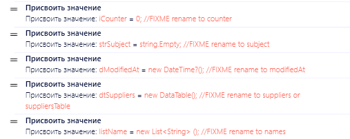
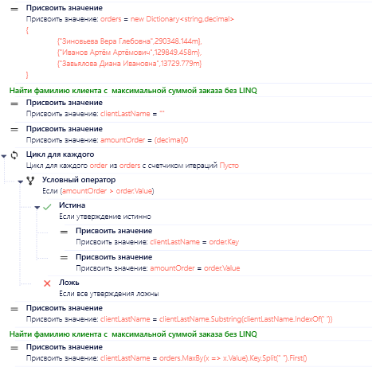
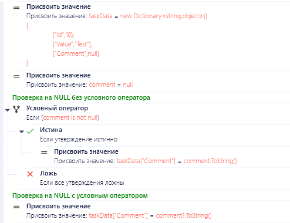

# PIX RPA Development Conventions & Best Practices

Стандартизированные соглашения и рекомендации для разработки роботов на платформе PIX RPA.  
Цель репозитория — обеспечить единый подход к проектированию, документированию и поддержке автоматизированных процессов.

## Зачем нужны соглашения и лучшие практики для PIX RPA?

Следование согласованным принципам и рекомендациям при разработке RPA-решений на платформе PIX обеспечивает ряд существенных преимуществ как для отдельных разработчиков, так и для команд. Применение описанных в данном документе подходов позволяет достичь следующих результатов:

**Улучшенная поддерживаемость:** `Четкая организация кода`,`Упрощение навигации по проекту`,`Быстрое понимание структуры новыми разработчиками`,`Упрощение рефакторинга`

**Повышенная надежность:** `Изолированные компоненты`,`Улучшенная обработка ошибок`,`Упрощение отладки`,`Снижение рисков при изменениях`

**Масштабируемость:** `Легкость добавления новых функций/скриптов`,`Упрощение интеграции с другими системами`,`Возможность параллельной разработки`

**Безопасность:** `Централизованное управление конфигурацией`,`Защита конфиденциальных данных`, `Контроль доступа к ресурсам`, `Улучшенное логирование`

**Эффективность разработки:** `Ускорение разработки новых роботов`,`Уменьшение дублирования кода`,`Упрощение тестирования`,`Снижение затрат на поддержку`

**Улучшенное качество:** `Стандартизированный подход`,`Улучшенная читаемость кода`,`Упрощение код-ревью`,`Снижение количества ошибок`

**Что включено в этот документ:**
- Соглашения по именованию (переменных, функций, проектов) для повышения читаемости кода
- Структура проекта: организация файлов и каталогов для удобства масштабирования
- Паттерны разработки и лучшие практики

**Практическая польза:**
- Упрощение onboarding новых разработчиков
- Снижение числа ошибок за счет унификации процессов
- Упрощение интеграции с метаданными и внешними системами
- Повышение эффективности командной работы

**Участвуйте в развитии!**  
Репозиторий открыт для предложений и доработок — создавайте Issues или Pull Requests, чтобы улучшить стандарты сообщества.

## В этой статье

- (NEW) [Соглашение об администрировании мастера] // В работе 
- [Соглашение о структуре проекта](#соглашение-о-структуре-проекта) //В работе, будет доп по другим шаблонам
- [Соглашение о Git](#соглашения-о-git)
- [Соглашение об именовании](#соглашение-об-именовании)
- [Соглашение о БД](#соглашение-о-бд)
- [Соглашение об очередях](#соглашение-об-очередях)
- [Соглашение о логировании](#соглашение-о-логировании)
- [Соглашение об исключениях](#соглашения-об-исключениях) //В работе
- [Рекомендации по написанию скриптов](#рекомендации-по-написанию-скриптов)
- (NEW) [Рекомендации о тестировании] //В работе

Стандарт скрипта необходим для поддержания удобочитаемости скрипта, согласованности и совместной работы в команде разработчиков. Скрипт, который соответствует отраслевым методикам и установленным рекомендациям, проще понимать, поддерживать и расширять. Большинство проектов применяют согласованный стиль с помощью соглашений о скрипте.

## Соглашение о структуре проекта

**Примечание:** В этом разделе речь идет в основном только о Unattended Robots и бизнес-процессах, подходящих под шаблон State Machine на транзакциях. Информация по другим шаблонам и Attended Robots будет добавлена позже. Все роботы работают в связке с PIX Master (Оркестратор).

<details>
    <summary><b>Разделение проекта на слои</b></summary>

Разделение проекта на слои - это архитектурный подход, при котором код организуется в логические группы (слои) в соответствии с их ответственностью. Это позволяет:
- Улучшить организацию кода
- Упростить поддержку и масштабирование
- Обеспечить четкое разделение ответственности
- Облегчить тестирование
- Повысить переиспользование кода

**Структура проекта:**
```console
├───Common (слой шаблонов и прочих файлов)
├───Helpers (слой независимых функций)
├───Infrastructure (слой работы с сервисами/интеграциями - может использоваться в разных State)
│   ├───DataBase (работа с бд)
│   ├───Mail (работа с почтой)
│   └───Http Client (работа с API сервиса)
├───States (слой состояний)
│   ├───Init
│   │   └───Transactions
│   ├───GetSetTransaction
│   │   └───Transactions
│   ├───Process
│   │   └───Transactions
│   └───EndProcess
└───Tests (слой тестов)
    ├───IntegrationTests
    └───UnitTests
```

**Описание слоев:**

1. **Common** - содержит общие компоненты проекта:
- Шаблоны документов
- Общие ресурсы

2. **Helpers** - включает вспомогательные функции:
- Утилиты для работы с данными
- Вспомогательные методы
- Общие алгоритмы

3. **Infrastructure** - слой для работы с внешними системами:
- Подключение к базам данных
- Работа с почтой
- Интеграции Http,SOAP Client

4. **States** - основной слой бизнес-логики:
- INIT - инициализация и подготовка
- GET/SET TRANSACTION - работа с транзакциями
- PROCESS - обработка данных
- END PROCESS - завершение работы

5. **Tests** - слой для тестирования:
- e2e тесты
- Интеграционные тесты
- Модульные тесты

**Преимущества разделения на слои:**
- Улучшенная организация кода и его навигация
- Упрощение поддержки и масштабирования
- Четкое разделение ответственности
- Упрощение тестирования
- Улучшение переиспользования кода

**[⬆ К началу статьи](#в-этой-статье)**

</details>

<details>
    <summary><b>Используйте шаблон на основе State Machine</b></summary>

[Список шаблонов](https://github.com/TheMrDJek/pix-templates)

**Преимущества использования State Machine:**
- Четкое разделение логики на состояния
- Упрощение отладки и мониторинга
- Возможность остановки и возобновления процесса
- Улучшенная обработка ошибок
- Масштабируемость решения

**[⬆ К началу статьи](#в-этой-статье)**

</details>

<details>
    <summary><b>Используйте слои по назначению</b></summary>

Робот должен состоять минимум из 3 основных состояний:

**Базовая структура (3 состояния):**
1. Init
2. ProcessTransaction
3. End Process

**Расширенная структура (4 состояния) для бизнес-процессов с транзакциями/циклами/коллекциями:**
1. Init
2. Get/Set Transaction
3. ProcessTransaction
4. End Process

**INIT**
---
Состояние INIT используется для инициализации робота, в этом блоке мы реализуем:
- Сброс ошибок
- Инициализация конфига
- Проверка доступов (доступ к бд, к папке, к api и так далее)
- Запуск и авторизация в приложение если мы работаем с UI
- Парсинг данных, если мы работаем не с очередями

**GET/SET TRANSACTION**
---
Состояние GET/SET TRANSACTION используется для получения транзакции* роботом, в этом
<br> блоке мы реализуем:</br>
- Получение транзакции
- Обработка сигнала стоп из мастера

транзакция в роботе* - минимальный набор данных для обработки сущностей/домена.

Например:
- Если робот обрабатывает очередь, то транзакцией будет - элемент очереди
- Если робот обрабатывает письма, то транзакцией будет - письмо
- Если робот обрабатывает папку с файлами, то транзакцией будет - файл

**PROCESSING TRANSACTION**
---
Состояние PROCESSING TRANSACTION используется для обработки транзакции роботом, в этом блоке мы реализуем:
- Обработка транзакции

**ВАЖНО:**
Не размазывайте бизнес логику связанную с транзакцией на другие состояние, 
если нужно отправить письмо, сохранить значения, отправить отчет по транзакции,
то все реализуем в этом состоянии и его ветках.

**END PROCESS**
---
Состояние END PROCESS используется для завершения робота, в этом блоке мы реализуем:
- Отключение соединений
- Закрытие приложений (если нужно, лучше оставлять по не закрытым что бы при <br>след запусках робота не тратить время на авторизацию и запуск самого приложения)
- Проверка ошибок
- Удаление временных папок

**ВАЖНО:**
Не игнорирейте ошибки, если у вас в каком то состоянии произошла системная ошибка робот должен завершиться с ошибкой

**Преимущества четкого разделения состояний:**
- Улучшенная читаемость кода
- Упрощение отладки
- Возможность повторного использования состояний
- Улучшенный контроль над процессом
- Упрощение тестирования

**[⬆ К началу статьи](#в-этой-статье)**

</details>

<details>
    <summary><b>Используйте ассеты мастера для хранения конфигурации</b></summary>

Конфиг должен быть реализован с учетом использование ассетов только из мастера.<br>
Заполнение конфига из других место увеличивает кол-во зависимостей, плюс может приводить к ошибкам.

Например:
- excel файл не доступен
- потеря соединения с бд

**Преимущества использования ассетов мастера:**
- Централизованное управление конфигурацией
- Упрощение развертывания
- Возможность быстрого изменения настроек
- Улучшенная безопасность
- Упрощение поддержки

**Входные параметры робота:**
- Помимо ассетов можно использовать входные параметры робота
- Все входные параметры имеют тип string
- Подходят для передачи динамических значений при запуске робота
- Не рекомендуется использовать для хранения конфигурационных данных

**Работа с контурами (Dev/UAT/Prod):**
- Ассеты с одинаковыми именами могут существовать в разных контурах
- При переносе робота между контурами значения в ассетах автоматически берутся из соответствующего оркестратора
- Это позволяет иметь разные настройки для разных окружений без изменения кода робота
- Важно поддерживать одинаковую структуру ассетов во всех контурах
- В рамках одного контура можно переопределять значения ассетов для разных агентов (например, для test и prod агентов)
- Переопределение значений происходит в настройках ассетов, где можно привязать конкретные значения к определенным роботам

**[⬆ К началу статьи](#в-этой-статье)**

</details>

<details>
    <summary><b>Используйте зашифрованные ассеты для хранения конфиденциальных данных</b></summary>

Конфиденциальные данные, такие как учетные записи, пароли, токены доступа и строки подключения должны храниться в специальных защищенных ассетах PIX Master.

**Типы ассетов для хранения конфиденциальных данных:**
- **Защищенные данные** - для хранения общей конфиденциальной информации
- **Учетные данные для авторизации** - специально для хранения логинов и паролей

**Преимущества использования защищенных ассетов:**
- Встроенное шифрование данных в хранилище
- Разграничение доступа на уровне мастера
- Снижение риска утечки конфиденциальной информации
- Централизованное управление учетными данными
- Возможность ротации учетных данных без изменения кода роботов
- Лог доступа к защищенным ассетам

**Примеры данных для хранения в защищенных ассетах:**
- Учетные данные для подключения к базам данных
- Пароли для доступа к внешним системам
- API-ключи и токены для внешних сервисов
- Сертификаты и ключи шифрования
- Данные для аутентификации в корпоративных системах
- Персональные данные сотрудников

**Последствия несоблюдения:**
- Хранение паролей в открытом виде в исходном коде или конфигурационных файлах
- Риск утечки конфиденциальной информации при доступе к репозиторию
- Сложности при необходимости регулярного обновления паролей
- Нарушение политик информационной безопасности
- Потенциальные проблемы при проверках и аудитах безопасности

**[⬆ К началу статьи](#в-этой-статье)**

</details>

<details>
    <summary><b>Храните шаблоны и прочие файлы в самом проекте робота</b></summary>

Не используйте сетевые, временные папки для хранения шаблонов. в PIX можно хранить подобные файлы в самом проекте робота


**Преимущества хранения файлов в проекте:**
- Упрощение развертывания
- Улучшенная версионность
- Отсутствие внешних зависимостей
- Упрощение миграции
- Улучшенная изоляция проекта

**[⬆ К началу статьи](#в-этой-статье)**

</details>

<details>
    <summary><b>Управление временными файлами</b></summary>

При работе с файлами в процессе выполнения роботов важно соблюдать правила хранения временных файлов для обеспечения стабильности и безопасности системы.

**Используйте системную временную директорию:**
- Всегда используйте системную папку Temp для временных файлов вместо жестко заданных путей
- Получайте путь к системной временной директории с помощью класса [Path](https://learn.microsoft.com/ru-ru/dotnet/api/system.io.path)
- Никогда не храните временные файлы внутри проекта робота или в корневых директориях дисков

**Рекомендации по работе с временными файлами:**
- Создавайте уникальные имена для временных файлов (используйте Guid)
- Обязательно удаляйте временные файлы после использования, после исключения или очищайте временные папки перед использованием
- Логируйте операции создания и удаления временных файлов **для отладки**

**Запрещенные практики:**
- Хранение временных файлов в проекте робота: `@"C:\Projects\MyBot\temp\file.xlsx"`
- Хардкодинг путей: `@"C:\Temp\file.xlsx"` или `@"D:\WorkFiles\temp.csv"`
- Использование локальных папок без проверки доступности: `@".\temp\file.xlsx"`
- Создание временных файлов без механизма их гарантированного удаления

**[⬆ К началу статьи](#в-этой-статье)**

</details>

<details>
    <summary><b>Избегайте использования общих библиотек с другими роботами</b></summary>

Использование общих Utils(кастомных) библиотек или скриптов с другими роботами приводит к зависимости робот друг от друга или других конфликтах

За частую если требуется внести изменения в библиотеку, то приходится вностить изменения в несколько роботов сразу, что приводит к увеличению трудозатрат и нарушению DRY.

В качестве решения, можно держать набор общих библитек, но после использования в проекте развивать отдельно в рамках одного проекта.

**Преимущества отказа от общих библиотек:**
- Независимость проектов
- Упрощение поддержки
- Отсутствие побочных эффектов при изменениях
- Улучшенная изоляция

**[⬆ К началу статьи](#в-этой-статье)**

</details>

## Соглашения о Git

Git — это основной инструмент для контроля версий при разработке роботов на PIX RPA. Правильная организация работы с Git существенно повышает эффективность как индивидуальной, так и командной разработки.

<details>
    <summary><b>Используйте осмысленные названия коммитов</b></summary>

Правильное название коммита должно описывать, что именно было изменено, и по возможности — почему. Это облегчает понимание истории проекта и упрощает откат изменений в будущем.

**Рекомендуемый формат:**
```
<тип>: <краткое описание изменений>

<подробное описание, если необходимо>
```

Типы коммитов:
- `feat`: новая функциональность
- `fix`: исправление ошибки
- `docs`: изменения в документации
- `style`: форматирование, отступы (не влияют на логику)
- `refactor`: рефакторинг кода без изменения функциональности
- `test`: добавление или изменение тестов
- `chore`: обновление внешних зависимостей, настройка сборки
- `wip`: промежуточная работа (Work In Progress) — для коммитов с частичной реализацией функциональности

**Примеры хороших названий коммитов:**
- `feat: добавлен модуль распознавания счетов-фактур`
- `fix: исправлена логика обработки транзакций при потере соединения`
- `refactor: оптимизирована выборка данных из БД для уменьшения потребления памяти`
- `docs: обновлена документация по настройке подключения к API`
- `wip: начата реализация парсера документов`
- `wip: добавлена часть логики Init`
- `feat: реализована валидация входных параметров в Init`
- `feat: добавлен модуль работы с API в Processing`

**Сценарии использования коммитов типа `wip` и `feat`:**

1. **Промежуточная работа (wip):**
   - Когда нужно сохранить прогресс, но функциональность еще не завершена
   - При реализации части большого блока (например, часть состояния Init)
   - Для сохранения работы в конце рабочего дня
   - Коммиты можно делать в личную ветку разработки

 **Рекомендации по коммитам промежуточной работы:**
- Стремитесь делать частые маленькие коммиты вместо редких больших
- Явно помечайте незавершенную работу префиксом `wip:`
- При командной разработке работайте с промежуточными коммитами в личных ветках
- Используйте `git rebase -i` перед слиянием в основную ветку для объединения промежуточных коммитов

2. **Завершенная функциональность (feat):**
   - Когда реализована законченная функция, даже если это часть большего блока
   - Если изменение можно протестировать отдельно
   - Такие коммиты подходят для отправки на ревью

**Сценарии использования других типов коммитов:**

3. **Исправление ошибок (fix):**
   - Устранение багов в существующей функциональности
   - Исправление некорректной логики обработки данных
   - Решение проблем совместимости или производительности
   - Примеры: `fix: исправлено зависание при отсутствии ответа от API`, `fix: устранена утечка памяти при обработке больших файлов`

4. **Документация (docs):**
   - Обновление или создание документации к роботу
   - Добавление комментариев к сложным участкам кода
   - Создание или обновление README, руководств пользователей, технических спецификаций
   - Примеры: `docs: создано руководство по настройке робота`, `docs: обновлено описание параметров конфигурации`

5. **Стиль (style):**
   - Форматирование кода без изменения его функциональности
   - Переименование переменных для большей понятности
   - Изменение отступов, пробелов, переносов строк
   - Примеры: `style: переформатирован код по стандартам проекта`, `style: улучшена читаемость скрипта обработки транзакций`

6. **Рефакторинг (refactor):**
   - Изменение структуры кода без изменения его функциональности
   - Оптимизация производительности существующего кода
   - Перенос логики между компонентами для лучшей архитектуры
   - Примеры: `refactor: оптимизирована обработка транзакций для повышения производительности`, `refactor: перенесены общие функции в Helper-компонент`

7. **Тестирование (test):**
   - Добавление или изменение тестов для существующего кода
   - Создание тестовых данных или сценариев
   - Настройка автоматизированного тестирования
   - Примеры: `test: добавлены тесты для валидации входных данных`, `test: созданы тестовые сценарии для обработки ошибочных ситуаций`

8. **Обслуживание (chore):**
   - Обновление внешних зависимостей или версий библиотек
   - Изменения в системе сборки или настройках проекта
   - Административные задачи, не влияющие напрямую на код
   - Примеры: `chore: обновлены настройки проекта`, `chore: изменена структура папок проекта`

</details>

<details>
    <summary><b>Следуйте стратегии ветвления</b></summary>

Для разработки RPA-проектов на PIX RPA с использованием Git рекомендуется следующая стратегия. Она поможет организовать ветки, коммиты и процессы так, чтобы команда легко ориентировалась в изменениях, особенно при работе с несколькими роботами.

**1. Стратегия веток (Branching Strategy)**

Используйте адаптированный GitFlow или GitHub Flow с акцентом на разделение по роботам:

| Тип ветки | Назначение | Пример имени ветки |
|-----------|------------|---------------------|
| `main` | Стабильная версия всех роботов (только релизные версии) | `main` |
| `develop` | Интеграционная ветка для текущей разработки | `develop` |
| `feature/{robot}/{task}` | Разработка нового робота или функционала существующего | `feature/InvoiceProcessing/ocr-update` |
| `fix/{robot}/{issue}` | Исправление бага в конкретном роботе | `fix/InvoiceProcessing/duplicate-entry` |
| `release/{robot}/{version}` | Подготовка к релизу робота (тестирование, документация) | `release/InvoiceProcessing/v1.2.0` |
| `hotfix/{robot}/{issue}` | Срочные исправления в релизной версии робота | `hotfix/InvoiceProcessing/login-error` |

**Модели ветвления:**

<details>
  <summary><b>GitFlow — для комплексных проектов с плановыми релизами</b></summary>

  

  **GitFlow** подходит для RPA-проектов со строгим циклом релизов. Эта модель предоставляет четкую структуру для управления разработкой, тестированием и выпуском новых версий роботов:
  
  - **master/main**: содержит только стабильные релизы роботов
  - **develop**: основная ветка разработки
  - **feature branches**: для разработки новых роботов/функций
  - **release branches**: для подготовки к релизу
  - **hotfix branches**: для срочных исправлений в релизной версии
  
  **Когда использовать GitFlow:**
  - Сложные роботы с долгосрочной поддержкой
  - Командная разработка с четкими ролями
  - Необходимость поддержки нескольких версий роботов
</details>

<details>
  <summary><b>GitHub Flow — для быстрой итеративной разработки</b></summary>

  

  **GitHub Flow** — более простая модель, ориентированная на непрерывную доставку и интеграцию. Этот подход хорошо подходит для RPA-проектов с частыми обновлениями:
  
  - **main**: всегда содержит рабочую версию, готовую к деплою
  - **change branches**: создаются для любых изменений (новые функции, исправления и т.д.)
  - После тестирования изменения сливаются напрямую в main
  
  **Когда использовать GitHub Flow:**
  - Небольшие роботы или быстрые изменения
  - Непрерывная доставка и деплой
  - Небольшие команды или индивидуальная разработка
</details>

**2. Именование веток**

Четко указывайте робота и задачу:
- Для разработки: `feature/InvoiceProcessing/add-email-trigger`
- Для исправлений: `fix/DataExtraction/column-missing`
- Для хотфиксов: `hotfix/ReportGenerator/date-format`

Избегайте общих названий вроде `fix-bug` или `update` — всегда уточняйте контекст.

**Привязка к задачам в Jira:**

Для улучшения отслеживания задач рекомендуется включать идентификатор задачи Jira в название ветки:

- `feature/InvoiceProcessing/RPA-56-api-integration`
- `fix/PayrollBot/RPA-128-incorrect-calculation`
- `hotfix/CustomerOnboarding/RPA-237-auth-error`
- `feature/common/RPA-84-excel-library`

При такой структуре:
- `RPA-56` - идентификатор задачи в Jira
- `InvoiceProcessing` - название робота
- `api-integration` - краткое описание задачи

Этот подход позволяет автоматически связывать коммиты с задачами в Jira и упрощает отслеживание прогресса.

**3. Процесс разработки**

**Для индивидуальной разработки (один разработчик):**
- Создайте ветку `feature/{robot}/{task}` из `develop`
- Разрабатывайте функционал с регулярными коммитами
- Создайте Pull Request в `develop` для самопроверки
- После завершения работы и тестирования, выполните слияние через Pull Request

**Для командной разработки:**
- Архитектор проекта создает ветку `develop` с базовой структурой роботов
- Разработчики создают ветки `feature/{robot}/{task}` для конкретных задач
- Слияние в `develop` выполняется через Pull Request после код-ревью
- Подготовка релиза осуществляется в ветке `release/{robot}/{version}`
- После тестирования релиз сливается в `main` и `develop`

**4. Управление релизами**

- Создавайте теги для релизов в формате `{robot}-v{MAJOR}.{MINOR}.{PATCH}`
- Документируйте изменения в CHANGELOG.md для каждого робота
- Для срочных исправлений создавайте ветки `hotfix/{robot}/{issue}` от `main`
- После исправления сливайте хотфикс в обе ветки: `main` и `develop`

**5. Особенности работы с несколькими роботами**

- Используйте префикс с именем робота во всех ветках (кроме `main` и `develop`)
- В сообщениях коммитов указывайте робота: `[InvoiceProcessing] feat: добавлен модуль OCR`
- Для общих компонентов используйте префикс `common`: `feature/common/api-client`
- Приоритизируйте изменения в общих компонентах, чтобы минимизировать конфликты

**Примеры workflow:**

1. **Разработка нового функционала:**
   ```
   develop → feature/InvoiceProcessing/add-validation → Pull Request → develop
   ```

2. **Релиз робота:**
   ```
   develop → release/InvoiceProcessing/v1.0.0 → тестирование → main (+ тег InvoiceProcessing-v1.0.0)
   ```

3. **Хотфикс производственной версии:**
   ```
   main → hotfix/InvoiceProcessing/fix-api-error → main и develop
   ```

**[⬆ К началу статьи](#в-этой-статье)**

</details>

<details>
    <summary><b>Используйте Pull/Merge Request для изменений</b></summary>

Даже работая в одиночку, используйте механизм Pull Request для внесения изменений в основные ветки. Это обеспечивает дополнительный уровень проверки и документирует внесенные изменения.

**Для индивидуальной разработки:**
- Создавайте PR для слияния функциональных веток в основную
- Используйте PR как механизм самопроверки
- Документируйте ключевые решения в описании PR

**Для командной разработки:**
- Обязательно используйте PR для всех изменений в основных ветках
- Назначайте необходимых ревьюеров для каждого PR
- Приводите контекст задачи и список внесенных изменений

**Рекомендации для эффективных PR:**
**Описывайте контекст изменений**:
- Что было сделано и почему
- Как тестировалось
- Связанные задачи или проблемы

**Делайте небольшие PR**:
- Проще для проверки
- Снижение конфликтов слияния
- Быстрее получение обратной связи

**Используйте чек-листы** для отслеживания прогресса

**Рекомендации для ревью кода:**
- Сосредотачивайтесь на логике и архитектуре, а не на форматировании
- Используйте конструктивные комментарии
- Проверяйте обработку исключений и крайних случаев
- Обращайте внимание на производительность для операций с большими данными

**[⬆ К началу статьи](#в-этой-статье)**

</details>

<details>
    <summary><b>Настройте .gitignore для PIX-проектов</b></summary>

Правильная настройка .gitignore предотвращает попадание в репозиторий временных, автоматически генерируемых и конфиденциальных файлов.

**Типичные элементы .gitignore для PIX RPA проектов:**

```gitignore
# Папки для временных файлов
[Tt]emp/
[Ll]ogs/
[Tt]estResults/

# Файлы с данными для тестирования
test_data/
sample_files/
```

**Рекомендации по настройке .gitignore:**
- Адаптируйте базовый шаблон под конкретный проект
- Добавляйте новые правила по мере необходимости
- Избегайте слишком общих правил, которые могут исключить нужные файлы
- Проверяйте, что все конфиденциальные данные исключены из репозитория

**[⬆ К началу статьи](#в-этой-статье)**

</details>

<details>
    <summary><b>Не коммитьте конфиденциальные данные</b></summary>

Никогда не коммитьте в репозиторий:
- Пароли, токены и учетные данные
- Приватные ключи и сертификаты
- Локальные конфигурационные файлы с чувствительными данными
- Временные и логи-файлы
- Тестовые данные с конфиденциальной информацией

**Что делать, если конфиденциальные данные случайно попали в репозиторий:**
1. Немедленно измените все скомпрометированные учетные данные
2. Используйте `git filter-branch` или BFG Repo-Cleaner для удаления данных из истории
3. Создайте новую историю и используйте `git push --force`
4. Обновите .gitignore, чтобы предотвратить повторение ситуации

**[⬆ К началу статьи](#в-этой-статье)**

</details>

<details>
    <summary><b>Документируйте изменения для релизов (Скорее всего на удаление, возможно избыточно)</b></summary>

Поддержание актуальной документации об изменениях (changelog) упрощает отслеживание внесенных модификаций и планирование развертывания.

**Рекомендации по ведению changelog:**
1. **Форматирование**: используйте стандартизированный формат (например, [Keep a Changelog](https://keepachangelog.com/))
2. **Версионирование**: следуйте Semantic Versioning (MAJOR.MINOR.PATCH)
3. **Группировка изменений** по типам:
- Added (добавлено)
- Changed (изменено)
- Deprecated (устарело)
- Removed (удалено)
- Fixed (исправлено)
- Security (безопасность)

**Пример структуры CHANGELOG.md:**
```markdown
# История изменений

## [1.2.0] - 2023-06-15
### Добавлено
- Поддержка нового формата счетов от поставщика XYZ
- Автоматическая проверка дубликатов документов

### Изменено
- Оптимизирован процесс обработки транзакций для повышения скорости

### Исправлено
- Корректное закрытие соединений с базой данных при возникновении ошибок
- Обработка случаев с отсутствующими датами в документах

## [1.1.0] - 2023-05-10
### Добавлено
...
```

**Интеграция changelog с процессом разработки:**
- Обновляйте changelog при подготовке Pull Request
- Включайте обновление changelog как часть проверки при ревью
- Используйте автоматизированные инструменты для генерации changelog на основе коммитов

**[⬆ К началу статьи](#в-этой-статье)**

</details>

<details>
    <summary><b>Используйте тегирование для версий (Скорее всего на удаление, возможно избыточно)</b></summary>

Тегирование в Git позволяет отмечать важные точки в истории проекта, такие как релизы или значимые обновления.

**Рекомендации по тегированию:**
1. **Форматирование тегов:**
   - Используйте семантическое версионирование: `v1.0.0`, `v2.3.1`
   - Для релиз-кандидатов: `v1.0.0-rc.1`, `v1.0.0-rc.2`
   - Для бета-версий: `v1.0.0-beta`

2. **Аннотированные теги** предпочтительнее легких:
   ```
   git tag -a v1.0.0 -m "Релиз версии 1.0.0"
   ```

3. **Включайте информативное сообщение** с описанием основных изменений

4. **Синхронизируйте теги с удаленным репозиторием:**
   ```
   git push origin v1.0.0
   ```
   или для всех тегов:
   ```
   git push origin --tags
   ```

5. **Связывайте теги с релизами** в вашей системе управления проектами

**Процесс создания новой версии:**
1. Обновите номер версии в проекте
2. Обновите changelog
3. Создайте коммит с изменениями версии
4. Создайте тег для новой версии
5. Отправьте изменения и тег в репозиторий
6. Создайте релиз в системе управления проектами

**[⬆ К началу статьи](#в-этой-статье)**

</details>

<details>
    <summary><b> (МОЖНО) Используйте вкладку "Проекты" в PIX Master для контроля версий</b></summary>

Помимо системы контроля версий Git, PIX RPA предоставляет встроенный механизм версионирования через вкладку "Проекты" в PIX Master.

**Преимущества использования вкладки "Проекты":**
- Нативная интеграция с платформой PIX RPA
- Не требует дополнительной настройки Git и хостинга репозиториев
- Упрощенный процесс сохранения и возврата к предыдущим версиям
- Доступно всем пользователям без необходимости обучения работе с Git

**Сценарии использования:**
1. **Быстрая разработка** небольших роботов одним разработчиком
2. **Создание контрольных точек** перед значительными изменениями
3. **Командная разработка** при ограниченном доступе к системам контроля версий
4. **Резервное копирование** проектов параллельно с Git

**Рекомендации по использованию:**
1. **Создавайте новую версию** после каждого значимого изменения
2. **Добавляйте описательные комментарии** к версиям для отслеживания изменений
3. **Следуйте стандартам именования** версий (например, семантическое версионирование)
4. **Периодически экспортируйте** проекты для резервного копирования

**Ограничения по сравнению с Git:**
- Отсутствие механизма веток для параллельной разработки
- Ограниченный контроль конфликтов при слиянии изменений
- Нет инструментов для профессионального код-ревью

**Рекомендации для гибридного подхода:**
Для оптимального управления версиями рассмотрите комбинирование Git и встроенного механизма версионирования PIX Master:
1. Используйте Git для полноценного контроля версий и командной разработки
2. Применяйте вкладку "Проекты" для быстрых контрольных точек и резервного копирования
3. Экспортируйте критически важные версии из PIX Master и сохраняйте их в Git-репозитории

**[⬆ К началу статьи](#в-этой-статье)**

</details>

## Соглашение об именовании

Единые соглашения об именовании в проектах PIX RPA значительно упрощают разработку, поддержку и взаимодействие между членами команды. Правильное именование компонентов помогает быстрее понимать код и снижает количество ошибок.

<details>
    <summary><b>Используйте PascalCasing для параметров скриптов</b></summary>

Используйте регистр Pascal Case (первая буква каждого слова заглавная, без разделителей) при именовании параметров скрипта. Добавляйте соответствующие префиксы для обозначения типа параметра:

- `In_` для входных параметров (например, `In_CustomerId`)
- `Out_` для выходных параметров (например, `Out_ProcessingResult`)
- `InOut_` для параметров, которые являются одновременно входными и выходными (например, `InOut_TransactionStatus`)

**[⬆ К началу статьи](#в-этой-статье)**

</details>

<details>
    <summary><b>Используйте camelCasing для локальных переменных</b></summary>

Используйте регистр camel Case (первая буква строчная, первые буквы следующих слов заглавные) при именовании локальных переменных в скриптах.

**Преимущества:**
- Визуальное отличие локальных переменных от параметров скрипта
- Соответствие общепринятым стандартам C#
- Улучшенная читаемость и структурированность кода

**Последствия несоблюдения:**
- Смешение стилей затрудняет понимание области видимости переменных
- Снижение читаемости кода
- Усложнение поддержки и модификации существующего кода


**[⬆ К началу статьи](#в-этой-статье)**

</details>

<details>
    <summary><b>Используйте осмысленные и информативные имена</b></summary>

Всегда давайте переменным, параметрам и функциям имена, которые ясно отражают их назначение и контекст использования.

**Хорошие примеры:**
- `customerInvoiceFilePath` вместо просто `path`
- `isTransactionCompleted` вместо `flag` или `status`
- `employeeCount` вместо `num` или `n`

**Последствия использования абстрактных имен:**
- Снижение читаемости кода
- Увеличение времени на анализ и понимание логики
- Повышение риска ошибок при использовании переменных
- Затруднение отладки и поддержки

**Исключения:** 
Для индексов в коротких циклах допустимо использовать однобуквенные переменные (`i`, `j`, `k`), но только в рамках локального контекста и небольших блоков кода. Никогда не используйте такие переменные как параметры скриптов.


**[⬆ К началу статьи](#в-этой-статье)**

</details>

<details>
    <summary><b>Соблюдайте конвенции нейминга языка и компании</b></summary>

Придерживайтесь общепринятых правил именования в C# и соглашений, принятых в вашей компании. Это обеспечивает преемственность и совместимость с существующими проектами и библиотеками.

**Преимущества:**
- Сокращение времени на адаптацию новых разработчиков
- Единообразие кодовой базы

**Последствия несоблюдения:**
- Рассогласованность в кодовой базе
- Увеличение времени на обучение новых членов команды
- Увеличение времени на передачу проекта другому сотрудники или команде поддержки

Ссылки на официальные руководства:
- [Правила и соглашения об именовании C#](https://learn.microsoft.com/ru-ru/dotnet/csharp/fundamentals/coding-style/identifier-names)

**[⬆ К началу статьи](#в-этой-статье)**

</details>

<details>
    <summary><b>Используйте устоявшиеся термины для общих понятий</b></summary>

Выбирайте один термин для обозначения каждого понятия и придерживайтеся его во всем проекте. Избегайте использования синонимов, которые могут вызвать путаницу.

**Примеры стандартизации терминов:**
- Поставщик: использовать `supplier` (а не provider, vendor, contractor)
- Заказчик: использовать `customer` (а не client, consumer)
- Цена: использовать `price` (а не rate, cost, pricing, worth)
- Объем: использовать `volume` (а не amount, size, bulk, quantity)
- Склад: использовать `warehouse` (а не storage, store, storehouse)

**Преимущества:**
- Единообразие терминологии во всем проекте
- Снижение когнитивной нагрузки при чтении кода
- Улучшение понимания предметной области

**Последствия несоблюдения:**
- Путаница в терминологии
- Сложности при коммуникации в команде

**[⬆ К началу статьи](#в-этой-статье)**

</details>

<details>
    <summary><b>Не используйте кириллицу в именах</b></summary>

Используйте только ASCII-символы (латиницу) для имен переменных, функций и параметров.

**Преимущества:**
- Совместимость со всеми средами разработки и системами контроля версий
- Соответствие индустриальным стандартам
- Отсутствие проблем с кодировками

**Последствия использования кириллицы:**
- Возможные ошибки кодировки в различных средах


**[⬆ К началу статьи](#в-этой-статье)**

</details>

<details>
    <summary><b>Избегайте венгерской нотации</b></summary>

Венгерская нотация (добавление префикса типа к имени переменной) избыточна в современных средах разработки с поддержкой типизации и подсказок IDE.

**Примеры:**
- Не используйте: `strName`, `intAge`, `boolIsActive`
- Используйте: `name`, `age`, `isActive`

**Преимущества отказа от венгерской нотации:**
- Более чистый и читаемый код
- Легкость рефакторинга при изменении типа переменной
- Соответствие современным практикам разработки

**Последствия использования венгерской нотации:**
- Избыточность информации
- Сложности при изменении типов данных



**[⬆ К началу статьи](#в-этой-статье)**

</details>

<details>
    <summary><b>Избегайте избыточных названий</b></summary>

Не дублируйте информацию, которая уже очевидна из контекста или типа переменной.

**Преимущества лаконичных имен:**
- Более компактный и читаемый код
- Сокращение визуального шума
- Фокус на смысловой составляющей имени

**Последствия избыточности:**
- Увеличение длины кода без добавления ценности
- Снижение читаемости
- Потеря внимания к действительно важным аспектам кода


**[⬆ К началу статьи](#в-этой-статье)**

</details>

<details>
    <summary><b>Используйте контекстуально понятные имена</b></summary>

Контекст использования переменной должен быть очевиден из её имени. Избегайте общих терминов без уточнения.

**Примеры улучшения контекста:**
- `filePath` вместо просто `path`
- `invoiceStatus` вместо просто `status`
- `paymentMethod` вместо просто `method`
- `customerEmail` вместо просто `email`
- `documentCreationDate` вместо просто `date`
- `orderConfirmationMessage` вместо просто `message`
- `employeeFirstName` вместо просто `name`
- `transactionAmount` вместо просто `value`
- `errorMessageText` вместо просто `text`
- `invoiceDownloadUrl` вместо просто `url`

**Преимущества контекстуальных имен:**
- Ясность назначения и использования переменной
- Уменьшение зависимости от комментариев
- Снижение когнитивной нагрузки при чтении кода

**Последствия отсутствия контекста:**
- Необходимость постоянно держать в уме контекст использования переменной
- Сложности при рефакторинге
- Увеличение вероятности ошибок при использовании


**[⬆ К началу статьи](#в-этой-статье)**

</details>

<details>
    <summary><b>Избегайте абстрактных названий</b></summary>

Название переменной должно ясно передавать её назначение и ожидаемые значения, а не просто обозначать действие.

**Примеры:**
- `isEmailValid` вместо `checkEmail`
- `hasAttachments` вместо `checkAttachments`
- `isAuthorized` вместо `authorizationCheck`
- `canUserEdit` вместо `verifyEditPermission`
- `isAccountActive` вместо `accountStatusCheck`
- `hasUnreadMessages` вместо `checkMessages`
- `isFileUploaded` вместо `uploadFileStatus`
- `areCredentialsValid` вместо `validateCredentials`
- `isRequestSuccessful` вместо `requestResult`
- `hasExpired` вместо `expirationCheck`

**Преимущества конкретных имен:**
- Однозначность в понимании ожидаемого результата
- Возможность использования переменной в условных выражениях без дополнительных пояснений
- Самодокументирующийся код

**Последствия абстрактных названий:**
- Неоднозначность в интерпретации значений
- Необходимость изучения реализации для понимания назначения
- Повышенный риск неправильного использования


**[⬆ К началу статьи](#в-этой-статье)**

</details>

<details>
    <summary><b>Избегайте отрицательных переменных</b></summary>

Логические переменные с отрицанием в названии затрудняют понимание условных выражений и повышают вероятность ошибок.

**Примеры:**
- Используйте `isValid` вместо `isNotInvalid`
- Используйте `isCompleted` вместо `isNotPending`
- Используйте `hasAccess` вместо `isNotForbidden`
- Используйте `isEnabled` вместо `isNotDisabled`
- Используйте `isAvailable` вместо `isNotUnavailable`
- Используйте `isIncluded` вместо `isNotExcluded`
- Используйте `isApproved` вместо `isNotRejected`
- Используйте `isEmpty` вместо `isNotFilled`
- Используйте `canProceed` вместо `isNotBlocked`
- Используйте `isAllowed` вместо `isNotProhibited`

**Преимущества позитивных формулировок:**
- Интуитивно понятные условные выражения
- Снижение когнитивной нагрузки при чтении кода
- Уменьшение вероятности логических ошибок в условиях

**Последствия использования отрицаний:**
- Запутанные условные выражения с двойным отрицанием
- Повышенная вероятность ошибок при изменении условий
- Сложности при чтении и понимании логики


**[⬆ К началу статьи](#в-этой-статье)**

</details>

## Соглашение о БД

Правильный подход к работе с базами данных в PIX RPA проектах позволяет значительно повысить производительность роботов, уменьшить потребление ресурсов и сделать решения более надежными.

<details>
    <summary><b>Используйте Bulk запросы</b></summary>

Для добавления или обновления большого количества записей в БД используйте bulk операции вместо циклов с одиночными запросами.

**Преимущества Bulk запросов:**
- Только один запрос к базе данных вместо множества одиночных
- Существенное ускорение операций с большими наборами данных
- Снижение нагрузки на сеть и СУБД
- Сокращение ресурсов, необходимых для транзакций

**Пример сравнения производительности:**

|Кол-во записей|Обычный запрос (Insert)|Bulk-запрос (bulk insert)|Ускорение|
|-:|:-:|:-:|:-:|
|100|2 мс|1,9 мс|~5%|
|1 000|18 мс|8 мс|~125%|
|10 000|203 мс|76 мс|~167%|
|100 000|2,13 с|742 мс|~187%|
|1 000 000|21,56 с|8,3 с|~160%|

*Тестовая таблица содержит 6 столбцов (Guid, string x2, int, decimal?, DateTime)*  
*Конфигурация тестового окружения:*
- CPU INTEL i7-10510U с частотой 2,30 ГГц
- RAM DDR3 16 ГБ
- SSD SAMSUNG 512 ГБ

**[⬆ К началу статьи](#в-этой-статье)**

</details>

<details>
    <summary><b>Выполняйте фильтрацию в SQL-запросах, а не в коде</b></summary>

Всегда переносите логику фильтрации данных в SQL-запросы вместо загрузки всего набора данных и последующей фильтрации в коде.

**Преимущества фильтрации на уровне SQL:**
- Значительное снижение объема передаваемых данных
- Меньшее потребление оперативной памяти
- Использование оптимизированных механизмов БД для обработки данных
- Повышение скорости выполнения операций

**[⬆ К началу статьи](#в-этой-статье)**

</details>

<details>
    <summary><b>Избегайте создания хранимых процедур в БД</b></summary>

В проектах PIX RPA рекомендуется избегать создания хранимых процедур и размещать всю логику работы с данными в коде робота.

**Преимущества отказа от хранимых процедур:**
- Полный контроль логики внутри робота
- Упрощение процесса разработки и отладки
- Снижение зависимости от администраторов БД при внесении изменений
- Возможность легкого переноса логики между средами
- Улучшение версионирования кода (вся логика в одном репозитории)
- Упрощение управления доступами (не требуются права на создание объектов в БД)

**Когда можно использовать хранимые процедуры:**
- При наличии централизованной бизнес-логики, используемой несколькими системами
- Когда требуется сложная обработка с минимальной передачей данных
- Если существуют строгие требования безопасности к прямому доступу к таблицам

**[⬆ К началу статьи](#в-этой-статье)**

</details>

<details>
    <summary><b>Корректно работайте с NULL и пустыми строками</b></summary>

При работе с базами данных важно понимать разницу между NULL и пустой строкой ('') и использовать их в соответствии с бизнес-логикой.

**Основные принципы:**
- **NULL** используется, когда значение отсутствует или неизвестно
- **Пустая строка ('')** используется, когда значение известно, но пусто

**Примеры правильного использования:**

1. **Использование NULL:**
- Необязательное поле не заполнено пользователем
- Данные еще не получены или не обработаны
- Значение не существует в контексте записи

2. **Использование пустой строки (''):**
- Поле было заполнено, но содержит пустое значение
- Результат обработки или распознавания был пустым
- Пользователь явно оставил поле пустым (не NULL)

**Типичные ошибки:**
- Сравнение с NULL через оператор "==" вместо IS NULL в SQL
- Использование пустой строки для представления отсутствующих данных
- Неправильная обработка NULL в условиях и проверках

**[⬆ К началу статьи](#в-этой-статье)**

</details>

## Соглашение об очередях

Очереди в PIX Master — это мощный инструмент для организации параллельной обработки данных и масштабирования роботов. Правильное использование очередей значительно повышает отказоустойчивость и эффективность автоматизации.

**Основные принципы работы с очередями:**
- Очереди позволяют распределять нагрузку между несколькими экземплярами роботов
- Элементы очереди сохраняют состояние между запусками роботов
- Возможность обработки исключений и повторного запуска проблемных элементов

<details>
    <summary><b>Понимайте особенности очередей в PIX Master</b></summary>

В PIX Master реализован единый тип очередей, который хранится в базе данных:
- Доступны через API и активности робота
- Поддерживают операции мониторинга и аналитики
- Обеспечивают согласованное состояние между различными экземплярами роботов

**Преимущества очередей в PIX Master:**
- Централизованное управление данными для обработки
- Встроенная отказоустойчивость и механизмы восстановления
- Поддержка параллельной обработки несколькими роботами
- Возможность мониторинга и аналитики процессов обработки

**[⬆ К началу статьи](#в-этой-статье)**

</details>

<details>
    <summary><b>Выбирайте оптимальный формат данных для элементов очереди</b></summary>

В PIX Master данные в элементах очереди можно хранить в различных форматах, каждый из которых имеет свои преимущества и ограничения:

1. **Dictionary (C#):**
- **Рекомендуемый формат** для большинства сценариев в PIX RPA
- Подходит для коллекций ключ-значение с простой структурой
- Обеспечивает быстрый и простой доступ к данным по ключу
- Не требует сложной сериализации/десериализации
- Работает "из коробки" без дополнительных библиотек

2. **DataTable (C#):**
- Оптимален для табличных данных с чёткой структурой строк и столбцов
- Удобен для обработки больших наборов однотипных записей
- Предоставляет встроенные методы для фильтрации и обработки данных
- Эффективен при работе с данными из баз данных и Excel
- Хорошо поддерживается стандартными активностями PIX RPA

3. **JSON-строки:**
- Подходит для обмена данными с внешними системами
- Поддерживает текстовое представление данных
- **Ограничения в PIX RPA:**
    - Сложности с парсингом и созданием вложенных структур без пользовательских классов
    - Рекомендуется использовать только для простых структур
    - Для сложных данных предпочтительнее Dictionary или DataTable

**Рекомендации по выбору формата в PIX RPA:**
- Используйте **Dictionary** как основной формат для большинства сценариев
- Применяйте **DataTable** для табличных данных и при работе с Excel/базами данных
- Используйте **JSON** только для простых структур или когда требуется совместимость с внешними системами
- Избегайте сложных вложенных JSON-структур из-за ограничений парсинга в PIX RPA

**[⬆ К началу статьи](#в-этой-статье)**

</details>

<details>
    <summary><b>Обновляйте статус элементов очереди в правильном порядке</b></summary>

Элементы очереди обновляйте в последнюю очередь, после того как все данные сохранены и обработка транзакции полностью завершена.

**Преимущества:**
- Предотвращение потери данных в случае сбоя системы
- Обеспечение целостности данных
- Упрощение восстановления после сбоев

**Последствия несоблюдения:**
- Риск пометить элемент как обработанный до завершения всех связанных операций
- Сложности при восстановлении после сбоев
- Возможность создания дубликатов и потери данных

**Правильный порядок действий:**
1. Получение элемента из очереди (статус "В обработке")
2. Полная обработка данных и сохранение результатов в целевые системы
3. Проверка успешности всех операций
4. Обновление статуса элемента очереди ("Успешно" или "Ошибка")

**[⬆ К началу статьи](#в-этой-статье)**

</details>

<details>
    <summary><b>Используйте информативные сообщения в статусах очередей</b></summary>

Статусы элементов очереди должны содержать краткую, но информативную информацию о состоянии обработки. В случае ошибки добавляйте ключевую информацию об ошибке.

**Пример информативных сообщений:**
- "Счет успешно создан: INV-12345"
- "Ошибка обработки: данные клиента не найдены"
- "Отложено: ожидание подтверждения от системы XYZ"

**Преимущества:**
- Упрощение мониторинга и анализа производительности
- Ускорение диагностики проблем
- Облегчение ручной обработки исключений

**Структура информативного сообщения об ошибке:**
1. Краткое описание ошибки (1-2 слова)
2. Контекст операции
3. Ключевая информация для исправления (если применимо)

**Пример:** "Ошибка API: создание клиента. Код 403: недостаточно прав"

**[⬆ К началу статьи](#в-этой-статье)**

</details>

<details>
    <summary><b>Правильно обрабатывайте повторные попытки (retry)</b></summary>

Механизм повторных попыток позволяет роботам эффективно справляться с временными сбоями.

**Рекомендации:**
- Используйте встроенный механизм повторных попыток в оркестраторе
- Чётко разделяйте временные и постоянные ошибки
- Устанавливайте разумное количество повторных попыток (обычно 3-5)
- Используйте экспоненциальную задержку между попытками

**Временные ошибки (подходят для retry):**
- Сетевые таймауты
- Временная недоступность API
- Блокировки в базе данных
- Кратковременные сбои в работе внешних систем

**Постоянные ошибки (не подходят для retry):**
- Отсутствие необходимых данных
- Неверный формат входных данных
- Ошибки авторизации и доступа
- Логические ошибки в данных

**[⬆ К началу статьи](#в-этой-статье)**

</details>

<details>
    <summary><b>Используйте транзакционный подход при работе с очередями (В работе)</b></summary>

Обработка элементов очереди должна следовать транзакционному подходу для обеспечения целостности данных.

**Основные принципы:**
- Каждый элемент очереди обрабатывается как атомарная транзакция
- В случае сбоя вся транзакция откатывается (если возможно) или регистрируется для ручной обработки
- Статус элемента очереди отражает статус всей транзакции

**Рекомендации:**
- Используйте паттерн "Сохранение данных → Обновление очереди"
- В случае сбоя при сохранении данных, не обновляйте статус элемента очереди
- Сохраняйте контрольные точки для сложных многошаговых процессов
- Реализуйте механизм компенсации для отката частично выполненных операций

**Преимущества транзакционного подхода:**
- Гарантия целостности данных между системами
- Предотвращение дублирования или потери данных
- Упрощение восстановления после сбоев
- Повышение надежности системы в целом

**[⬆ К началу статьи](#в-этой-статье)**

</details>

## Соглашение о логировании

Эффективное логирование - ключевой элемент успешного выполнения и сопровождения RPA-роботов. В PIX RPA часть информации логируется автоматически, но правильная настройка пользовательского логирования существенно упрощает отладку, мониторинг и поддержку роботов.

**Основные цели логирования в RPA-проектах:**
- **Диагностика проблем** — быстрое определение причин сбоев
- **Мониторинг производительности** — анализ времени выполнения процессов
- **Аудит действий** — отслеживание критичных бизнес-операций
- **Сбор метрик** — данные для оптимизации процессов

**Что не следует логировать:**
- Информацию, которая уже логируется платформой PIX RPA автоматически
- Конфиденциальные данные (пароли, персональные данные, коммерческую информацию)
- Избыточную информацию, создающую "информационный шум"
- Полные стеки вызовов в часто повторяющихся операциях

<details>
    <summary><b>Логируйте прогресс обработки (В работе)</b></summary>

При обработке массивов данных важно логировать текущий прогресс для понимания состояния выполнения и оценки оставшегося времени.

**Рекомендации:**
- Для крупных массивов (более 100 элементов) логируйте прогресс в процентах (10%, 20%, ...)
- Используйте формат "обработано X из Y элементов" для большей информативности
- Логируйте через равные интервалы (например, каждые 10% или 100 элементов)
- Избегайте слишком частого логирования при небольших объемах данных


**Пример: //Пока пример на C# будут примеры скриптов**
```csharp
// Эффективное логирование прогресса
var totalItems = dataTable.Rows.Count;
var logStep = Math.Max(1, totalItems / 10); // Логируем каждые 10%

for (int i = 0; i < totalItems; i++)
{
    // Обработка элемента
    ProcessItem(dataTable.Rows[i]);
    
    // Логирование прогресса с интервалами
    if (i % logStep == 0 || i == totalItems - 1)
    {
        var percentage = (int)Math.Round((double)(i + 1) / totalItems * 100);
        Logger.Info($"Прогресс обработки: {percentage}% ({i + 1} из {totalItems})");
    }
}
```

**[⬆ К началу статьи](#в-этой-статье)**

</details>

<details>
    <summary><b>Правильно логируйте исключения (В работе)</b></summary>

Исключения должны логироваться так, чтобы содержать достаточно информации для диагностики, но не создавать избыточных записей.

**Рекомендации:**
- Логируйте контекст, в котором произошла ошибка (идентификатор транзакции, этап процесса)
- Включайте сообщение и тип исключения, а также ключевую информацию из внутренних исключений
- Не дублируйте информацию, которая уже логируется платформой PIX RPA
- Избегайте логирования полных трейсов исключений элементы очередей мастера

**Пример эффективного логирования исключений://Пока пример на C# будут примеры скриптов**
```csharp
try
{
    // Код, который может вызвать исключение
    ProcessInvoice(invoiceId);
}
catch (Exception ex)
{
    // Логируем с контекстом, но без полного стека вызовов
    var innerMsg = ex.InnerException != null ? $" Внутренняя ошибка: {ex.InnerException.Message}" : "";
    Logger.Error($"Ошибка при обработке счета {invoiceId}. Тип: {ex.GetType().Name}. Сообщение: {ex.Message}.{innerMsg}");
    
    // Перебрасываем исключение для обработки на более высоком уровне
    throw;
}
```

**[⬆ К началу статьи](#в-этой-статье)**

</details>

<details>
    <summary><b>Используйте подходящие уровни логирования</b></summary>

В PIX RPA фактические уровни логирования смещены относительно традиционных из-за того, что начало и конец выполнения скриптов автоматически логируются на уровне INFO.

**Важно**: Из-за особенностей логирования в PIX RPA стандартная иерархия уровней смещается:
- **ERROR** сохраняет своё предназначение
- **WARNING** фактически соответствует уровню INFO в традиционном понимании 
- **INFO** фактически соответствует уровню DEBUG в традиционном понимании
- Уровни **DEBUG** и **TRACE** в production практически не используются

**Рекомендуемые уровни в PIX RPA:**
- **ERROR** — критические ошибки, требующие вмешательства или прерывающие выполнение
- **WARNING** — важные бизнес-события и ключевые этапы процесса (используйте для значимой информации)
- **INFO** — детальная техническая информация, промежуточные этапы и диагностические сообщения
- **DEBUG** — очень подробная отладочная информация (не используйте в production)

**Особенности использования уровней в PIX RPA:**
- Поскольку системная информация уже логируется на уровне INFO, используйте для своих значимых сообщений уровень WARNING
- Для диагностических и детальных сообщений используйте уровень INFO
- В production среде обычно настраивается просмотр только уровней ERROR и WARNING
- Уровень INFO включайте только при детальной диагностике проблем

**Типичные сценарии использования:**
- **ERROR**: "Не удалось подключиться к API после 3 попыток", "Транзакция отклонена: недостаточно средств"
- **WARNING**: "Успешно обработана транзакция #12345", "Загружено 100 записей из БД", "Полностью сформирован пакет документов"
- **INFO**: "Начата обработка элемента #42", "Параметры запроса к API: {параметры}", "Результат проверки формата: допустимый"
- **DEBUG**: Крайне детальная информация о внутренних операциях (практически не используется)

**[⬆ К началу статьи](#в-этой-статье)**

</details>

<details>
    <summary><b>Избегайте избыточного логирования</b></summary>

Избыточное логирование создает "информационный шум" и усложняет анализ логов.

**Не рекомендуется логировать:**
- События начала и конца скриптов (PIX RPA уже логирует эту информацию)
- Техническую информацию о вызовах методов без бизнес-контекста
- Подробности каждой итерации в цикле (кроме прогресса)
- Успешные стандартные операции, которые редко вызывают проблемы

**[⬆ К началу статьи](#в-этой-статье)**

</details>

<details>
    <summary><b>Логируйте метрики производительности (если нужно собирать метрики внутри робота)</b></summary>

Для оптимизации роботов важно собирать данные о времени выполнения ключевых операций.

**Рекомендации:**
- Измеряйте и логируйте время выполнения длительных операций
- Отслеживайте количественные показатели (обработано документов, ошибок и т.д.)
- Используйте консистентный формат для упрощения автоматизированного анализа

**[⬆ К началу статьи](#в-этой-статье)**

</details>

<details>
    <summary><b>Защищайте конфиденциальные данные</b></summary>

Особое внимание необходимо уделять защите конфиденциальной информации при логировании.

**Никогда не логируйте:**
- Пароли и ключи доступа
- Полные номера кредитных карт (можно только последние 4 цифры)
- Персональные данные (ФИО, даты рождения, адреса)
- Медицинскую информацию и другие защищаемые законом данные
- Коммерческую тайну и внутреннюю информацию компании

**Методы защиты чувствительных данных:**
- Маскирование: `"Номер карты: ****1234"`
- Хеширование: `"Клиент: " + GetHashValue(customerData)`
- Сокращение: `"Email: j***@example.com"`

**[⬆ К началу статьи](#в-этой-статье)**

</details>

## Соглашение об исключениях

Правильная обработка исключений — ключевой аспект разработки надежных роботов в PIX RPA. Грамотный подход к исключениям позволяет создавать устойчивые решения и упрощает диагностику проблем.

**Основные принципы работы с исключениями в PIX RPA:**
- Исключения следует использовать только для обработки исключительных (непредвиденных) ситуаций
- Нормальный поток выполнения должен управляться с помощью условных выражений, а не исключений
- Ошибки при нормальной работе процесса должны обрабатываться с помощью проверок и условий

<details>
    <summary><b>Избегайте появления 'Exception has been thrown by the target of an invocation.'</b></summary>

Некоторые ошибки в PIX выбрасывают исключение с текстом 'Exception has been thrown by the target of an invocation'. На самом деле, настоящая ошибка указана в InnerException данного исключения.

**Пример обработки вложенного исключения://Пока пример на C# будут примеры скриптов**

```csharp
try
{
    // Код, который может вызвать исключение
    InvokeScriptOrActivity();
}
catch (Exception ex)
{
    // Проверяем наличие внутреннего исключения
    if (ex.Message.Contains("Exception has been thrown by the target of an invocation") && ex.InnerException != null)
    {
        // Логируем внутреннее исключение вместо внешнего
        Logger.Error($"Произошла ошибка: {ex.InnerException.Message}");
        // Можно также проверить тип внутреннего исключения
        if (ex.InnerException is NullReferenceException)
        {
            // Специфическая обработка для NullReferenceException
        }
    }
    else
    {
        // Обработка обычного исключения
        Logger.Error($"Произошла ошибка: {ex.Message}");
    }
}
```

**Пример вызова исключения NullReferenceException:**


**[⬆ К началу статьи](#в-этой-статье)**

</details>

<details>
    <summary><b>Не генерируйте исключения повторно (В работе, Пока только на чистом C#, в PIX RPA работает по другому)</b></summary>

Повторная генерация исключений (`throw ex`) уничтожает исходный стек вызовов, что сильно затрудняет отладку. Вместо этого используйте `throw` без параметров для сохранения исходной информации об ошибке.

**Неправильно:**
```csharp
try
{
    // Код, который может вызвать исключение
    ProcessData(inputData);
}
catch (Exception ex)
{
    Logger.Error($"Ошибка обработки данных: {ex.Message}");
    
    // Так делать НЕ НАДО - теряется оригинальный стек вызовов
    throw ex;
    
    // Так тоже не рекомендуется - обертывание исключения без добавления контекста
    throw new Exception("Ошибка!", ex);
}
```

**Правильно:**
```csharp
try
{
    // Код, который может вызвать исключение
    ProcessData(inputData);
}
catch (Exception ex)
{
    // Логируем ошибку с контекстом
    Logger.Error($"Ошибка обработки данных [{inputData.Id}]: {ex.Message}");
    
    // Правильно - сохраняет оригинальный стек вызовов
    throw;
    
    // Альтернативно - обертывание с добавлением ценного контекста
    // throw new DataProcessingException($"Ошибка обработки данных для ID {inputData.Id}", ex);
}
```

**Преимущества сохранения оригинального стека вызовов:**
- Точное определение места возникновения ошибки
- Сохранение всей цепочки вызовов методов
- Упрощение отладки и диагностики проблем
- Возможность быстрее найти и устранить корневую причину

**[⬆ К началу статьи](#в-этой-статье)**

</details>

<details>
    <summary><b>Не оставляйте Catch пустым и не используйте Try/Catch/Finally в бизнес-логике</b></summary>

Пустые блоки Catch создают иллюзию обработки ошибок, а Try/Catch в бизнес-логике приводит к запутанному коду и снижению производительности.

**Проблемы пустых блоков Catch:**
- Скрывают ошибки, делая их обнаружение невозможным
- Оставляют систему в неопределенном состоянии
- Усложняют отладку и поиск источника проблем
- Создают ложное впечатление, что ошибка обработана

**Проблемы использования Try/Catch в бизнес-логике:**
- Код становится сложнее для понимания и поддержки
- Снижается производительность (обработка исключений ресурсоемка, но в рамках простых роботов не критично)
- Смешиваются нормальный поток выполнения и обработка ошибок
- Исключения используются для контроля потока выполнения

**Типичный антипаттерн: конвертация строки в DateTime через исключения //Пока пример на C# будут примеры скриптов**

**Неправильно:**
```csharp
public DateTime ConvertToDateTime(string dateStr)
{
    try
    {
        // Пробуем сначала формат дд.мм.гггг
        return DateTime.ParseExact(dateStr, "dd.MM.yyyy", CultureInfo.InvariantCulture);
    }
    catch
    {
        try
        {
            // Если не получилось, пробуем мм/дд/гггг
            return DateTime.ParseExact(dateStr, "MM/dd/yyyy", CultureInfo.InvariantCulture);
        }
        catch
        {
            // Если и так не получилось, возвращаем значение по умолчанию
            // При этом не учитывается, что это может быть любой другой формат
            // и в логах PIX RPA будет отображаться ошибка, хотя это нормальный путь исполнения
            return DateTime.MinValue;
        }
    }
}
```

**Правильно:**
```csharp
public DateTime ConvertToDateTime(string dateStr)
{
    if (string.IsNullOrEmpty(dateStr))
    {
        return DateTime.MinValue;
    }
    
    // Определяем массив возможных форматов
    string[] formats = { "dd.MM.yyyy", "MM/dd/yyyy", "yyyy-MM-dd" };
    
    DateTime result;
    if (DateTime.TryParseExact(
        dateStr, 
        formats,
        CultureInfo.InvariantCulture,
        DateTimeStyles.None, 
        out result))
    {
        return result;
    }
    
    // Если ни один формат не подошел
    return DateTime.MinValue; // или можно выбросить бизнес-исключение
}
```

**Антипаттерн: использование исключений для проверки существования файлов //Пока пример на C# будут примеры скриптов**

**Неправильно:**
```csharp
public void SaveDataToFile(string filePath, string data)
{
    try
    {
        // Пытаемся записать данные в файл напрямую
        File.WriteAllText(filePath, data);
    }
    catch (DirectoryNotFoundException)
    {
        // Если директория не существует, создаем её и пробуем снова
        // В логах PIX RPA при этом будет ошибка, хотя это ожидаемый сценарий
        Directory.CreateDirectory(Path.GetDirectoryName(filePath));
        File.WriteAllText(filePath, data);
    }
}
```

**Правильно:**
```csharp
public void SaveDataToFile(string filePath, string data)
{
    // Проверяем существование директории перед записью
    string directory = Path.GetDirectoryName(filePath);
    if (!Directory.Exists(directory))
    {
        Directory.CreateDirectory(directory);
    }
    
    // Теперь безопасно записываем данные без риска получить исключение
    File.WriteAllText(filePath, data);
}
```

**Важные рекомендации по работе с UI в PIX RPA:**
1. **Используйте активности поиска элемента** вместо try/catch
2. **Настраивайте разумные таймауты** для поиска элементов
3. **Разделяйте логику поиска элементов** и взаимодействия с ними (если элементы динамичные)
4. **Создавайте четкие селекторы**, чтобы минимизировать ошибки поиска

**Важно для PIX RPA:** Платформа автоматически логирует все исключения, даже те, которые перехватываются в блоках catch. Это создает лишние записи в логах и может дезинформировать при анализе проблем. Когда вы используете try/catch для контроля потока выполнения, в логах появляются ошибки, хотя фактически это может быть нормальный сценарий выполнения.

**Рекомендации:**
**Вместо Try/Catch используйте функции с префиксом Try-:**
- `DateTime.TryParse()` и `DateTime.TryParseExact()` вместо `DateTime.Parse()` в блоке try-catch
- `int.TryParse()` вместо `Convert.ToInt32()` в блоке try-catch
- `Dictionary.TryGetValue()` вместо доступа по ключу в блоке try-catch

**Для файловых операций используйте проверки вместо исключений:**
- `File.Exists()` перед `File.ReadAllText()`
- `Directory.Exists()` перед `Directory.GetFiles()`
- `Directory.CreateDirectory()` создаст директорию, если она не существует (не выбрасывает исключений)

**Для сетевых операций:**
- Проверяйте соединение перед отправкой запроса
- Используйте таймауты и повторные попытки вместо простого перехвата исключений

**В сложных алгоритмах:**
- Проверяйте граничные условия и недопустимые значения в начале метода
- Применяйте паттерн Guard Clause для раннего выхода из метода

**Когда допустимо использовать try-catch:**
- Внешний уровень приложения для глобальной обработки ошибок
- Взаимодействие с внешними системами, где ошибки непредсказуемы
- Работа с неуправляемыми ресурсами (в сочетании с блоком finally)
- Специфические сценарии, где ошибка — это ожидаемая часть бизнес-логики

Исключения должны использоваться для обработки **исключительных ситуаций**, а не для обычного контроля потока выполнения программы.

**[⬆ К началу статьи](#в-этой-статье)**

</details>

<details>
    <summary><b>Используйте свойство Data для хранения дополнительной информации в исключениях</b></summary>

Свойство `Exception.Data` представляет собой коллекцию ключ-значение, которая позволяет хранить дополнительную контекстную информацию об ошибке без создания пользовательских типов исключений.

**Преимущества использования Exception.Data:**
- Добавление бизнес-контекста к стандартным исключениям
- Возможность передачи структурированной информации без создания новых типов
- Простота использования в PIX RPA, где создание новых типов ограничено
- Возможность добавления данных на разных уровнях обработки исключения

**Пример использования://Пока пример на C# будут примеры скриптов**
```csharp
public void ProcessInvoice(Invoice invoice)
{
    try
    {
        // Проверка данных счета
        if (invoice.Total < 0)
        {
            var ex = new ArgumentException("Сумма счета не может быть отрицательной");
            
            // Добавляем контекстную информацию в свойство Data
            ex.Data.Add("InvoiceId", invoice.Id);
            ex.Data.Add("InvoiceTotal", invoice.Total);
            ex.Data.Add("Customer", invoice.CustomerName);
            ex.Data.Add("CreatedDate", invoice.Date);
            
            throw ex;
        }
        
        // Обработка счета...
    }
    catch (Exception ex)
    {
        // Добавляем информацию о текущей операции
        ex.Data.Add("Operation", "ProcessInvoice");
        ex.Data.Add("Timestamp", DateTime.Now);
        
        // Логируем ошибку вместе с контекстом
        LogExceptionWithContext(ex);
        throw;
    }
}

private void LogExceptionWithContext(Exception ex)
{
    var contextInfo = new StringBuilder();
    contextInfo.AppendLine($"Ошибка: {ex.Message}");
    
    // Извлекаем всю информацию из коллекции Data
    foreach (DictionaryEntry entry in ex.Data)
    {
        contextInfo.AppendLine($"   {entry.Key}: {entry.Value}");
    }
    
    Logger.Error(contextInfo.ToString());
}
```

**Рекомендации по использованию Exception.Data:**
1. **Добавляйте только значимую информацию** — не перегружайте исключение лишними данными
2. **Используйте понятные ключи** — названия должны быть говорящими
3. **Добавляйте контекст на разных уровнях** — каждый уровень обработки может добавить свою информацию
4. **Проверяйте наличие ключей перед чтением** — используйте `ex.Data.Contains(key)` перед получением значений
5. **Не храните чувствительную информацию** — пароли, токены и личные данные не должны добавляться в исключения

**Пример проверки и извлечения данных:**
```csharp
// Безопасное извлечение значений
if (ex.Data.Contains("InvoiceId"))
{
    var invoiceId = ex.Data["InvoiceId"];
    // Использование invoiceId для обработки...
}
```

**Важно:** В PIX RPA использование `Exception.Data` — это хороший способ добавить бизнес-контекст к исключению, особенно в ситуациях, когда создание собственных типов исключений невозможно или избыточно.

**Когда использовать Exception.Data вместо пользовательских исключений:**
- Когда нет возможности создать собственный класс исключения (например, в PIX RPA без DLL)
- Для временного хранения дополнительной информации об ошибках
- При необходимости добавить контекст на разных уровнях обработки
- В ситуациях, когда избыточно создавать отдельный тип для редкого сценария ошибки

**Ограничения подхода с Exception.Data:**
- Нет строгой типизации хранимых данных
- Нет проверки на этапе компиляции
- Сложнее поддерживать согласованную структуру данных
- Требует дополнительной документации для понимания ожидаемых ключей

**[⬆ К началу статьи](#в-этой-статье)**

</details>

<details>
    <summary><b>Обрабатывайте исключения на правильном уровне абстракции</b></summary>

Исключения должны обрабатываться на том уровне, где есть достаточно контекста для принятия решения о дальнейших действиях. Не подавляйте исключения на низких уровнях без добавления ценной информации.


**Рекомендации по определению уровня обработки:**
1. **Низкий уровень (служебные методы)**: перехватывайте только для добавления контекста, затем пробрасывайте дальше
2. **Средний уровень (бизнес-логика)**: обрабатывайте исключения, когда можете принять информированное решение
3. **Высокий уровень (координаторы процессов)**: глобальная обработка ошибок для целостности процесса
4. **Верхний уровень (точка входа)**: общий перехватчик для логирования и восстановления

**[⬆ К началу статьи](#в-этой-статье)**

</details>


## Рекомендации по написанию скриптов

<details>
    <summary><b>Соблюдайте соглашение о коде C#</b></summary>

Стандарт кода необходим для поддержания удобочитаемости кода, согласованности и совместной работы в команде разработчиков. Для PIX RPA особенно важно следовать единому стилю, так как это упрощает поддержку и развитие роботов разными сотрудниками.

### Основные соглашения о стиле кода

Базируйтесь на [официальных соглашениях о коде C#](https://learn.microsoft.com/ru-ru/dotnet/csharp/fundamentals/coding-style/coding-conventions) от Microsoft, адаптируя их к особенностям PIX RPA.

### Стиль LINQ запросов

В PIX RPA часто используется LINQ для обработки данных. Следуйте этим рекомендациям для поддержания читаемости:

- **Предпочитайте метод-синтаксис выражение-синтаксису** для лучшей читаемости
  ```csharp
  var filteredItems = items
      .Where(i => i.IsActive)
      .Select(i => new { i.Id, i.Name })
      .ToList();
  ```

- **Форматируйте цепочки методов** для улучшения читаемости
  ```csharp
  //Плохо: сложно читать
  var result = collection.Where(x => x.IsValid).Select(x => x.Name).OrderBy(x => x).Distinct().ToList();
  
  //Хорошо: каждый метод с новой строки и с отступом
  var result = collection
      .Where(x => x.IsValid)
      .Select(x => x.Name)
      .OrderBy(x => x)
      .Distinct()
      .ToList();
  ```

**[⬆ К началу статьи](#в-этой-статье)**

</details>

<details>
    <summary><b>Соблюдайте ключевые принципы проектирования</b></summary>

Следование основным принципам разработки программного обеспечения повышает качество, поддерживаемость и надежность RPA-роботов. Правильное применение этих принципов к специфике PIX RPA поможет создавать более эффективные решения.

### DRY (Don't Repeat Yourself - Не повторяйся)

**Суть принципа:** Избегайте дублирования кода, логики и данных.

**Применение в PIX RPA:**
- Выделяйте повторяющуюся логику в отдельные скрипты или функции
- Создавайте универсальные утилитные методы для общих операций (парсинг дат, обработка файлов)
- Используйте параметризацию для адаптации скриптов к разным ситуациям

### SRP (Single Responsibility Principle - Принцип единственной ответственности)

**Суть принципа:** Каждый модуль должен отвечать только за одну часть функциональности.

**Применение в PIX RPA:**
- Разделяйте скрипты по функциональному назначению
- Создавайте отдельные скрипты для каждого этапа обработки
- Избегайте "универсальных" скриптов, выполняющих множество разнородных действий

### KISS (Keep It Simple, Stupid - Делай проще)

**Суть принципа:** Проектирование должно быть максимально простым и понятным.

**Применение в PIX RPA:**
- Отдавайте предпочтение простым и прямолинейным решениям
- Избегайте сложных условий и глубоких вложений
- Используйте понятные имена и структуру кода

### YAGNI (You Aren't Gonna Need It - Вам это не понадобится)

**Суть принципа:** Не добавляйте функциональность, пока она реально не потребуется.

**Применение в PIX RPA:**
- Реализуйте только необходимую для текущих требований функциональность
- Не усложняйте код гипотетическими сценариями
- Внедряйте проверки и обработку только для реальных ситуаций

### Defensive Programming (Защитное программирование)

**Суть принципа:** Предполагайте возможные проблемы и защищайтесь от них.

**Применение в PIX RPA:**
- Проверяйте наличие динамичных UI-элементов перед взаимодействием
- Обрабатывайте граничные случаи и пустые значения
- Используйте значения по умолчанию и резервные пути выполнения

**[⬆ К началу статьи](#в-этой-статье)**

</details>


<details>
    <summary><b>Используйте минимальное кол-во аргументов</b></summary>

Большое количество аргументов в функциях и скриптах усложняет понимание, тестирование и поддержку кода. Стремитесь к минимально необходимому количеству параметров.

### Основные рекомендации:

- **Оптимальное количество**: стремитесь к 0-3 аргументам в большинстве функций
- **Максимальное количество**: избегайте более 5 аргументов в функции
- **Связанные аргументы** лучше объединять в единую структуру (словарь, объект)
- **Порядок аргументов**: обязательные аргументы идут первыми, необязательные с дефолтными значениями - последними

### Признаки проблем с количеством аргументов:
- Функция принимает более 5 параметров
- Несколько аргументов связаны между собой логически
- Вызов функции требует длинного списка параметров
- Сложно запомнить порядок и назначение аргументов
- Большинство вызовов используют одинаковые значения для некоторых аргументов

### Особенности применения в PIX RPA:
- **Для хранения сложных аргументов** используйте Dictionary или DataTable, если нельзя создать отдельный класс


**[⬆ К началу статьи](#в-этой-статье)**

</details>

<details>
    <summary><b>Эффективная работа со строковыми литералами в C#</b></summary>

C# предлагает несколько специальных синтаксических конструкций для работы со строками, которые значительно упрощают разработку в PIX RPA.

### Основные типы строковых литералов:

#### 1. Интерполяция строк (`$`)

Позволяет встраивать выражения C# непосредственно в строки без конкатенации.

```csharp
// Вместо конкатенации:
string message = "Обработано " + fileCount + " файлов в папке " + folderPath;

// Используйте интерполяцию:
string message = $"Обработано {fileCount} файлов в папке {folderPath}";

// Можно использовать выражения и форматирование:
string report = $"Сумма: {amount:C2} | Дата: {date:dd.MM.yyyy}";
```

**Когда использовать в PIX RPA:**
- Формирование сообщений для логирования
- Построение SQL-запросов с параметрами
- Формирование путей к файлам
- Генерация отчетов

#### 2. Дословные строки (`@`)

Позволяют игнорировать escape-последовательности и записывать многострочный текст.

```csharp
// Вместо экранирования обратных слешей:
string path = "C:\\Program Files\\Application\\Data";

// Используйте дословные строки:
string path = @"C:\Program Files\Application\Data";

// Многострочный текст:
string query = @"
SELECT *
FROM Customers
WHERE City = 'Moscow'
  AND Status = 'Active'";
```

**Когда использовать в PIX RPA:**
- Пути к файлам и директориям
- SQL-запросы
- Регулярные выражения
- XML/HTML-шаблоны

#### 3. Необработанные строковые литералы (`"""`)

Позволяют работать с многострочным текстом, сохраняя форматирование и не требуя экранирования кавычек (доступно в новых версиях C#).

```csharp
// Многострочный текст с сохранением форматирования:
string json = """
{
    "name": "PIX Robot",
    "version": "1.0",
    "settings": {
        "timeout": 30,
        "retryCount": 3
    }
}
""";
```

**Примечание:** Доступна с версий PIX RPA которые работают на .NET 8 и выше

### Комбинирование строковых литералов

Вы можете комбинировать разные типы строковых литералов для максимального удобства:

```csharp
// Интерполяция + дословные строки:
string logEntry = $@"Время: {DateTime.Now:HH:mm:ss}
Пользователь: {userName}
Путь: C:\Users\{userName}\Documents";
```

### Советы для PIX RPA:

- **Используйте интерполяцию** (`$`) для динамического формирования строк вместо конкатенации
- **Применяйте дословные строки** (`@`) для путей к файлам и многострочных запросов
- **Избегайте сложной конкатенации строк** в циклах, используйте `StringBuilder` для большого количества операций
- **Для строк с HTML/XML-кодом** всегда используйте дословные строки (`@`) для улучшения читаемости

```csharp
// Пример в контексте PIX RPA:
string logMessage = $"[{DateTime.Now:yyyy-MM-dd HH:mm:ss}] Обработка файла {fileName}";

// Пример пути к файлу:
string filePath = @$"C:\PIX\Reports\{DateTime.Now:yyyy-MM-dd}\{reportName}.xlsx";

// Пример SQL-запроса:
string query = @$"
SELECT * 
FROM Orders 
WHERE CustomerID = '{customerId}' 
AND OrderDate >= '{startDate:yyyy-MM-dd}'";
```

Дополнительная информация:
- [Строковые литералы verbatim](https://learn.microsoft.com/ru-ru/dotnet/csharp/programming-guide/strings/#verbatim-string-literals)
- [Необработанные строковые литералы](https://learn.microsoft.com/ru-ru/dotnet/csharp/programming-guide/strings/#raw-string-literals)
- [Интерполяция строк](https://learn.microsoft.com/ru-ru/dotnet/csharp/programming-guide/strings/#string-interpolation)


**[⬆ К началу статьи](#в-этой-статье)**

</details>

<details>
    <summary><b>Эффективное использование LINQ в PIX RPA</b></summary>

LINQ (Language Integrated Query) — мощный инструмент для работы с коллекциями данных в C#, который позволяет писать компактный и выразительный код. В контексте PIX RPA применение LINQ вместо циклов и встроенных активностей существенно повышает читаемость и поддерживаемость кода.

### Преимущества LINQ в PIX RPA

- **Компактность**: LINQ-запросы умещаются в одну активность, уменьшая количество блоков в потоке
- **Читаемость**: декларативный подход делает код более понятным и близким к естественному языку
- **Гибкость**: деревья выражений позволяют строить сложные запросы для любых задач
- **Параллелизм**: встроенные методы PLINQ для параллельной обработки больших объемов данных

### Основные принципы использования LINQ

#### 1. Эффективное выполнение запросов

- **Отложенное выполнение**: LINQ-запросы исполняются только при обращении к результатам (итерации, ToList(), First() и т.д.)
- **Материализация**: используйте ToList(), ToArray() для сохранения результатов, если они нужны несколько раз
- **Раннее ограничение данных**: фильтруйте (Where) как можно раньше в цепочке методов
- **Выборочное проецирование**: извлекайте (Select) только необходимые поля вместо всей сущности

```csharp
// Плохо: извлечение всех данных, многократный проход
var customers = dataTable.AsEnumerable();
var activeCustomers = customers.Where(r => r.Field<bool>("IsActive"));
var customerNames = activeCustomers.Select(r => r.Field<string>("Name"));
var result = customerNames.ToList();

// Хорошо: ранняя фильтрация, проекция только нужных полей, однократный проход
var result = dataTable.AsEnumerable()
    .Where(r => r.Field<bool>("IsActive"))
    .Select(r => r.Field<string>("Name"))
    .ToList();
```

#### 2. Оптимальные методы для типовых задач

- **Проверка наличия элементов**: Any() вместо Count() > 0
- **Поиск элемента по условию**: FirstOrDefault(x => условие) вместо Where(x => условие).FirstOrDefault()
- **Уникальные значения**: Distinct() для коллекций с дубликатами
- **Объединение коллекций**: Union() для объединения без дубликатов, Concat() — с дубликатами
- **Разница между коллекциями**: Except() для элементов, присутствующих только в первой коллекции
- **Пересечение коллекций**: Intersect() для элементов, присутствующих в обеих коллекциях

```csharp
// Плохо: избыточные методы
if (items.Count() > 0) { /* ... */ }
var item = items.Where(x => x.Id == 5).FirstOrDefault();

// Хорошо: оптимальные методы
if (items.Any()) { /* ... */ }
var item = items.FirstOrDefault(x => x.Id == 5);
```

#### 3. Избегание повторной обработки данных

При многократном использовании результатов LINQ-запроса сохраняйте их в переменную:

```csharp
// Плохо: многократный проход по коллекции
var count = customers.Where(c => c.IsActive).Count();
var total = customers.Where(c => c.IsActive).Sum(c => c.Balance);
var avg = customers.Where(c => c.IsActive).Average(c => c.Balance);

// Хорошо: кэширование результатов
var activeCustomers = customers.Where(c => c.IsActive).ToList();
var count = activeCustomers.Count();
var total = activeCustomers.Sum(c => c.Balance);
var avg = activeCustomers.Average(c => c.Balance);
```

#### 4. Параллельная обработка данных (PLINQ)

Для ускорения обработки больших коллекций используйте AsParallel():

```csharp
// Последовательная обработка
var result = collection.Where(x => IsComplexCondition(x)).ToList();

// Параллельная обработка (в несколько потоков)
var result = collection.AsParallel()
    .Where(x => IsComplexCondition(x))
    .ToList();
```

### Чек-лист по LINQ в PIX RPA

- Понимать разницу между IEnumerable (работа в памяти) и IQueryable (работа с БД)
- Фильтровать (Where) данные как можно раньше в цепочке методов
- Извлекать (Select) только нужные поля, а не всю сущность
- Использовать Any() вместо Count() > 0 для проверки наличия элементов
- Избегать многократных запросов к одной коллекции (кэшировать результаты через ToList())
- Применять методы агрегации (Sum, Average, Min, Max) к отфильтрованным данным
- Предпочитать метод FirstOrDefault(предикат) вместо Where(предикат).FirstOrDefault()
- Вызывать Where() перед Select() для раннего сокращения объема данных
- Использовать ?? и ?.  при работе с коллекциями, которые могут быть null
- Применять Distinct() для получения уникальных значений
- Использовать GroupBy().ToLookup() для кэширования результатов группировки
- Предпочитать LINQ-запросы с методами вместо LINQ-запросов с SQL-подобным синтаксисом

### Типичные примеры использования LINQ в PIX RPA

#### Пример 1: Обработка данных из DataTable

```csharp
// Фильтрация и агрегация данных из DataTable
var result = dataTable.AsEnumerable()
    .Where(row => row.Field<DateTime>("Date") >= DateTime.Today.AddDays(-7))
    .GroupBy(row => row.Field<string>("Category"))
    .Select(group => new {
        Category = group.Key,
        TotalAmount = group.Sum(row => row.Field<decimal>("Amount")),
        Count = group.Count()
    })
    .OrderByDescending(x => x.TotalAmount)
    .ToList();
```

#### Пример 2: Работа со словарями (Dictionary)

```csharp
// Обработка данных из Dictionary (часто используется в PIX RPA)
var configData = new Dictionary<string, object> {
    ["Settings"] = new Dictionary<string, object> {
        ["Retry"] = 3,
        ["Timeout"] = 30,
        ["Servers"] = new[] { "Server1", "Server2", "Server3" }
    },
    ["Credentials"] = new Dictionary<string, string> {
        ["UserName"] = "Admin",
        ["Domain"] = "Corp"
    }
};

// Получение списка серверов из конфигурации
var servers = ((Dictionary<string, object>)configData["Settings"])
    .TryGetValue("Servers", out var serversObj) && serversObj is string[] serversArray
    ? serversArray
    : Array.Empty<string>();
```




### Ограничения и случаи, когда не стоит использовать LINQ

- **Производительность**: для критичных операций цикл for быстрее (for > foreach > LINQ)
- **Сложная отладка**: для больших и сложных запросов
- **Внешние сервисы**: при цикличной работе с файлами, БД, почтой, UI предпочтительнее использовать циклы (проще отлаживать)
- **Сложная бизнес-логика**: когда условия обработки сложные и изменяются во время выполнения

### Дополнительные ресурсы

- [Документация по LINQ](https://learn.microsoft.com/ru-ru/dotnet/csharp/programming-guide/concepts/linq/)
- [101 примеров LINQ (Для ознакомления, но майкрософт не поддерживают проект, отправили его в архив)](https://github.com/dotnet/try-samples/blob/main/101-linq-samples/index.md)
- [Производительность LINQ](https://learn.microsoft.com/ru-ru/dotnet/standard/linq/write-efficient-queries)

**[⬆ К началу статьи](#в-этой-статье)**

</details>

<details>
    <summary><b>Эффективное использование условных операторов в PIX RPA (будут добавлены примеры)</b></summary>

Современные версии C# предлагают элегантные условные операторы, которые позволяют писать более компактный и читаемый код в PIX RPA. Использование этих операторов вместо стандартных условных блоков (if-else) и активностей значительно сокращает количество блоков в потоке и упрощает понимание логики.

### Основные условные операторы

#### 1. Оператор условного null-доступа (`?.`)

Позволяет безопасно обращаться к свойствам и методам объектов, которые могут быть null.



**Применение в PIX RPA:**
- Доступ к вложенным свойствам объектов из API
- Безопасная работа с результатами активностей
- Доступ к элементам в коллекциях, которые могут быть пустыми


#### 2. Условный оператор индексации (`?[]`)

Защищает от ошибок при доступе к элементам массивов или коллекций, которые могут быть null.

// Будет пример скрипта, пока пример на С#

```csharp
// Вместо проверки:
string firstServer;
if (config != null && config.Servers != null && config.Servers.Count > 0)
{
    firstServer = config.Servers[0];
}

// Используйте ?[]:
string firstServer = config?.Servers?[0];
```

// Будет пример скрипта

**Применение в PIX RPA:**
- Безопасный доступ к элементам DataTable и Dictionary
- Обработка результатов запросов, которые могут быть пустыми

#### 3. Тернарный условный оператор (`?:`)

Компактная замена простых условных конструкций if-else.


> **Важно:** В PIX RPA контекстные значения являются свойствами C#, поэтому нельзя использовать параметры `out` и `ref` напрямую.


**Применение в PIX RPA:**
- Условная логика в выражениях и присваиваниях
- Форматирование вывода в зависимости от условий
- Выбор значений параметров в зависимости от контекста

#### 4. Операторы объединения со значением null (`??` и `??=`)

Предоставляют значение по умолчанию для null-выражений.


**Применение в PIX RPA:**
- Установка значений по умолчанию
- Инициализация объектов, если они null
- Обработка отсутствующих значений в конфигурациях

#### 5. Pattern matching с switch expression

Современный C# позволяет использовать мощный механизм сопоставления с образцом (pattern matching) для более выразительной обработки условий.
Pattern matching позволяет сопоставлять не только значения, но и типы, свойства и условия.


**Применение в PIX RPA:**
- Маппинг статусов и кодов ошибок
- Обработка разнотипных данных, полученных из разных источников
- Замена сложных условных конструкций
- Валидация и трансформация входных данных

**Преимущества:**
- Более читаемый и компактный код
- Меньше вероятность ошибок при сложной логике
- Легче поддерживать и расширять
- Позволяет деконструировать сложные объекты

### Практические примеры в PIX RPA
// ... existing code ...

### Сравнение производительности условных операторов (Для роботов не критично)

| Оператор | Производительность | Читаемость | Когда использовать |
|----------|-------------------|------------|-------------------|
| Обычные if-else | Высокая | Средняя | Сложная логика с многими действиями |
| Тернарный оператор (?:) | Средняя-высокая | Высокая (для простых случаев) | Простое условное присваивание |
| Null-условный оператор (?.) | Средняя | Высокая | Цепочки проверок на null |
| Null-объединение (??) | Средняя | Высокая | Установка значений по умолчанию |
| Pattern matching (switch expression) | Средняя | Очень высокая | Множественные условия с возвратом значений |

### Рекомендации по использованию

1. **Используйте для простых условий** - условные операторы делают код более компактным, но их чрезмерное вложение может ухудшить читаемость
2. **Предпочитайте `?.` вместо явных проверок на null** для цепочек обращений к свойствам
3. **Комбинируйте `?.` с `??`** для обеспечения значений по умолчанию
4. **Разбивайте сложные выражения** на несколько строк для лучшей читаемости
5. **Используйте тернарный оператор** только для простых условий с понятными результатами

### Когда не использовать

- **Сложная бизнес-логика** с множеством условий и действий
- **Цепочки из нескольких вложенных тернарных операторов** — они становятся трудночитаемыми
- **Когда нужны отладочные точки** внутри условий

### Дополнительная информация
- [Оператор условного null-доступа](https://learn.microsoft.com/ru-ru/dotnet/csharp/language-reference/operators/member-access-operators#null-conditional-operators--and-)
- [Операторы объединения со значением null](https://learn.microsoft.com/ru-ru/dotnet/csharp/language-reference/operators/null-coalescing-operator)
- [Тернарный условный оператор](https://learn.microsoft.com/ru-ru/dotnet/csharp/language-reference/operators/conditional-operator)

**[⬆ К началу статьи](#в-этой-статье)**

</details>

<details>
    <summary><b>Эффективная работа с файловой системой в PIX RPA</b></summary>

C# предлагает мощные встроенные классы для безопасной и эффективной работы с файловой системой. Их использование в PIX RPA повышает надежность и читаемость кода.

### Класс Path для работы с путями

Класс `Path` предоставляет методы для обработки строк пути к файлам и директориям без обращения к реальной файловой системе. Он обеспечивает кроссплатформенность и безопасность операций.

**Основные методы:**

- `Path.Combine()` - объединяет две или более строки в путь с учетом разделителей для текущей ОС
- `Path.GetExtension()` - возвращает расширение файла (включая точку)
- `Path.GetFileName()` - возвращает имя файла и расширение
- `Path.GetFileNameWithoutExtension()` - возвращает имя файла без расширения
- `Path.GetDirectoryName()` - возвращает директорию из полного пути к файлу
- `Path.GetFullPath()` - возвращает абсолютный путь
- `Path.GetTempPath()` - возвращает путь к временной папке (особенно важно для PIX RPA)
- `Path.GetTempFileName()` - создает уникальный временный файл и возвращает путь к нему
- `Path.GetRandomFileName()` - генерирует случайное имя файла для временных файлов
- `Path.ChangeExtension()` - изменяет расширение в указанном пути
- `Path.HasExtension()` - проверяет наличие расширения в пути
- `Path.IsPathRooted()` - проверяет, является ли путь абсолютным

**Примеры использования в PIX RPA://Пока только на C#**

```csharp
// Создание путей к файлам отчетов с текущей датой
string reportFolder = Path.Combine(
    Settings.ReportBasePath, 
    DateTime.Now.ToString("yyyy-MM-dd")
);

// Генерация имени временного файла в системной папке
string tempFile = Path.Combine(
    Path.GetTempPath(), 
    $"pix_temp_{Guid.NewGuid()}.xlsx"
);

// Обработка списка файлов с определенным расширением
var files = Directory.GetFiles(sourceDir)
    .Where(f => Path.GetExtension(f).Equals(".pdf", StringComparison.OrdinalIgnoreCase))
    .Select(f => new { 
        FullPath = f,
        FileName = Path.GetFileNameWithoutExtension(f),
        CreationTime = File.GetCreationTime(f)
    })
    .ToList();
```

### Класс Directory для работы с директориями

Класс `Directory` предоставляет статические методы для создания, перемещения и перечисления директорий.

**Ключевые методы:**

- `Directory.Exists()` - проверяет существование директории
- `Directory.CreateDirectory()` - создает директорию (включая все родительские), если она не существует
- `Directory.Delete()` - удаляет директорию
- `Directory.GetFiles()` - получает список файлов в директории
- `Directory.GetDirectories()` - получает список поддиректорий
- `Directory.Move()` - перемещает директорию и её содержимое
- `Directory.GetCurrentDirectory()` - получает текущую рабочую директорию

**Примеры использования в PIX RPA://Пока только на C#**

```csharp
// Создание структуры директорий для хранения результатов
string baseDir = Path.Combine(Environment.GetFolderPath(Environment.SpecialFolder.MyDocuments), "PIX_Results");
string dateDir = Path.Combine(baseDir, DateTime.Now.ToString("yyyy-MM-dd"));
Directory.CreateDirectory(dateDir); // Создаст все необходимые директории

// Рекурсивная обработка файлов в директории и поддиректориях
void ProcessFilesRecursively(string directory, string searchPattern)
{
    // Обрабатываем файлы в текущей директории
    foreach (var file in Directory.GetFiles(directory, searchPattern))
    {
        ProcessFile(file);
    }
    
    // Рекурсивно обрабатываем поддиректории
    foreach (var subDir in Directory.GetDirectories(directory))
    {
        ProcessFilesRecursively(subDir, searchPattern);
    }
}
```

### Класс File для работы с файлами

Класс `File` предоставляет статические методы для создания, копирования, удаления, перемещения и открытия файлов.

**Полезные методы:**

- `File.Exists()` - проверяет существование файла
- `File.Copy()` - копирует файл
- `File.Move()` - перемещает файл
- `File.Delete()` - удаляет файл
- `File.ReadAllText()` - читает содержимое текстового файла
- `File.WriteAllText()` - записывает текст в файл
- `File.ReadAllBytes()` - читает файл как массив байтов
- `File.WriteAllBytes()` - записывает данные в файл
- `File.ReadAllLines()` - читает все строки файла
- `File.AppendAllText()` - добавляет текст в конец файла
- `File.GetLastWriteTime()` - получает время последнего изменения файла
- `File.GetCreationTime()` - получает время создания файла

### Чего следует избегать при работе с файлами в PIX RPA //Пока только на C#

**Не используйте жестко заданные пути**
```csharp
// Плохо
string badPath = "C:\\Users\\Username\\Documents\\file.txt";

// Хорошо
string goodPath = Path.Combine(
    Environment.GetFolderPath(Environment.SpecialFolder.MyDocuments),
    "file.txt"
);
```

**Не конкатенируйте пути как строки**
```csharp
// Плохо - проблемы с разделителями
string badPath = baseDir + "\\" + subDir + "\\" + fileName;

// Хорошо - кроссплатформенно и надежно
string goodPath = Path.Combine(baseDir, subDir, fileName);
```

**Не создавайте файлы без проверки существования директории**
```csharp
// Плохо - может вызвать исключение
File.WriteAllText(Path.Combine(newDir, "file.txt"), content);

// Хорошо - создает директорию, если она не существует
Directory.CreateDirectory(newDir);
File.WriteAllText(Path.Combine(newDir, "file.txt"), content);
```

**[⬆ К началу статьи](#в-этой-статье)**

</details>

<details>
    <summary><b>Избегайте жесткого кодирования в PIX RPA</b></summary>

Жесткое кодирование (hardcoding) - это внедрение данных и настроек непосредственно в исходный код программы. В PIX RPA жесткое кодирование особенно критично, поскольку роботы должны быть гибкими и легко адаптируемыми к изменениям в бизнес-процессах и окружении.

### Почему это важно для PIX RPA

Роботы часто взаимодействуют с разными системами, используют учетные данные и обрабатывают конфиденциальную информацию. Жесткое кодирование в этом контексте создает риски безопасности и существенно снижает гибкость решений.

### Примеры жестко закодированных значений

| Тип данных | Пример жесткого кодирования | Проблема |
|------------|--------------------------|----------|
| Строки подключения | `"Server=192.168.1.45;Database=CRM;User Id=sa;Password=p@ssw0rd;"` | Пароли в коде, невозможность смены сервера |
| URL API | `"https://api.example.com/v1/customers"` | Сложно переключаться между тестовым и рабочим API |
| Пути к файлам | `@"C:\Users\JohnDoe\Documents\Reports\"` | Код не будет работать на других машинах |
| Учетные данные | `Login("admin", "SuperSecret123")` | Компрометация учетных данных в репозитории |
| Бизнес-правила | `amount > 10000` | Сложно изменить правила без перекомпиляции, плюс непонятно что значит 10000 |
| Адреса email | `boss@company.com` | Нельзя легко изменить получателя |
| Индексы таблиц | `var status = dataTable.Rows[0][7].ToString();` | При изменении структуры таблицы код сломается |
| Имена файлов | `string filename = "Report_2023.xlsx";` | Затруднена обработка файлов с другими именами |
| Строки запросов | `"SELECT * FROM Orders WHERE Status = 'New'"` | Сложно модифицировать запрос для разных условий |
| Таймауты | `await Task.Delay(5000);` | Нет гибкости для разных сценариев выполнения |
| Пороговые значения | `if (errorCount >= 3) { /* ... */ }` | Неочевидный смысл числовых констант |
| Форматы дат | `DateTime.ParseExact("dd.MM.yyyy")` | Проблемы при интернационализации |

### Особая проблема: жестко закодированные индексы

Один из наиболее распространенных и опасных видов жесткого кодирования в PIX RPA — использование числовых индексов для доступа к элементам коллекций, строкам и столбцам таблиц.

```csharp
// Плохо: жестко закодированные индексы
var customerName = dataTable.Rows[0][3].ToString();
var statusCode = resultArray[5];
var firstItem = itemsList[0];

// Хорошо: именованный доступ к данным
const int CUSTOMER_NAME_COLUMN_INDEX = 3;
var customerName = dataTable.Rows[0][CUSTOMER_NAME_COLUMN_INDEX].ToString();

// Иногда можно использовать: поиск по имени столбца
var customerName = dataTable.Rows[0]["CustomerName"].ToString();
```

**Проблемы с жестко закодированными индексами:**
- Код сломается при изменении структуры данных
- Неочевидное значение индексов затрудняет понимание кода
- Нет проверки на выход за границы массива/коллекции
- Высокая вероятность ошибок при копировании и модификации кода

### Критическая проблема: пересборка и публикация при каждом изменении

Одним из самых серьезных недостатков жесткого кодирования является необходимость:
1. Изменять исходный код
2. Перекомпилировать проект
3. Тестировать обновленную версию
4. Публиковать новую версию
5. Обновлять установленные экземпляры робота

**Последствия для команды разработки:**
- Увеличение времени реакции на изменения требований
- Повышение рисков регрессии при внесении изменений
- Необходимость проведения полного цикла тестирования при минорных изменениях
- Задержки в развертывании критических обновлений
- Усложнение координации между разработчиками и бизнес-пользователями

**Сравнение подходов при изменении бизнес-правила:**

| Действие | С жестким кодированием | С конфигурацией в ассетах |
|----------|----------------------|--------------------------|
| Внесение изменения | Изменение кода | Изменение ассета |
| Время выполнения | ~30-60 минут | ~2-5 минут |
| Требуемые навыки | Разработчик | Администратор/аналитик |
| Тестирование | Полный цикл | Минимальное |
| Риски | Высокие (регрессия) | Низкие (изолированное изменение) |
| Откат изменений | Новая сборка | Возврат значения в ассете |

### Правильные подходы в PIX RPA

### Чек-лист для избавления от жесткого кодирования в PIX RPA

- [ ] Проверьте код на наличие "магических строк" и чисел
- [ ] Проанализируйте, какие данные могут изменяться в будущем
- [ ] Используйте ассеты в PIX Master для хранения настроек
- [ ] Используйте зашифрованные ассеты для чувствительных данных
- [ ] Вынесите пути к файлам в конфигурацию
- [ ] Добавьте валидацию конфигурационных данных при старте робота
- [ ] Документируйте структуру и назначение всех настроек

### Преимущества отказа от жесткого кодирования

- **Гибкость**: легко менять параметры без перекомпиляции кода
- **Безопасность**: чувствительные данные не хранятся в исходном коде
- **Масштабируемость**: одна и та же сборка работает в разных средах
- **Тестируемость**: упрощается переключение между тестовыми и рабочими настройками
- **Поддерживаемость**: устраняются "магические числа" и неочевидные значения
- **Централизация**: все настройки собраны в одном месте
- **Быстрое реагирование**: оперативное внесение изменений в конфигурацию без затрагивания кода

**[⬆ К началу статьи](#в-этой-статье)**

</details>

<details>
    <summary><b>Правильное использование активности 'Выполнить' (C# Code)</b></summary>

Активность **'Выполнить'** в PIX RPA позволяет вставлять и выполнять произвольный код на C# непосредственно в потоке процесса. Хотя эта возможность может показаться удобной для быстрого решения задач, неправильное её использование создаёт значительные проблемы при отладке, сопровождении и масштабировании роботов.

### Основные проблемы с большим кодом в активности 'Выполнить'

1. **Невозможность отладки**
   - Нельзя установить точки останова внутри кода
   - Невозможно отследить изменение переменных
   - Сложно локализовать ошибки в больших блоках кода

2. **Ухудшение читаемости процесса**
   - Логика "спрятана" в отдельных блоках кода
   - Сложно понять поток выполнения процесса
   - Трудно визуально оценить, что делает робот

3. **Сложности с повторным использованием**
   - Код внутри активности сложно переиспользовать в других процессах
   - Дублирование кода между разными роботами
   - Трудности с поддержкой однотипных решений


### Преимущества структурированного подхода

- **Улучшение отладки**: возможность установки точек останова, пошаговое выполнение
- **Повышение читаемости**: понятный визуальный поток процесса
- **Упрощение сопровождения**: легче вносить изменения, меньше риск ошибок

**[⬆ К началу статьи](#в-этой-статье)**

</details>

<details>
    <summary><b>Правильное использование активности "Комментарий" в PIX RPA</b></summary>

Активность "Комментарий" в PIX RPA часто используется для добавления пояснений к процессу, однако её чрезмерное применение может негативно сказаться на читаемости и поддерживаемости робота.

### Основные проблемы избыточных комментариев

- **Визуальный шум**: большое количество комментариев перегружает схему процесса
- **Устаревание информации**: комментарии часто не обновляются при изменении логики
- **Дублирование**: комментарии повторяют то, что должно быть понятно из структуры процесса
- **Ложное чувство документированности**: наличие комментариев не гарантирует понимания процесса

### Вместо активности "Комментарий" используйте:

1. **Понятные имена переменных и активностей**:
   - `decimal totalInvoiceAmount` вместо `decimal temp1`
   - `GetCustomerDetails` вместо `Process Data`

2. **Структурированные последовательности**:
   - Группируйте логически связанные активности
   - Используйте вложенные последовательности с говорящими именами

3. **Осмысленные имена аргументов**:
   - `reportDestinationFolder` вместо `folder` или `path`

4. **Документацию на уровне процесса**:
   - Описывайте назначение и логику работы процесса на стартовой странице робота
   - Создавайте отдельный документ с описанием архитектуры и бизнес-логики

### Когда использовать активность "Комментарий"

Используйте активность "Комментарий" только в следующих случаях:

1. **Временные метки и напоминания**:
   ```
   TODO: Обновить логику расчета после получения новых требований (Ожидается к 15.05.2023)
   ```

2. **Документирование неочевидных решений**:
   ```
   Используем Thread.Sleep(3000) из-за задержек в отображении элемента на странице, даже когда селектор уже найден
   ```

3. **Пояснение сложных бизнес-правил**:
   ```
   Если сумма > 1000000, требуется дополнительное подтверждение согласно регламенту Fin-2023/05
   ```

4. **Маркировка критичных участков**:
   ```
   ВНИМАНИЕ! Не изменять последовательность операций — влияет на формирование итоговой суммы
   ```

### Рекомендации для самодокументируемых процессов

1. **Используйте осмысленные имена для всех элементов**:
   - Называйте переменные и активности так, чтобы их назначение было очевидно
   - Избегайте сокращений, неясных аббревиатур и технического жаргона

2. **Структурируйте процесс логически**:
   - Группируйте связанные действия
   - Используйте подпроцессы для выделения повторяющейся логики

3. **Соблюдайте баланс**:
   - Полное отсутствие документации так же вредно, как и её избыток
   - Документируйте то, что неочевидно, а не то, что и так понятно

4. **Поддерживайте документацию в актуальном состоянии**:
   - Обновляйте комментарии при изменении логики
   - Удаляйте устаревшие комментарии

**[⬆ К началу статьи](#в-этой-статье)**

</details>

<details>
    <summary><b>Избегайте флагов в аргументах</b></summary>

Флаг указывает на то, что у метода есть несколько функций. Лучше всего, если у метода есть только одна функция (принцип SRP). Разделите метод на две части, если логический параметр добавляет к методу несколько функций.

- упрощает поддержку
- упрощает модульное тестирование

Например вместо CreateFile → CreateFile, CreateTempFile

**[⬆ К началу статьи](#в-этой-статье)**

</details>

<details>
    <summary><b>Избегайте глубоких вложенний</b></summary>
Добавить

**[⬆ К началу статьи](#в-этой-статье)**

</details>

</details>

<details>
    <summary><b>Избегайте отрицательных условий</b></summary>
Добавить

**[⬆ К началу статьи](#в-этой-статье)**

</details>

<details>
    <summary><b>Избегайте громоздких if-ов</b></summary>
Добавить

**[⬆ К началу статьи](#в-этой-статье)**

</details>

<details>
    <summary><b>Временные решения</b></summary>

- Если скрипт часто вызывается, замените его на контейнер (пока не решится вопрос логами)

**[⬆ К началу статьи](#в-этой-статье)**

</details>

## Рекомендации документации роботов // Не использовать: На удалении Будет переделана и вынесена во внутренний confluence

<details>
    <summary><b>Общие рекомендации по документированию</b></summary>

Документация является критически важной частью разработки роботов и должна фиксироваться отдельными коммитами с типом `docs`:

**Типы документации для роботов PIX RPA:**

1. **Внешняя документация** (отдельные файлы и руководства):
- README.md с общим описанием робота, его назначением и требованиями
- Руководство по установке и настройке робота
- Спецификации API и интеграций
- Инструкции по обработке ошибок и устранению неполадок
- Документация по архитектуре и потоку работы

2. **Внутренняя документация** (комментарии в коде):
- Описания назначения и логики работы сложных скриптов
- Пояснения к неочевидным решениям или обходным путям
- Документация по ограничениям и особенностям работы
- Комментарии к публичным интерфейсам и контрактам между модулями

**Рекомендации по документированию роботов:**
- Создавайте документацию параллельно с разработкой, а не "после"
- Обновляйте документацию при изменении функциональности
- Используйте стандартные форматы (Markdown для текстовых документов)
- Включайте диаграммы и визуальные пояснения сложных процессов
- Добавляйте примеры типичных сценариев использования
- Документируйте не только успешные сценарии, но и обработку ошибок

**[⬆ К началу статьи](#в-этой-статье)**

</details>

<details>
    <summary><b>Структура документации проекта</b></summary>

Хорошо организованная документация должна иметь четкую структуру и охватывать все аспекты работы робота.

**Рекомендуемая структура документации:**

1. **README.md** - основной документ проекта:
- Название и краткое описание робота
- Решаемые бизнес-задачи
- Технические требования и зависимости
- Краткая инструкция по установке
- Ссылки на детальную документацию
- Контактная информация для поддержки

2. **Техническая документация**:
- Архитектура и принципы работы
- Диаграммы процессов и состояний
- Описание модулей и их взаимодействия
- Интеграции с внешними системами
- Обработка ошибок и исключительных ситуаций

3. **Руководство по установке и настройке**:
- Пошаговая инструкция по развертыванию
- Настройка параметров и ассетов
- Требования к окружению
- Проверка работоспособности

4. **Руководство пользователя**:
- Описание пользовательского интерфейса (если есть)
- Типичные сценарии использования
- Решение распространенных проблем
- Часто задаваемые вопросы

5. **CHANGELOG.md**:
- История изменений по версиям
- Добавленная функциональность
- Исправленные ошибки
- Устаревшие или удаленные возможности

**Форматирование документации:**
- Используйте заголовки разных уровней для структурирования
- Добавляйте оглавление для объемных документов
- Выделяйте важную информацию (предупреждения, советы)
- Включайте скриншоты и изображения для наглядности
- Используйте списки и таблицы для структурирования информации

**[⬆ К началу статьи](#в-этой-статье)**

</details>

<details>
    <summary><b>Комментирование кода</b></summary>

Грамотное комментирование кода является ключевым аспектом документирования роботов PIX RPA.

**Общие принципы комментирования:**
- Комментарии должны объяснять "почему", а не "что" делает код
- Избегайте очевидных комментариев, описывающих и так понятные операции
- Фокусируйтесь на бизнес-логике и неочевидных технических решениях
- Обновляйте комментарии при изменении кода

**Рекомендуемые места для комментариев:**

1. **Заголовок скрипта/функции**:
   ```csharp
   // Функция для валидации входных данных транзакции
   // Проверяет обязательные поля и форматы данных
   // Возвращает: true если данные корректны, false если есть ошибки
   ```

2. **Сложные алгоритмы и бизнес-логика**:
   ```csharp
   // Алгоритм приоритизации задач:
   // 1. Сначала обрабатываем срочные задачи (priority=1)
   // 2. Затем задачи с датой выполнения сегодня
   // 3. Остальные задачи в порядке создания
   ```

3. **Неочевидные решения и обходные пути**:
   ```csharp
   // Используем Thread.Sleep(500) перед запросом к API из-за
   // ограничения на стороне сервера (не более 2 запросов в секунду)
   ```

4. **Известные ограничения**:
   ```csharp
   // ВНИМАНИЕ: Функция работает корректно только с файлами до 10MB
   // Для больших файлов используйте ChunkedFileProcessor
   ```

5. **TODO и планируемые изменения**:
   ```csharp
   // TODO: Заменить на асинхронную версию после обновления библиотеки
   ```

**Практики, которых следует избегать:**
- Комментарии, противоречащие коду
- Закомментированные блоки устаревшего кода (используйте систему контроля версий)
- Избыточное комментирование очевидных операций
- Комментарии без актуализации при изменении кода

**[⬆ К началу статьи](#в-этой-статье)**

</details>